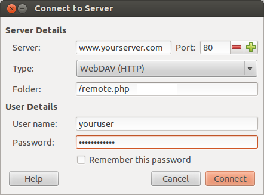

Mounting ownCloud via WebDAV
=============================

All major operating systems allow for mounting a users ownCloud via WebDAV,
a HTTP extension as specified in :rfc:`2518`. This chapter describes how to 
setup WebDAV on different operating systems.

Windows
-------

On Windows, you can assign ownCloud a drive letter.  This allows you to 
browse files stored on an ownCloudserver the way you would files stored in a 
mapped network drive. 

Using this feature requires network connectivity. If you want to store
your files offline, use the ownCloud Client to sync all files on your
ownCloud to one or more directories of your local hard drive. 

.. note:: Prior to mapping your drive, you will need to permit the use of 
          Basic Authentication in the Windows Registry. The procedure is
          documented in KB841215_ and differs between Windows XP/Server 2003
          and Windows Vista/7. Please follow the Knowledge Base article
          before proceeding, and follow the Vista instructions if you run 
          Windows 7. 

Mapping via the command line
~~~~~~~~~~~~~~~~~~~~~~~~~~~~

Suppose your ownCloud is installed at ``https://www.yourserver.com/owncloud``,
that is, entering this URL in your webbrowser will bring up the login screen.
Running

  net use Z: https://www.yourserver.com/owncloud/remote.php/webdav /user:youruser yourpassword

will map the files of your ownCloud account to the drive letter Z:. An alternative
syntax is: 

  net use Z: \\www.yourserver.com@ssl\owncloud\remote.php\webdav /user:youruser yourpassword

Appending ``/persistent`` makes the connection persistent across reboots.

You can also mount your ownCloud via HTTP, leaving the connection unencrypted.
Use either of the following syntaxes::

  net use Z: http://www.yourserver.com/owncloud/remote.php/webdav /user:youruser yourpassword
  net use Z: \\www.yourserver.com\owncloud\remote.php\webdav /user:youruser yourpassword

Please note that this allows anyone to sniff your ownCloud data with ease, especially
on public WiFi hotspots. Plain HTTP should therefore only be used in conjunction
with a VPN tunnel when used on Laptops. 

Using Windows Explorer
~~~~~~~~~~~~~~~~~~~~~~

Right-click on ``Computer`` entry and select ``Map network drive...``. Choose a local network
drive to map ownCloud to. Finally, enter the address to your ownCloud instance, followed by
``/remote.php/webdav``, e.g. :: 

  https://www.yourserver.com/owncloud/remote.php/webdav

for an SSL protected server. Check ``Reconnect at logon`` to make this mapping persistent 
across reboots. If you want to connect as another user, check ``Connect using different credentials``.

.. figure:: images/explorer_webdav.png 
   :scale: 80%
   
   Mapping WebDAV on Windows Explorer. 

After pressing ``Finish``, Windows Explorer will map the network drive and your ownCloud instance
should be available

Using Cyberduck (4.2.1)
~~~~~~~~~~~~~~~~~~~~~~~

Specify a server without any leading protocol information. e.g.:

Server
  owncloudhost.com

The port depends on whether your ownCloud server supports SSL or not. Cyberduck requires that you select a different connection type depending on whethr SSL is to be used ('WebDAV' or 'WebDAV (HTTPS/SSL)'):

Port
  80 (for WebDAV)
  443 (for WebDAV (HTTPS/SSL))
  
Use the 'More Options' drop-down menu to add the rest of your webdav URL into the 'Path' field. e.g.:

Path
  remote.php/webdav

Known Problems
~~~~~~~~~~~~~~

Problem
  Windows refuses to connect via HTTPS

Solution
  The Windows WebDAV Client does not support Server Name Indication (SNI) on
  encrypted connections. If you encounter an error mounting an SSL-encrypted
  ownCloud instance, please contact your provider about assigning a dedicated
  IP address for your SSL-based server.
          
Problem
  I receive the error ``Error 0x800700DF: The file size exceeds the limit allowed and cannot be saved.``

Solution
  Windows limits the maximum size a file transferred from or to  a WebDAV
  share may have.  You can increase the value ``FileSizeLimitInBytes`` in
  ``HKEY_LOCAL_MACHINE\SYSTEM\CurrentControlSet\Services\WebClient\Parameters``.
  by clicking on ``Modify``. In order to increase the limit to the maximum
  value of 4GB, pick ``Decimal`` and enter ``4294967295`` as value. Afterwards,
  reboot Windows or restart the ``WebClient`` service.
 
.. todo::

   document registry keys on file size limit and not complaining in no network cases 

Mac OS X
--------

Assuming your owncloud instance is installed at ``https://www.yourserver.com/owncloud``:

In the Finder, choose ``Go > Connect to Server,`` type the address of the server in the
``Server Address`` field, and click ``Connect``.  The server address should be in a form
similar to this: ``ADDRESS/files/webdav.php``. For our example, it would be::

  https://www.yourserver.com/owncloud/files/webdav.php 

For details, check the respective `vendor documentation`_ at the Apple website.

Linux
------

KDE/Dolphin
~~~~~~~~~~~

Assuming your owncloud instance is installed at ``http://www.yourserver.com/owncloud``:

1. Open Dolphin and click on where it says Network in the left hand Places column.
2. Click on the icon labeled ``Add a Network Folder``.
3. It should come up with WebDAV already selected. Make sure it is and then click ``Next``.
4. Enter the following settings:

  * Name: The name you’ll see in the ``Places`` bookmark, for example ownCloud
  * User: Your ownCloud username you use to log in, for example admin
  * Server: Your ownCloud domain name, for example ``www.yourserver.com``
    (without ``http://`` before or directories afterwards).
  * Folder: Enter ``owncloud/files/webdav.php``.

5. Create icon checkbox: Tick to get a bookmark in the Places column
6. Port & Encrypted checkbox: Leave as it is unless you have special settings or an SSL certificate.

Ubuntu/Gnome (Nautilus)
~~~~~~~~~~~~~~~~~~~~~~~

   
   Nautilus WebDAV mounting dialog

Mounting from command line
~~~~~~~~~~~~~~~~~~~~~~~~~~

1. Install the WebDAV support using the davfs package. On Debian/Ubuntu, you can use: ``sudo apt-get install davfs2``.
2. Reconfigure davfs2 to allow access to normal users: sudo dpkg-reconfigure davfs2 (select Yes when prompted).
3. Add the users you want to be able to mount the share to the davfs2 group: ``sudo usermod -aG davfs2 <user>``
4. Edit ``/etc/fstab``, and add the following line for each user who wants to mount the folder
   (with your details where appropriate): ``ADDRESS/files/webdav.php /home/<username>/owncloud davfs user,rw,noauto 0 0``.

Then, as each user who wants to mount the folder:

1. Create the folders ``owncloud`` and ``.davfs2`` in your home directory
2. Create the file secrets inside ``.davfs2``, fill it with the following (with your credentials where appropriate) ``ADDRESS/files/webdav.php <username> <password>``
3. Ensure the file is only writable by you either through the file manager, or via ``chmod 600 ~/.davfs2/secrets``
4. Run the command: ``mount ~/owncloud``
5. To automatically mount the folder on login, add the command you used in step 4 to ``~/.bashrc``
	
Known Issues
++++++++++++

**Problem:** Resource temporarily unavailable

**Solution:** If you experience trouble when you create a file in the directory, edit ``/etc/davfs2/davfs2.conf`` and add `use_locks 0``

**Problem:** Certificate warnings

**Solution:** If you use a self-signed certificate, you will get a warning. If you are willing to take the risk of a man in the middle attack, run this command instead: ``echo "y" | mount ~/owncloud > /dev/null 2>&1``.

.. _`vendor documentation`: http://docs.info.apple.com/article.html?path=Mac/10.6/en/8160.html
.. _KB841215: http://support.microsoft.com/kb/841215
