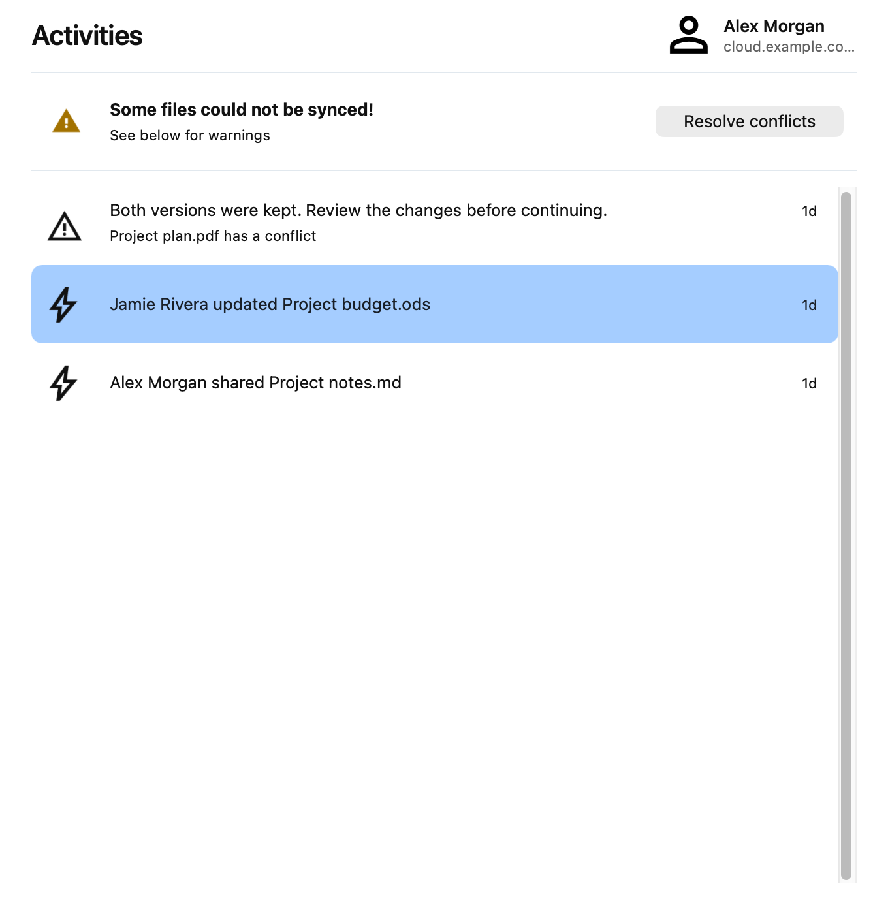
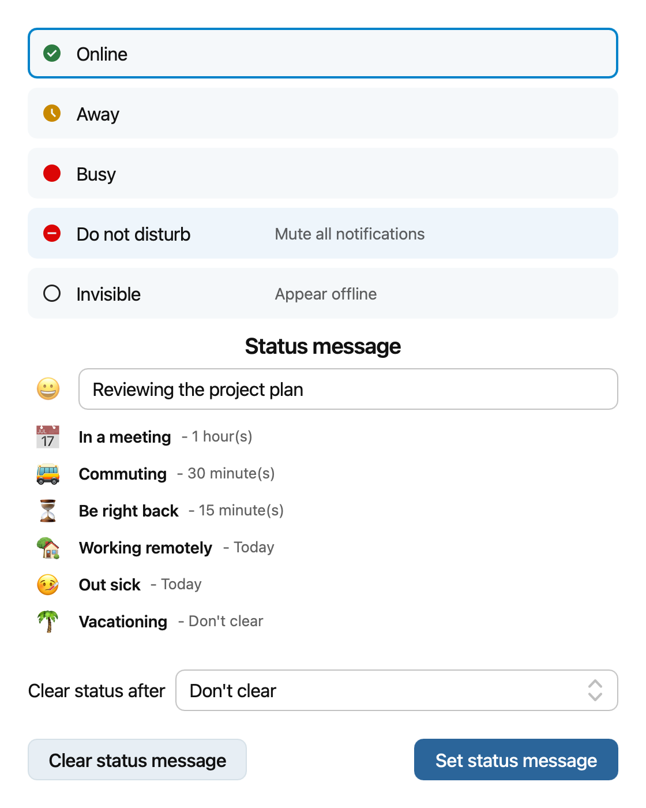
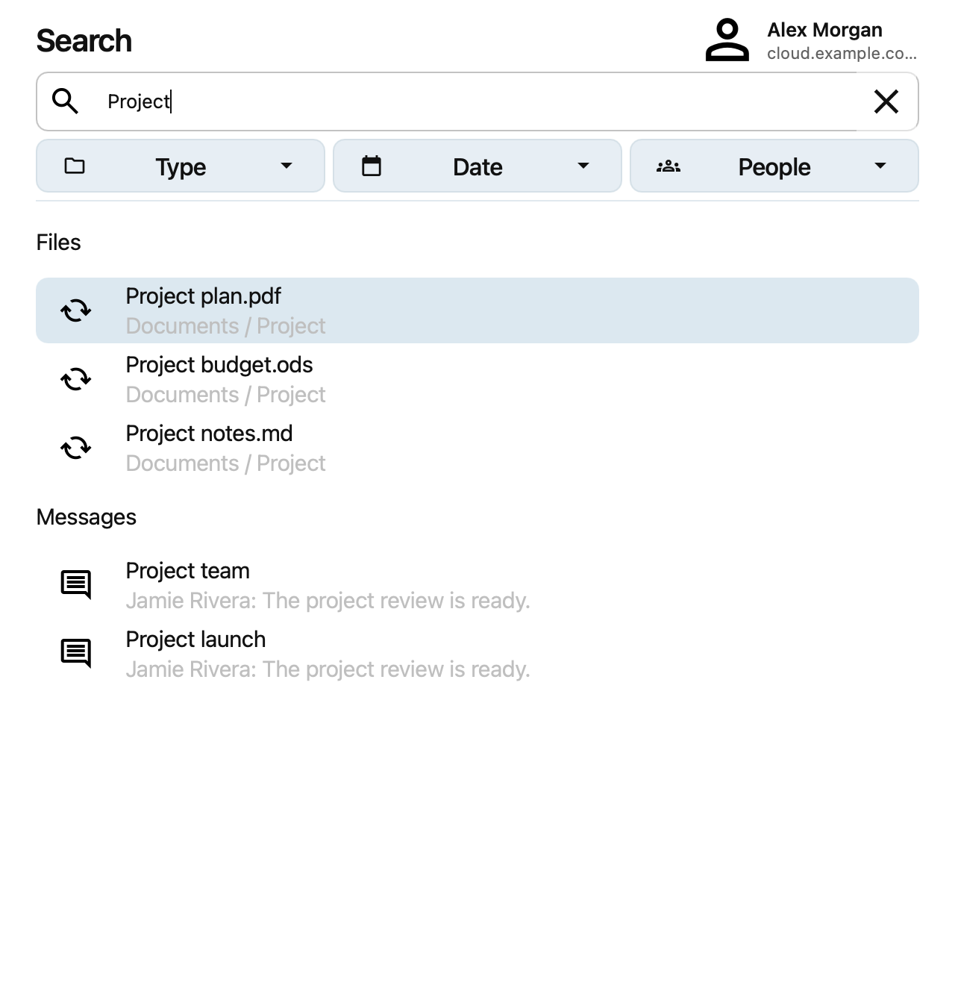
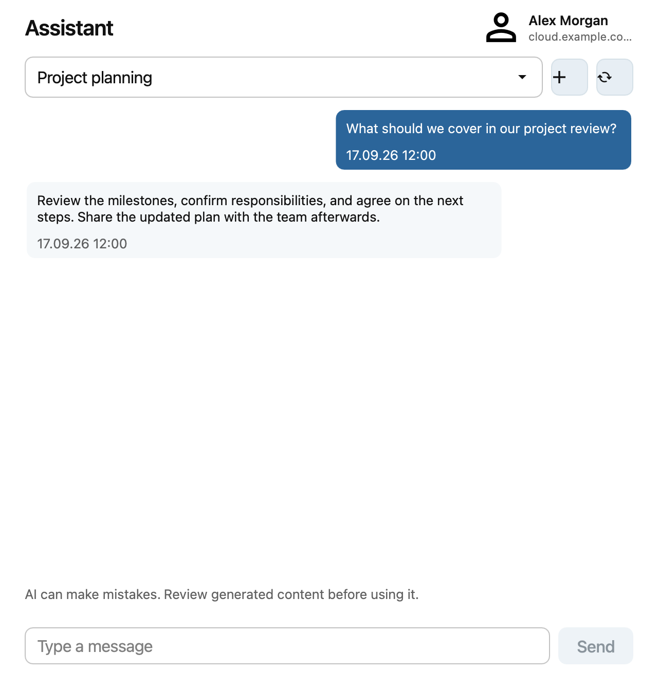

===============
Client features
===============

Activities
----------

Open **Activities** in the client to see recent file activity and synchronization warnings. If files conflict, use
**Resolve conflicts** to review them.

User status
-----------

If your server has the user status app, open your account in the settings dialog and click **Online status**. Choose
your availability, enter a status message or select a suggested one, and choose when to clear it. Click **Set status
message** to save it, or **Clear status message** to remove an existing message.

Search
------

Open **Search** in the client and enter a term to find files and other results from your Nextcloud server. Use the
**Type**, **Date**, and **People** filters to narrow the results.

Assistant
---------

If your server provides the Assistant, open **Assistant** in the client to ask a question or continue a conversation.
Select a conversation, type your message, and click **Send**.

