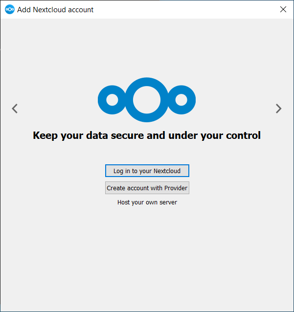
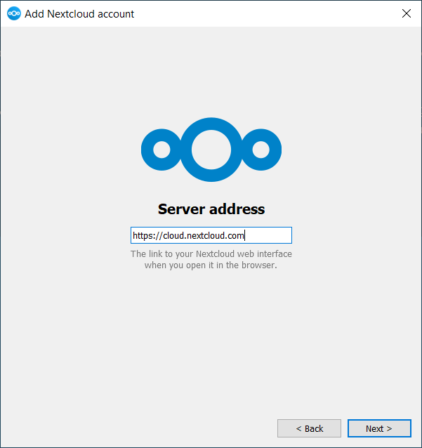
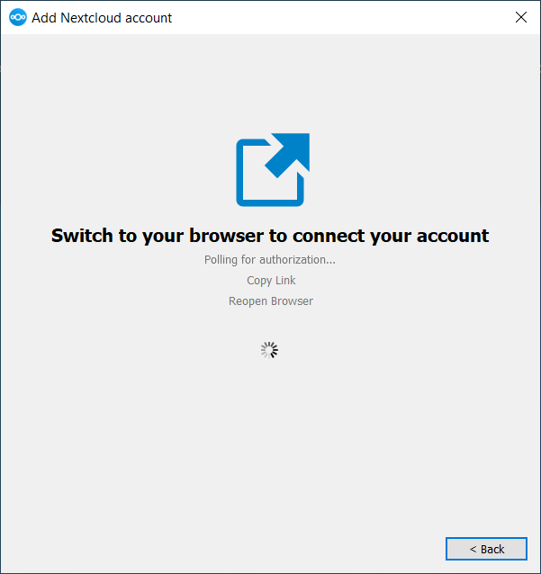
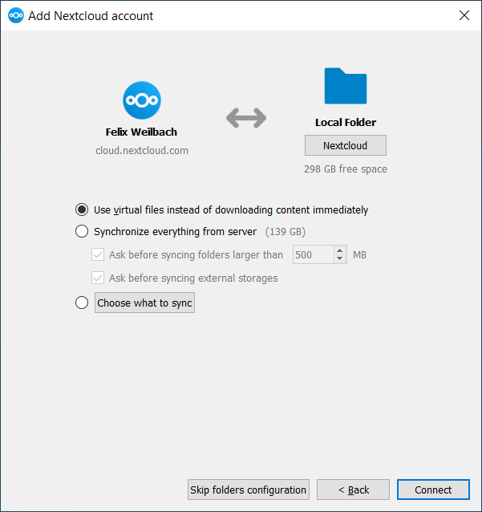

============
Installation
============

Download
--------

You can download the latest version of the Nextcloud Desktop Synchronization Client
from the `Nextcloud download page`_. Clients are available for Linux, macOS, and Microsoft Windows.

You will also find links to source code archives and older versions on the download page.

Supported server versions
-------------------------

Each desktop client release supports the latest three stable Nextcloud server
major versions at the time of release. See the `Nextcloud Server release schedule`_
for supported major versions.

System Requirements
-------------------

- Windows 10+ (64-bits only)
- macOS 12.0+ (64-bits only)
- Linux (Ubuntu 24.04 or openSUSE 15.5 or Alma 8 or ...) (64-bits only)

  For Linux distributions, we support, if technically feasible, the current
  LTS releases. For BSD, we support them if technically feasible, but we do not
  test them.

.. note::
   We do not support Citrix.

   - We will do our best to advise Citrix users from the desktop client point of view.
   - We will fix issues that are also reproducible on the standard supported systems.
   - Everything else is outside of our scope.

Install on macOS and Windows
----------------------------

Installation on macOS and Windows is the same as for any other software
application: download the program and then double-click it to launch the
installation, and then follow the installation wizard. After it is installed and
configured the desktop client will automatically keep itself updated; see
:doc:`autoupdate` for more information.

For administrator-focused deployment options such as advanced Windows MSI
configuration, non-interactive account provisioning, and command-line wizard
preconfiguration, see the Admin Manual chapter on desktop client deployment and setup.

Install on Linux
----------------

For Linux, Nextcloud officially provides the desktop client as an AppImage on
the `Nextcloud download page`_.

Some Linux distributions also provide the Nextcloud desktop client through their
package managers. These packages are maintained by the distribution or community,
not by Nextcloud. If you prefer a package-managed installation, refer to your distribution's documentation.

Linux users must also have a password manager enabled, such as GNOME Keyring or
KWallet, so that the desktop client can log in automatically.

Initial Setup
-------------

After installation, the initial setup wizard is triggered. In the setup wizard,
you can log in to your server, create an account with a provider, and configure
which folders to sync. The wizard will guide you step-by-step through the
essential configuration options and basic account setup.

First, you need to enter the URL of your Nextcloud server.

If you already have an account on a Nextcloud instance, click ``Login to your
Nextcloud``. If you do not yet have a Nextcloud instance or an account, you may
need to create one first. Alternatively, you might want to register an account
with a provider. Press ``Create account with Provider`` in that case.

.. note::
   The desktop client build you are using may have been built without provider
   support. In that case, you won't see this page and will immediately see the
   next page.

Enter the URL for your Nextcloud instance. The URL is the same URL that
you type into your browser when you try to access your Nextcloud instance.

Now your web browser should open and prompt you to log in to your
Nextcloud instance. Enter your username and password in your web
browser and click *Grant access* when prompted. After you do that,
go back to the wizard.

.. note::
   You might not need to enter your username and password if you are
   already logged in to your web browser.

    them in.

On the local folder options screen, you may sync all of your files on
the Nextcloud server, or select individual folders. The default local
sync folder is ``Nextcloud``, in your home directory. You may change this as well.

When you have completed selecting your sync folders, click the *Connect*
button at the bottom right. The client will attempt to connect to your
Nextcloud server. If it is successful, the wizard will close itself. You
can then observe the sync activity and open the main dialog by clicking
on the tray icon.

.. Links

.. _Nextcloud download page: https://nextcloud.com/download/#install-clients

.. _Nextcloud Server release schedule: https://github.com/nextcloud/server/wiki/Maintenance-and-Release-Schedule
