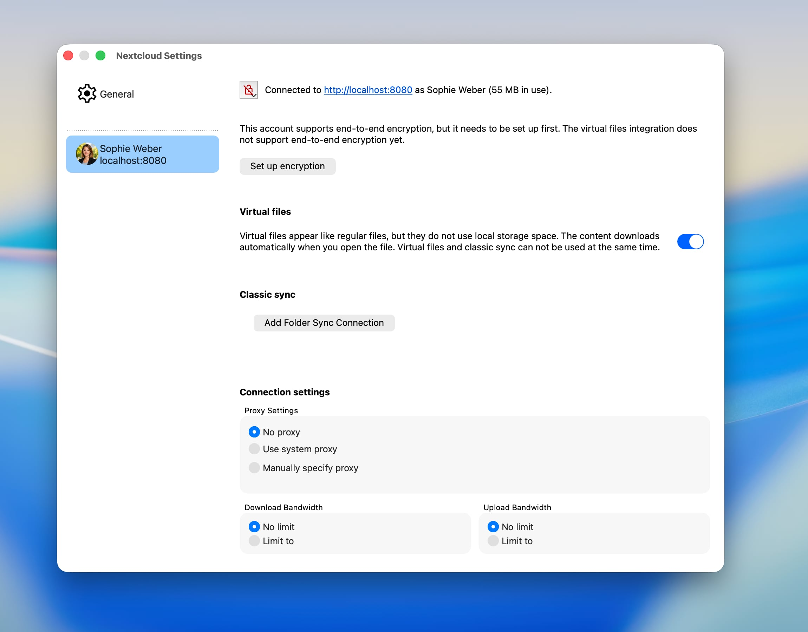
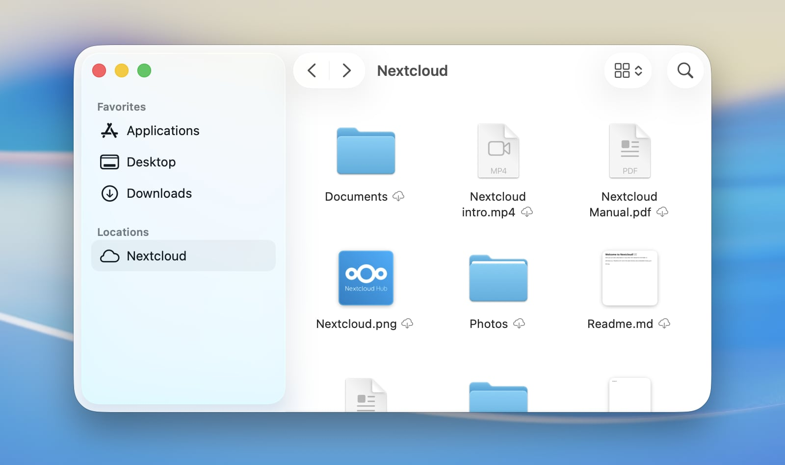
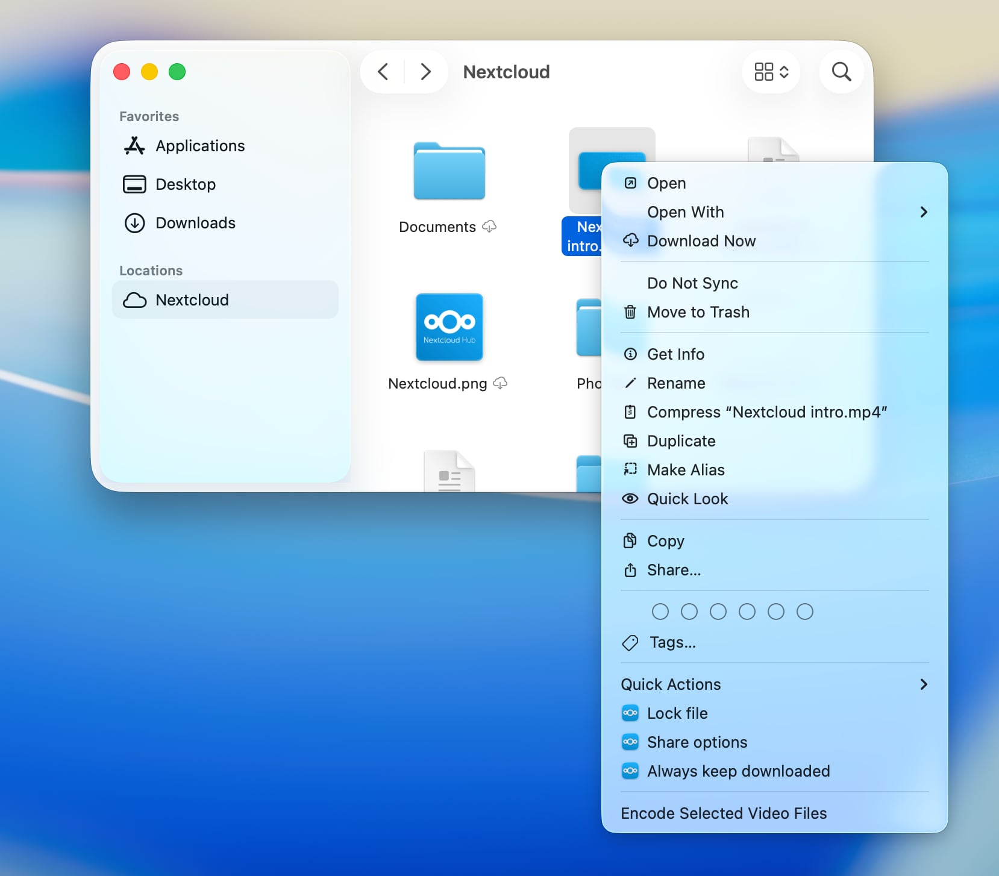
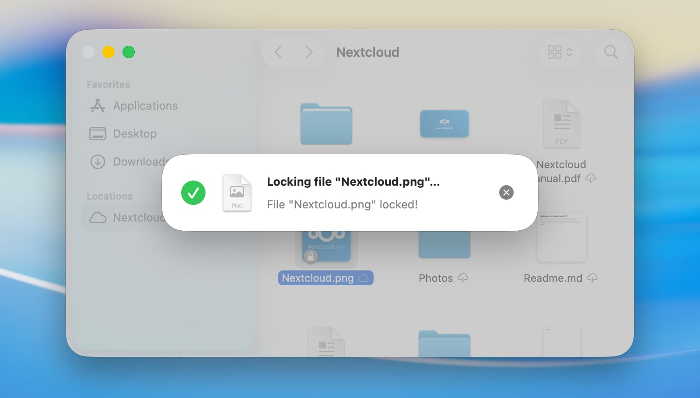
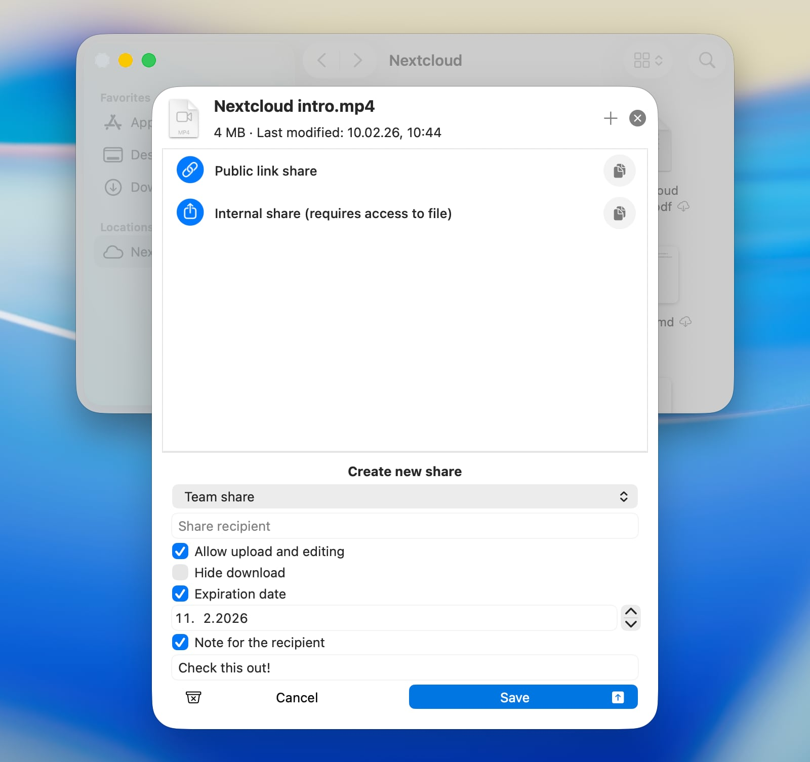

=============================
Using the macOS File Provider
=============================

On macOS, our client can also seamlessly integrate Nextcloud files into macOS
as a File Provider extension. Any newly configured Nextcloud account will have
the integration enabled by default.

Supported features
------------------

- Keeping files or whole folders available offline
- Freeing up local disk space by evicting local copies without deleting items
- Intelligent and automatic local data eviction
- File previews within Finder for files which are not downloaded yet
- Support for Apple-specific formats, for example Pages, Numbers or Keynote bundles
- Support for server-side file locking (if supported by the connected server)
- “Edit locally” support
- Sharing with other users
- Server-side actions integrated directly in Finder's context menu
- Automatic discovery of server-side changes

Configuration
-------------

Settings related to the File Provider extension can be adjusted on a
per-account basis via the Nextcloud desktop client's settings window.

Here the integration into Finder can be enabled or disabled.

When disabling the File Provider extension while still having unsynchronized
changes, macOS will save the unsynchronized items in a folder that is
automatically revealed after the integration is disabled.

Finder integration
------------------

On macOS, remote storage like a Nextcloud files account appears like a
dedicated location in the Finder sidebar. The actual location of the
content on disk is defined by macOS.

.. note::
   To accelerate server-side change detection, we recommend enabling the
   ``notify_push`` app on your Nextcloud server. This app will notify
   the desktop client of changes on the server as soon as they happen,
   reducing the time it takes for changes to appear in Finder.
   Otherwise the client needs to poll the server which will result in an
   increased delay between a change on the server and its local visibility.

Sync status indicators
----------------------

Similar to classic synchronization folders, Finder displays status
indicators next to items. Unlike the custom indicators in classic
synchronization folders, these standardized indicators are provided by macOS to
ensure a consistent appearance across all cloud storage apps which a user may
use on their system.

- *Cloud with downward arrow*: The item and its descendants are not downloaded
  yet. They can be downloaded, assuming a network connection is available.
- *Outlined cloud*: The item is not fully uploaded yet in its current local
  state.
- *Strikethrough cloud*: The item is excluded from synchronization.
- *Pie chart*: The item is currently being uploaded or downloaded, and the progress
  is visualized.
- *Filled circle with a pin*: The item is available offline and will
  be kept locally.
- *No icon*: The item is available offline and up to date.

Context menu actions
--------------------

The File Provider extension also provides special Nextcloud features through
the context menu in Finder.

Keep Downloaded
^^^^^^^^^^^^^^^

Files and folders can be marked to be kept downloaded and available offline
permanently. If this is chosen on folders, it will also apply to all their
contents. This is especially useful for users with limited or no network
access, as it ensures that they can always access their important files without
needing to worry about connectivity. macOS will **not** free up local disk
space by evicting items which are marked to be kept downloaded, even if they
have not been accessed for a long time.

This can be undone by selecting "Allow automatic freeing up space" on the same
items.

To always keep everything in an account available locally, you can select
"Always keep downloaded" on the location root in the Finder sidebar.

Locking
^^^^^^^

If the server supports file locking, the client will offer manual locking and
unlocking of files in Finder.

Sharing
^^^^^^^

When the server supports sharing and the item is allowed to be shared,
then you can create new shares or manage existing shares for an item directly
from the context menu in Finder, as in the Nextcloud web interface.

File actions
^^^^^^^^^^^^

If the server has apps installed which provide file actions for the selected
file types, these actions will also be available in the context menu in Finder.
This allows you to use server-side features of your Nextcloud instance directly
from the Finder.

Known issues
------------

macOS Extensions conflict
^^^^^^^^^^^^^^^^^^^^^^^^^

Due to technical limitations in macOS which are imposed by Apple,
it is not possible to have the Finder integration for classic sync folders
running in parallel to an enabled File Provider extension.
This means that item decorations and context menu options will be
unavailable for classic sync folders while the File Provider extension is
enabled.

Alias files
^^^^^^^^^^^

When opening a macOS alias file stored on Nextcloud for the first time on a
device where it has not yet been downloaded, the file may open as a binary
document in a text editor instead of jumping to its target. This happens
because macOS decides how to open a file before downloading it, and alias files
carry no recognisable file extension or type information on the server — the
only way to identify them is by reading their content. Once the file has been
opened or downloaded once, Nextcloud Desktop learns that it is an alias and
stores that information locally, so all subsequent opens will work correctly.
To avoid the issue entirely, right-click the alias file in Finder and choose
**Keep Downloaded** before opening it for the first time.

“Edit locally”
^^^^^^^^^^^^^^^^^^^^^^^^^^^^^^

The “Edit locally” action offered by the Nextcloud web interface cannot open
files that are managed by the File Provider extension.

This is a restriction of macOS itself, not a fault in the client. For your
protection, macOS only lets specific apps open a given file, and it does not
allow an app to grant itself that permission. The part of the client that is
allowed to manage these files is not permitted to launch other apps, and the
part that could launch your editor is not permitted to open the file. Granting
Full Disk Access does not help, because a different part of the macOS security
system is responsible for this.

To edit such a file, open it directly from Finder instead: select your
Nextcloud location in the Finder sidebar and double-click the file.

Troubleshooting
---------------

Debug-level Logging
^^^^^^^^^^^^^^^^^^^^^^^^^^^^

Debug-level log entries for the File Provider extension are disabled by
default.
If you want to report an issue with the File Provider, it can be helpful to
enable them to get more detailed information about what is happening under the
hood. To enable them, you have to issue the following command in Terminal:

.. code-block:: bash

   defaults write com.nextcloud.desktopclient.FileProviderExt debugLoggingEnabled -bool YES

The change takes effect within a couple of seconds; no restart of the extension
or the Mac is required. It is recommended to restore the default value by
deleting the explicit value after you have resolved the problem you were
investigating:

.. code-block:: bash

   defaults delete com.nextcloud.desktopclient.FileProviderExt debugLoggingEnabled
