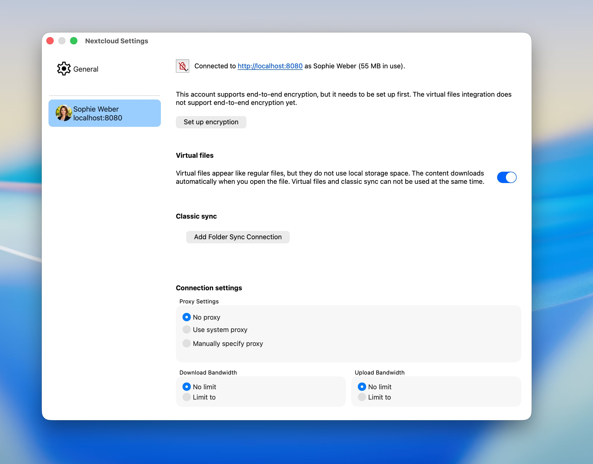
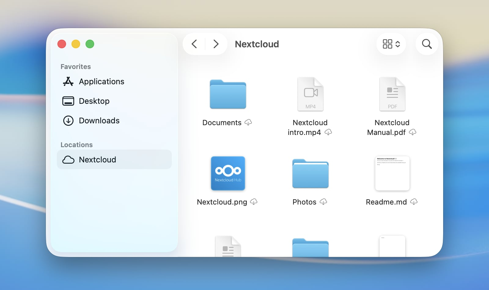
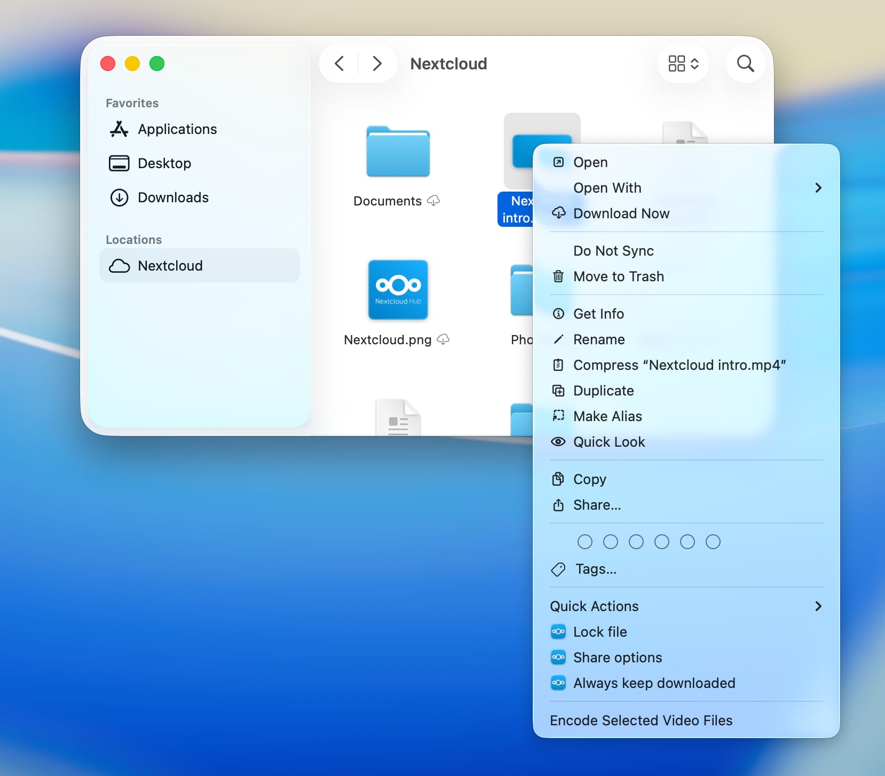
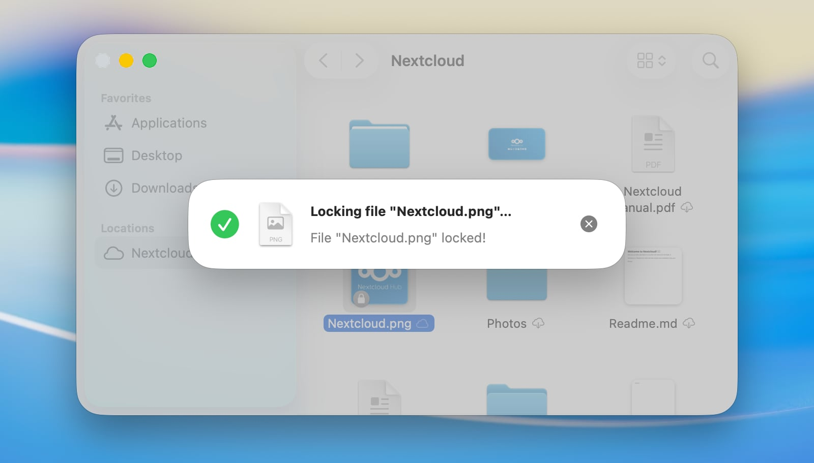
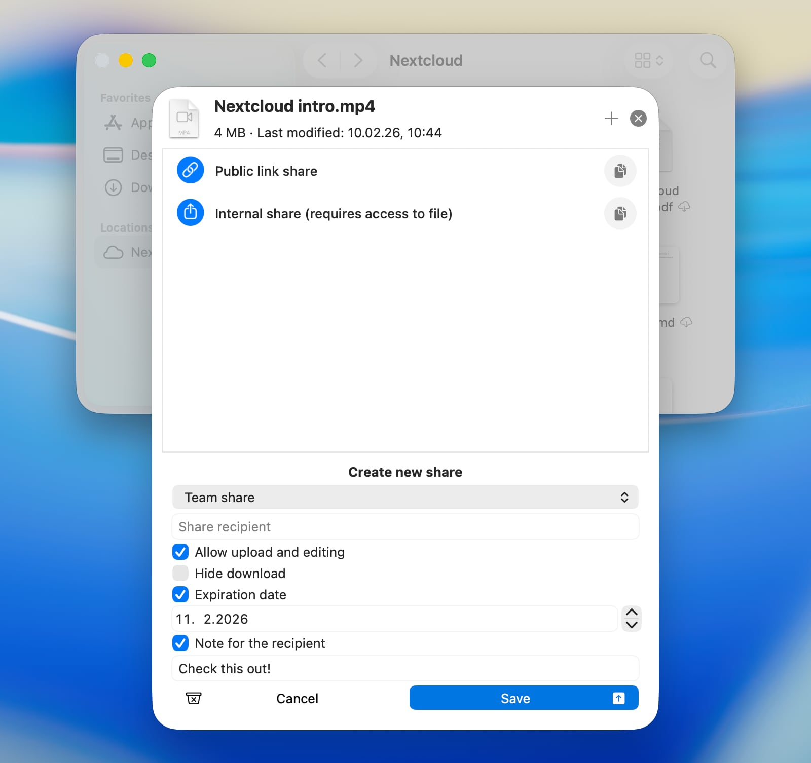

==========================
macOS Virtual Files Client
==========================

On macOS, our client can also seamlessly integrate Nextcloud files into macOS
as a file provider extension. Any newly configured Nextcloud account will have
the integration enabled by default.

Supported features
------------------

- Keeping files or whole folders available offline
- Freeing up local disk space by evicting local copies without deleting items
- Intelligent and automatic local data eviction
- File previews within Finder for files which are not downloaded yet
- Support for Apple-specific formats, for example Pages, Numbers or Keynote bundles
- Support for server-side file locking (if supported by the connected server)
- “Edit locally” support
- Sharing with other users
- Automatic discovery of server-side changes

.. note::
    Due to technical limitations in macOS which are imposed by Apple,
    it is not possible to have the Finder integration for classic sync folders
    running in parallel to an enabled virtual files integration.
    This means that item decorations and context menu options will be
    unavailable for classic sync folders while the file provider extension is
    enabled.

Configuration
-------------

Virtual files-related settings can be adjusted on a per-account basis
via the Nextcloud desktop client's settings window.

Here the integration into Finder can be enabled or disabled.

When disabling the file provider extension while still having unsynchronized
changes, macOS will save the unsynchronized items in a folder that is
automatically revealed after the integration is disabled.

Finder integration
------------------

On macOS, remote storage like a Nextcloud files account appears like a
dedicated location in the Finder sidebar. The actual location of the
content on disk is defined by macOS.

.. note::
   To accelerate server-side change detection, we recommend enabling the
   ``notify_push`` app on your Nextcloud server. This app will notify
   the desktop client of changes on the server as soon as they happen,
   reducing the time it takes for changes to appear in Finder.
   Otherwise the client needs to poll the server which will result in an
   increased delay between a change on the server and its local visibility.

Sync status indicators
----------------------

Similar to classic synchronization folders, Finder displays status
indicators next to items. Unlike the custom indicators in classic
synchronization folders, these standardized indicators are provided by macOS to
ensure a consistent appearance across all cloud storage apps which a user may
use on their system.

- *Cloud with downward arrow*: The item and its descendants are not downloaded
  yet. They can be downloaded, assuming a network connection is available.
- *Outlined cloud*: The item is not fully uploaded yet in its current local
  state.
- *Strikethrough cloud*: The item is excluded from synchronization.
- *Pie chart*: The item is currently being uploaded or downloaded, and the progress
  is visualized.
- *Filled circle with downward arrow*: The item is available offline and will
  be kept locally.
- *No icon*: The item is available offline and up to date.

Context menu actions
--------------------

The file provider extension also provides special Nextcloud features through
the context menu in Finder.

Keep Downloaded
^^^^^^^^^^^^^^^

Depending on the download state of a folder or file, the context menu will
offer to always keep an item downloaded or free up local disk space by
evicting the local copy while not actually deleting the item. This way, it
stays available any time for download from the server.

Locking
^^^^^^^

If the server supports file locking, the client will offer manual locking and
unlocking of files in Finder.

Sharing
^^^^^^^

When the server supports sharing and the item is allowed to be shared,
then you can create new shares or manage existing shares for an item directly
from the context menu in Finder, as in the Nextcloud web interface.