================
Using the Client
================

The Nextcloud desktop client runs in the background. Open its settings from the system tray on Windows and Linux or
the menu bar on macOS.

.. _desktop-add-account:

Add account
-----------

To connect another Nextcloud account, open the settings dialog and click **Add account** in the sidebar. Enter the
address you use to access your Nextcloud server in a browser, then click **Log in**.

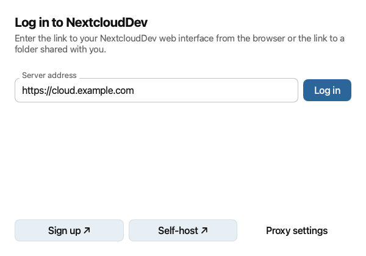

If your network requires a proxy, click **Proxy settings** before logging in. Choose the system proxy or enter your
proxy settings manually, then click **Done**.

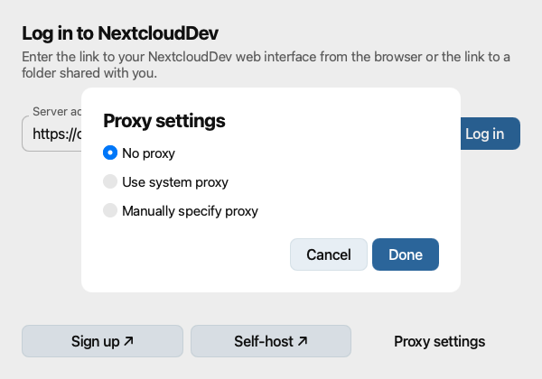

If the secure connection fails, check the server address and contact your server administrator. The wizard may offer
to connect without TLS or use a client certificate. Use **Use client certificate** only if your server requires one.

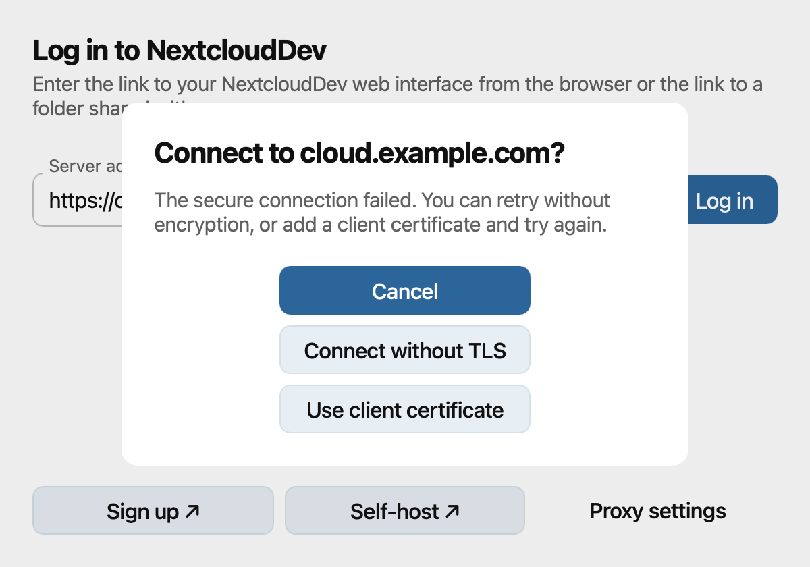

If prompted for a client certificate, choose the PKCS#12 file provided by your administrator, enter its password,
and click **Connect**.

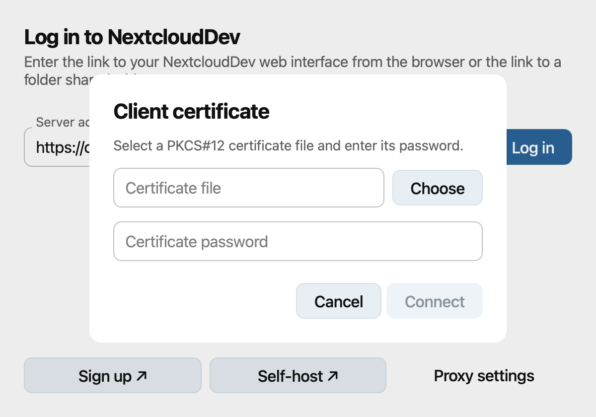

The wizard asks you to switch to your browser. Click **Open** if the browser does not open automatically. Log in and
grant the desktop client access when prompted. Then return to the wizard.

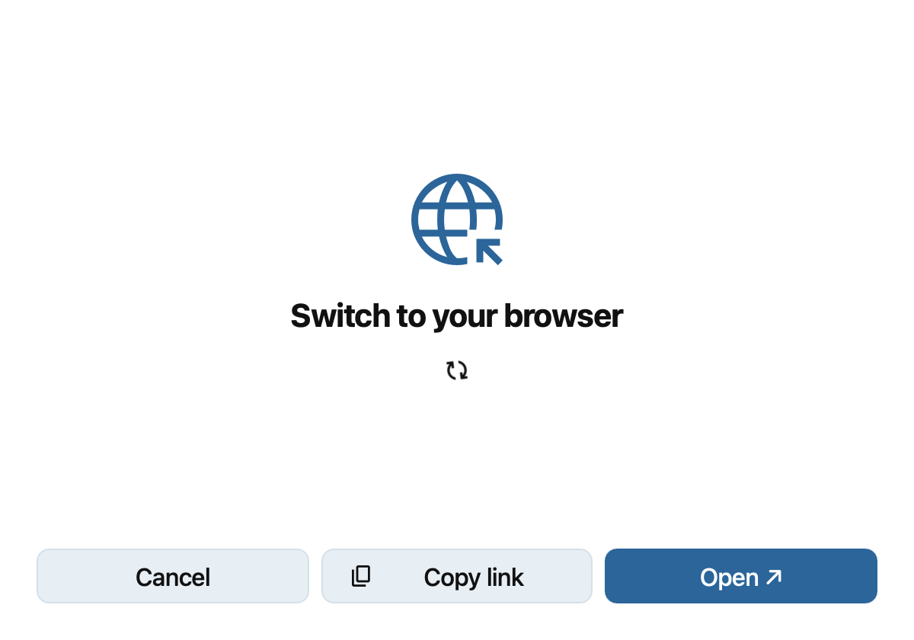

Choose how to sync your files. With classic synchronization, choose **Synchronize everything** or **Choose what to
sync**. Use **Choose** beside **Local sync folder** to change where files are stored, then click **Done**.

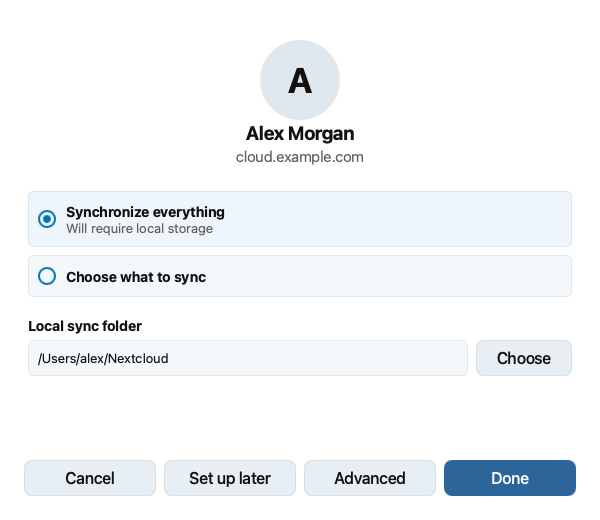

You can choose **File Provider** to download files on demand. Click **Done** to finish adding the account. On macOS,
see :doc:`macosfileprovider` for details about Finder integration.

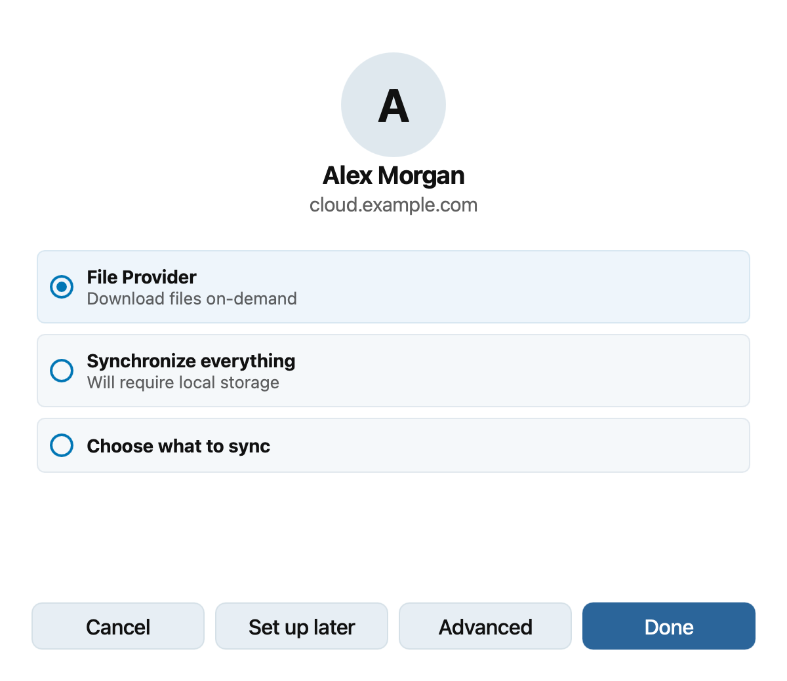

Before finishing classic synchronization, click **Advanced** if you want confirmation before syncing large folders
or external storage. Set your preferences in **Advanced options**, then click **Done** to return to the wizard.

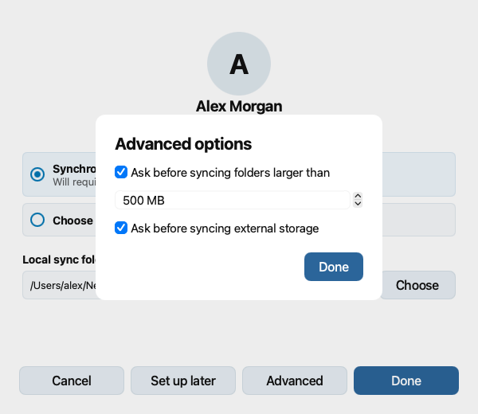

Settings dialog
---------------

Select an account in the sidebar to see its sync status, local folder, storage usage, and connection settings. Use
**Add Folder Sync Connection** to set up another classic sync folder for that account. You can log out or remove the
account from the same page.

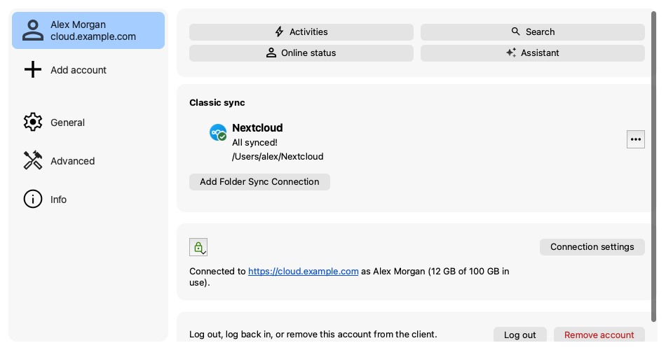

Under **General**, choose whether to launch the client at startup, use monochrome icons, and show notifications.
On macOS, you can also enable File Provider for all accounts. This setting replaces classic sync folders and their
Finder integration.

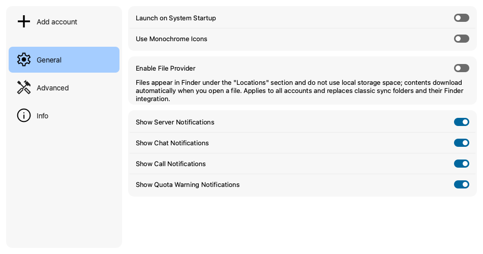

Under **Advanced**, set confirmation thresholds for large folders and external storage. You can also adjust the
server polling interval, decide whether removed files go to the trash, edit ignored files, or create a debug archive.

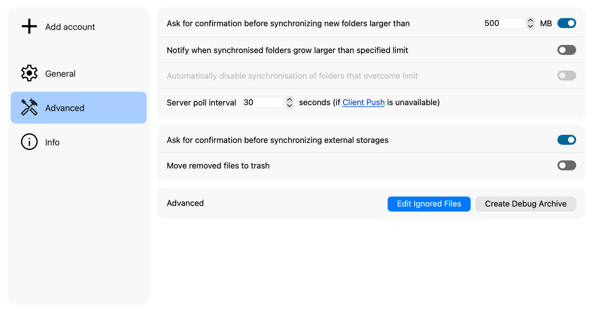

.. _usingIgnoredFilesEditor-label:

To exclude files or folders from synchronization, click **Edit Ignored Files** under **Advanced**. Add a pattern for
each item you want to ignore. An asterisk (``*``) matches any number of characters, a question mark (``?``)
matches one character, and a trailing slash (``/``) limits a pattern to folders. Select **Allow Deletion** only for
ignored items that the client may remove when they prevent a folder from being deleted. Click **OK** to save.

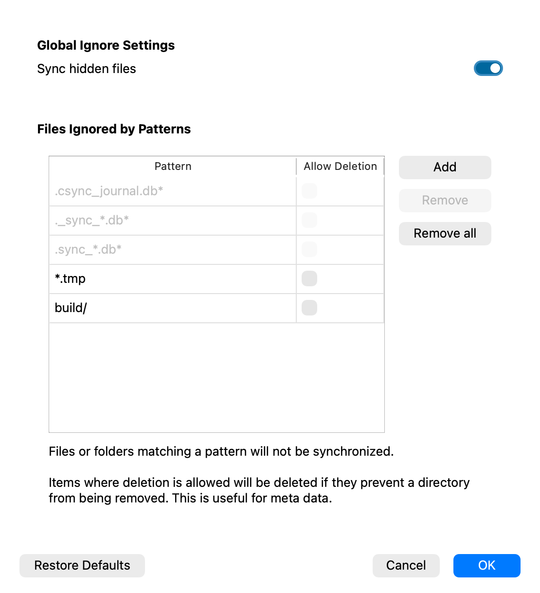

Under **Info**, you can check the desktop client version and open its usage documentation or legal notice.

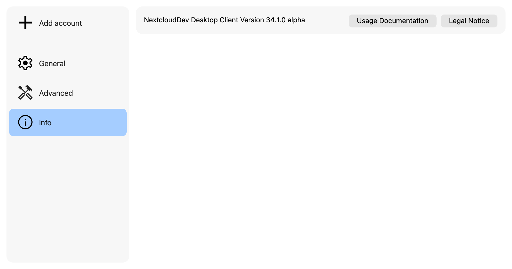

Systray icon
------------

The desktop client shows a status icon in the system tray on Windows and Linux or the menu bar on macOS. Colorful
status icons and colorful or monochrome tray icons are available for the same sync states. You can choose monochrome
icons under **General** in the settings dialog.

.. list-table:: Synchronization status icons
   :header-rows: 1
   :widths: 46 18 18 18

   * - State
     - Status
     - Mono tray
     - Color tray
   * - Up to date and connected
     - .. image:: images/icon-status-ok.png
          :alt: Colorful up-to-date status icon
          :width: 40px
     - .. image:: images/icon-tray-ok.png
          :alt: Monochrome up-to-date tray icon
          :width: 40px
     - .. image:: images/icon-tray-colored-ok.png
          :alt: Colorful up-to-date tray icon
          :width: 40px
   * - Synchronizing
     - .. image:: images/icon-status-sync.png
          :alt: Colorful synchronizing status icon
          :width: 40px
     - .. image:: images/icon-tray-sync.png
          :alt: Monochrome synchronizing tray icon
          :width: 40px
     - .. image:: images/icon-tray-colored-sync.png
          :alt: Colorful synchronizing tray icon
          :width: 40px
   * - Paused
     - .. image:: images/icon-status-pause.png
          :alt: Colorful paused status icon
          :width: 40px
     - .. image:: images/icon-tray-pause.png
          :alt: Monochrome paused tray icon
          :width: 40px
     - .. image:: images/icon-tray-colored-pause.png
          :alt: Colorful paused tray icon
          :width: 40px
   * - Offline
     - .. image:: images/icon-status-offline.png
          :alt: Colorful offline status icon
          :width: 40px
     - .. image:: images/icon-tray-offline.png
          :alt: Monochrome offline tray icon
          :width: 40px
     - .. image:: images/icon-tray-colored-offline.png
          :alt: Colorful offline tray icon
          :width: 40px
   * - Warning; open the client for details
     - .. image:: images/icon-status-warning.png
          :alt: Colorful warning status icon
          :width: 40px
     - .. image:: images/icon-tray-warning.png
          :alt: Monochrome warning tray icon
          :width: 40px
     - .. image:: images/icon-tray-colored-warning.png
          :alt: Colorful warning tray icon
          :width: 40px
   * - Error; open the client for details
     - .. image:: images/icon-status-error.png
          :alt: Colorful error status icon
          :width: 40px
     - .. image:: images/icon-tray-error.png
          :alt: Monochrome error tray icon
          :width: 40px
     - .. image:: images/icon-tray-colored-error.png
          :alt: Colorful error tray icon
          :width: 40px

Open the tray or menu bar icon to view the client and its available actions, such as pausing or resuming sync.

File manager overlay icons
--------------------------

For classic sync folders, the desktop client adds overlay icons to files in the file manager. A green checkmark
means a file is up to date. A warning icon can mean that a file is ignored; a red X indicates a sync error. A blue
icon indicates a file waiting to sync or currently syncing. When the client is offline, it does not show overlays
for the folder's current sync state.

A folder's overlay reflects sync errors in its contents. Ignored files do not change the parent folder's status.
On macOS, File Provider uses the standard Finder status indicators described in :doc:`macosfileprovider`.

Sharing from your desktop
-------------------------

The desktop client integrates sharing actions into Finder on macOS and Explorer on Windows. On Linux, install the
integration package for your file manager, such as ``nautilus-nextcloud`` or ``dolphin-nextcloud``.

In your file manager, right-click a file and select **Nextcloud** > **Share options** to open the share dialog.

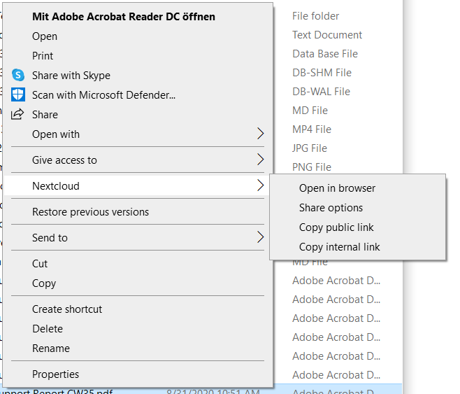

From this dialog, you can create a share link or share with another Nextcloud user.

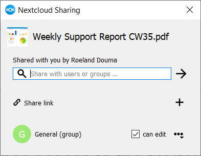
