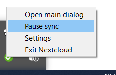
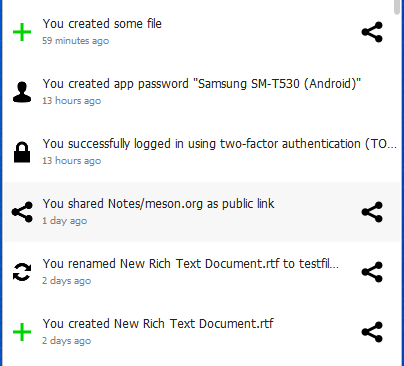
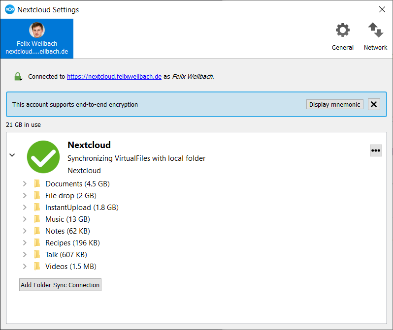

## Systray Icon

A right-click on the systray icon opens a menu for quick access to multiple
operations.

:alt: The right-click sync client menu

This menu provides options to:

* Open the main dialog.
* Pause or resume synchronization for all accounts.
* Open Settings.
* Exit Nextcloud.

A left-click on the systray icon opens the main dialog of the desktop client.

:alt: Main dialog

The main dialog shows recent activities, errors, and server notifications.

To manage accounts or open the client settings, open the current account menu.

## Configuring Nextcloud Account Settings

:alt: Nextcloud Desktop Client settings

The settings interface provides configuration options for the selected account.

On the account settings page, you can view and manage options such as:

* The connection status and the Nextcloud server you are connected to.
* Your Nextcloud username.
* The available and used storage space on the server.
* The current synchronization status.
* Folder synchronization settings.

The available options can vary depending on the platform and Desktop Client
version.

## Adding Accounts

You can configure multiple Nextcloud accounts in the desktop sync client.

To add another account, open the current account menu and select **Add account**.
Follow the account setup wizard to connect the new account.

After adding an account, you can switch between configured accounts from the
same account menu. Select the account you want to use to make it the active
account.

To manage an account's settings, open the account menu and select **Settings**.
From there, you can manage the settings for the selected account.

To remove an account, open **Settings**, select the account you want to remove,
and select **Remove account**.
