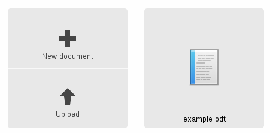
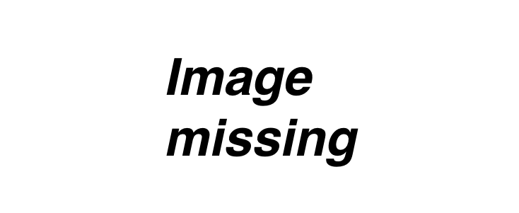
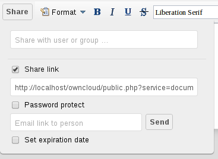

Collaborative Document Editing
==============================

The Documents application supports editing documents within ownCloud, without 
the need to launch an external application. The Documents app supports these 
features:

* Cooperative edit, with multiple users editing files simultaneously. 
* Document creation within ownCloud.
* Document upload.
* Share and edit files in the browser, and then share them inside ownCloud or 
  through a public link.

Supported file formats are `.odt`, `.doc`, and `.docx`.

The main interface
------------------

Create or Upload a Document
~~~~~~~~~~~~~~~~~~~~~~~~~~~

In the Documents application, you can upload an existing document or create a 
new one. The *New document* button creates a document named "New 
document.odt". The extension ODT is an OpenDocument format, which is supported 
by most word processors including Microsoft Word, LibreOffice Writer, and 
OpenOffice Writer.

Edit a Document
~~~~~~~~~~~~~~~

To edit a document, access the Documents app from your Apps menu at the top 
left of your ownCloud window. 

.. image:: images/oc_documents_edit.png

#. Click on the file name to change it.
#. Share your document (See the :ref:`Share a document 
   <share-a-document>` section.)
#. Formatting toolbar.
#. Zoom in/out
#. Close and save.
#. Users currently editing this document.

Collaboratively Editing a Document
^^^^^^^^^^^^^^^^^^^^^^^^^^^^^^^^^^

To edit a file collaboratively, it must be shared with everyone who needs 
editing permissions. Multiple users can edit it at the same time, and changes 
appear as they are made. The cursor of each user is the same color as the 
border color of their user picture.

If a user is not a local user (e.g accessing the file using public link), they
will be shown as guest in the user list, automatically named Guest 1, Guest 2, 
and so on. Guests can change their nicknames at any time by clicking on their
names or thumbnails in the user list.

Delete a Document
~~~~~~~~~~~~~~~~~

You can't delete a document from inside the Document app, but must go to your 
Files page and delete it from there. You'll find it in your default documents 
directory, which is configured on your ownCloud Personal page (see 
:doc:`userpreferences`.)

.. _share-a-document:

Share a Document
~~~~~~~~~~~~~~~~

Document sharing has the same options as when sharing other files. While editing 
a document, you can use the *Share* button to enable other users to edit the 
document. This button will display all available options to share:

By default, you can enter local users or groups to share with. Checking *Share 
link* will enable sharing via a public link. Shares can optionally have an 
expiration date and password. ownCloud will send the public link to users by 
email by typing each email address into the email field.  Separate multiple 
email addresses with a space.

