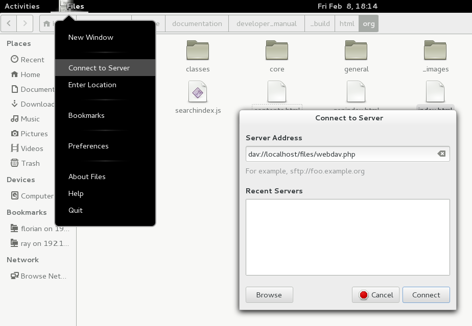
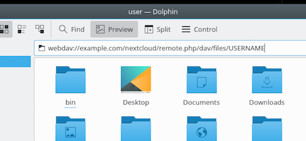

======================================
Accessing Nextcloud files using WebDAV
======================================

Nextcloud fully supports the WebDAV protocol, and you can connect and synchronize
with Nextcloud Files over WebDAV. In this chapter, you will learn how to
connect Linux, macOS, Windows, and mobile devices to your Nextcloud server.

WebDAV stands for Distributed Authoring and Versioning. It is an HTTP extension
that makes it easy to create, read, and edit files hosted on remote Web servers. With
a WebDAV client, you can access your Nextcloud Files (including shares) on Linux,
macOS and Windows in a similar way as any remote network share, and stay synchronized.

Before we get into configuring WebDAV, let's take a quick look at the
recommended way of connecting client devices to Nextcloud.

Official Nextcloud desktop and mobile clients
---------------------------------------------

The recommended way to synchronize a computer with a Nextcloud server is by
using the `official Nextcloud sync clients <https://nextcloud.com/install/#install-clients>`_.
You can configure the client to save files in any local directory and you can choose which
directories on the Nextcloud server to sync with. The client displays the
current connection status and logs all activity, so you always know which
remote files have been downloaded to your PC and you can verify that files
created and updated on your local PC are properly synchronized with the server.

The recommended way to synchronize Android and Apple iOS devices is by using
the `official Nextcloud mobile apps <https://nextcloud.com/install/>`_.

To connect the official Nextcloud apps to a Nextcloud server use the
same URL you use to access Nextcloud from your web browser - e.g.::

    https://cloud.example.com

    https://example.com/nextcloud (if Nextcloud is installed in a subdirectory called "nextcloud")

Third-party WebDAV clients
--------------------------

If you prefer, you may also connect your computer to your Nextcloud server by
using any third-party client that supports the WebDAV protocol (including what may be
built into your operating system).

You can also use third-party WebDAV capable apps to connect your mobile
device to Nextcloud.

When using third-party clients, keep in mind that they may not be optimized for use with
Nextcloud or implement capabilities you consider important to your use case.

Mobile clients that Nextcloud community members have reported using include:

* `FolderSync (Android) <https://foldersync.io/>`_
* `WebDAV Navigator (iPhone) <https://apps.apple.com/us/app/webdav-navigator/id382551345>`_

The URL to use when configuring third-party apps to connect to Nextcloud is a bit lengthier than the one for official clients::

    https://cloud.example.com/remote.php/dav/files/USERNAME/

    https://example.com/nextcloud/remote.php/dav/files/USERNAME/ (if Nextcloud is installed in a subdirectory called "nextcloud")

.. note:: When using a third-party WebDAV client (including your operating system's
   built-in client), you should use an application password for login rather than your
   regular password. In addition improved security, this `increases performance significantly
   <https://github.com/nextcloud/server/issues/32729#issuecomment-1556667151>`_. To
   configure an application password, log into the Nextcloud Web interface, click on the avatar
   in the top right and choose *Personal settings*. Then choose *Security* in the left
   sidebar and scroll to the very bottom. There you can create an app password (which can
   also be revoked in the future without changing your main user password).

.. note:: In the following examples, you should replace **example.com/nextcloud** with the
   URL of your Nextcloud server (omit the directory part if the installation is
   in the root of your domain), and **USERNAME** with the username of the connecting user.

   See the WebDAV URL (bottom left in settings) on your Nextcloud.

Accessing files using Linux
---------------------------

You can access files in Linux operating systems using the following methods.

Nautilus file manager
^^^^^^^^^^^^^^^^^^^^^

**When you configure your Nextcloud account in the** `GNOME Control Center
<../groupware/sync_gnome.html>`_, **your files will automatically be mounted
by Nautilus as a WebDAV share, unless you deselect file access**.

You can also mount your Nextcloud files manually. Use the ``davs://``
protocol to connect the Nautilus file manager to your Nextcloud
share::

  davs://example.com/nextcloud/remote.php/dav/files/USERNAME/

.. note:: If your server connection is not HTTPS-secured, use ``dav://`` instead
   of ``davs://``:

.. note:: The same method works for other file managers that use GVFS,
	  such as MATE's Caja and Cinnamon's Nemo.

Accessing files with KDE and Dolphin file manager
^^^^^^^^^^^^^^^^^^^^^^^^^^^^^^^^^^^^^^^^^^^^^^^^^

To access your Nextcloud files using the Dolphin file manager in KDE, use
the ``webdav://`` protocol::

    webdav://example.com/nextcloud/remote.php/dav/files/USERNAME/

You can create a permanent link to your Nextcloud server:

#. Open Dolphin and click "Network" in the left-hand "Places" column.
#. Click on the icon labeled **Add a Network Folder**.
   The resulting dialog should appear with WebDAV already selected.
#. If WebDAV is not selected, select it.
#. Click **Next**.
#. Enter the following settings:

   * Name: the name you want to see in the **Places** bookmark, for example, Nextcloud.

   * User: the Nextcloud username you used to log in, for example, admin.

   * Server: the Nextcloud domain name, for example, **example.com** (without
     **http://** before or directories afterwards).
   * Folder -- Enter the path ``nextcloud/remote.php/dav/files/USERNAME/``.
#. (Optional) Check the "Create icon" checkbox for a bookmark to appear in the
   Places column.
#. (Optional) Provide any special settings or an SSL certificate in the "Port &
   Encrypted" checkbox.

Creating WebDAV mounts on the Linux command line
------------------------------------------------

You can create WebDAV mounts from the Linux command line. This is useful if you
prefer to access Nextcloud the same way as any other remote filesystem mount.
The following example shows how to create a personal mount and have it mounted
automatically every time you log in to your Linux computer.

#. Install the ``davfs2`` WebDAV filesystem driver, which allows you to mount
   WebDAV shares just like any other remote filesystem. Use this command to
   install it on Debian/Ubuntu::

    apt-get install davfs2

#. Use this command to install it on CentOS, Fedora, and openSUSE::

    yum install davfs2

#. Add yourself to the ``davfs2`` group::

    usermod -aG davfs2 <username>

#. Then create a ``nextcloud`` directory in your home directory for the
   mount point, and ``.davfs2/`` for your personal configuration file::

    mkdir ~/nextcloud
    mkdir ~/.davfs2

#. Copy ``/etc/davfs2/secrets`` to ``~/.davfs2``::

    cp  /etc/davfs2/secrets ~/.davfs2/secrets

#. Set yourself as the owner and make the permissions read-write owner only::

    chown <linux_username>:<linux_username> ~/.davfs2/secrets
    chmod 600 ~/.davfs2/secrets

#. Add your Nextcloud login credentials to the end of the ``secrets`` file,
   using your Nextcloud server URL and your Nextcloud username and password::

    https://example.com/nextcloud/remote.php/dav/files/USERNAME/ <username> <password>
    or
    $PathToMountPoint $USERNAME $PASSWORD
    for example
    /home/user/nextcloud john 1234

#. Add the mount information to ``/etc/fstab``::

    https://example.com/nextcloud/remote.php/dav/files/USERNAME/ /home/<linux_username>/nextcloud davfs user,rw,auto 0 0

#. Then test that it mounts and authenticates by running the following
   command. If you set it up correctly you won't need root permissions::

    mount ~/nextcloud

#. You should also be able to unmount it::

    umount ~/nextcloud

Now every time you login to your Linux system your Nextcloud share should
automatically mount via WebDAV in your ``~/nextcloud`` directory. If you prefer
to mount it manually, change ``auto`` to ``noauto`` in ``/etc/fstab``.

Known issues
------------

Problem
^^^^^^^
Resource temporarily unavailable

Solution
^^^^^^^^
If you experience trouble when you create a file in the directory,
edit ``/etc/davfs2/davfs2.conf`` and add::

    use_locks 0

Problem
^^^^^^^
Certificate warnings

Solution
^^^^^^^^

If you use a self-signed certificate, you will get a warning. To
change this, you need to configure ``davfs2`` to recognize your certificate.
Copy ``mycertificate.pem`` to ``/etc/davfs2/certs/``. Then edit
``/etc/davfs2/davfs2.conf`` and uncomment the line ``servercert``. Now add the
path of your certificate as in this example::

    servercert /etc/davfs2/certs/mycertificate.pem

Accessing files using macOS
---------------------------

.. note:: The macOS Finder suffers from a `series of implementation problems <http://sabre.io/dav/clients/finder/>`_ and should only be used if the Nextcloud server runs on **Apache** and **mod_php**, or **Nginx 1.3.8+**. Alternative macOS-compatible clients capable of accessing WebDAV shares include open source apps like `Cyberduck <https://cyberduck.io/>`_ (see instructions `here <https://docs.nextcloud.com/server/latest/user_manual/files/access_webdav.html#accessing-files-using-cyberduck>`_) and `Filezilla <https://filezilla-project.org>`_. Commercial clients include `Mountain Duck <https://mountainduck.io/>`_, `Forklift <https://binarynights.com/>`_, `Transmit <https://panic.com/>`_, and `Commander One <https://mac.eltima.com/>`_.

.. TODO ON RELEASE: Update version number above on release

To access files through the macOS Finder:

#. From the Finder's top menu bar, choose **Go > Connect to Server…**:

   .. image:: ../images/osx_webdav1.png
     :alt: Screenshot of entering your Nextcloud server address on macOS

#. When the **Connect to Server…** window opens, enter your Nextcloud server's WebDAV address in the **Server Address:** field, i.e.::

    https://cloud.YOURDOMAIN.com/remote.php/dav/files/USERNAME/

   .. image:: ../images/osx_webdav2.png
     :alt: Screenshot: Enter Nextcloud server address in "Connect to Server…" dialog box

#. Click **Connect**. Your WebDAV server should appear on the Desktop as a shared disk drive.

Accessing files using Microsoft Windows
---------------------------------------

If you use the native Windows implementation of WebDAV, you can map Nextcloud to a new
drive using Windows Explorer. Mapping to a drive enables you to browse files stored on a
Nextcloud server the way you would browse files stored in a mapped network drive.

Using this feature requires network connectivity. If you want to store your
files offline, use the Desktop Client to sync all files on your
Nextcloud to one or more directories of your local hard drive.

.. note:: Windows 10 now defaults to allow Basic Authentication if HTTPS is enabled before mapping your drive.

    On older versions of Windows, you must permit the use of Basic Authentication in the Windows Registry:

    * launch ``regedit`` and navigate to ``HKEY_LOCAL_MACHINE\SYSTEM\CurrentControlSet\Services\WebClient\Parameters``.
    * Create or edit the ``BasicAuthLevel`` (Windows Vista, 7 and 8), or ``UseBasicAuth`` (Windows XP and Windows Server 2003), ``DWORD`` value and set its value data to ``1`` for SSL connections.
      A value of ``0`` means that Basic Authentication is disabled, and a value of ``2`` allows both SSL and non-SSL connections (not recommended).
    * Then exit Registry Editor, and restart the computer.

Mapping drives with the command line
^^^^^^^^^^^^^^^^^^^^^^^^^^^^^^^^^^^^

The following example shows how to map a drive using the command line. To map
the drive:

#. Open a command prompt in Windows.
#. Enter the following line in the command prompt to map to the computer Z
   drive::

    net use Z: https://<drive_path>/remote.php/dav/files/USERNAME/ /user:youruser yourpassword

   with <drive_path> as the URL to your Nextcloud server.
   For example::

    net use Z: https://example.com/nextcloud/remote.php/dav/files/USERNAME/ /user:youruser yourpassword

   The computer maps the files of your Nextcloud account to the drive letter Z.

.. error:: If you get the following error
     ``System error 67 has occurred. The network name cannot be found.``,
     or frequent disconnections, open the **Services** app and make sure
     that the ``WebClient`` service is running and started automatically at startup.

.. note:: Though not recommended, you can also mount the Nextcloud server using HTTP, leaving the connection unencrypted.

     If you plan to use HTTP connections on devices while in a public place, we strongly recommend using a VPN tunnel to provide the necessary security.

   An alternative command syntax is::

    net use Z: \\example.com@ssl\nextcloud\remote.php\dav /user:youruser
    yourpassword

Mapping drives with Windows Explorer
^^^^^^^^^^^^^^^^^^^^^^^^^^^^^^^^^^^^

To map a drive using Microsoft Windows Explorer:

#. Open Windows Explorer on your MS Windows computer.
#. Right-click on **Computer** entry and select **Map network drive…** from
   the drop-down menu.
#. Choose a local network drive to which you want to map Nextcloud.
#. Specify the address to your Nextcloud instance, followed by
   **/remote.php/dav/files/USERNAME/**.

   For example::

    https://example.com/nextcloud/remote.php/dav/files/USERNAME/

   .. note:: For SSL-protected servers, check **Reconnect at sign-in** to ensure
     that the mapping is persistent upon subsequent reboots. If you want to
     connect to the Nextcloud server as a different user, check **Connect using
     different credentials**.

   .. figure:: ../images/explorer_webdav.png
     :scale: 80%
     :alt: Screenshot of mapping WebDAV on Windows Explorer

5. Click the ``Finish`` button.

Windows Explorer maps the network drive, making your Nextcloud instance available.

Accessing files using Cyberduck
-------------------------------

`Cyberduck <https://cyberduck.io/>`_ is an open source FTP, SFTP, WebDAV, OpenStack Swift, and Amazon S3 browser designed for file transfers on macOS and Windows.

.. note:: This example uses Cyberduck version 4.2.1.

To use Cyberduck:

1. Specify a server without any leading protocol information.

   For example: ``example.com``

2. Specify the appropriate port.

   The port you choose depends on whether or not your Nextcloud server supports SSL. Cyberduck requires that you select a different connection type if you plan to use SSL.

   For example:
    * ``80`` for unencrypted WebDAV
    * ``443`` for secure WebDAV (HTTPS/SSL)

3. Use the 'More Options' drop-down menu to add the rest of your WebDAV URL into
   the 'Path' field.

   For example: ``remote.php/dav/files/USERNAME/``

Now Cyberduck enables file access to the Nextcloud server.

Accessing public shares over WebDAV
-----------------------------------

Nextcloud provides the possibility to access public shares anonymously over WebDAV.

To access the public share, open::

  https://example.com/nextcloud/public.php/webdav

in a WebDAV client, use the share token as username and the (optional) share password as the password. For example, with a share link https://example.com/s/kFy9Lek5sm928xP, ``kFy9Lek5sm928xP`` will be the username.

.. note:: **Settings** → **Administration** → **Sharing** → **Allow users on this server to send shares to other servers**.
  This option also allows WebDAV access to public shares and needs to be enabled to make this feature work, except if cURL is being used (see below).

Known problems
--------------

Problem
^^^^^^^
Windows does not connect using HTTPS.

Solution 1
^^^^^^^^^^

The Windows WebDAV Client might not support Server Name Indication (SNI) on
encrypted connections. If you encounter an error mounting an SSL-encrypted
Nextcloud instance, contact your provider about assigning a dedicated IP address
for your SSL-based server.

Solution 2
^^^^^^^^^^

The Windows WebDAV Client might not support TLSv1.1 and TLSv1.2 connections. If
you have restricted your server config to only provide TLSv1.1 and above the
connection to your server might fail. Please refer to the WinHTTP_ documentation
for further information.

.. _WinHTTP: https://msdn.microsoft.com/en-us/library/windows/desktop/aa382925.aspx#WinHTTP_5.1_Features

Problem
^^^^^^^

You receive the following error message: **Error 0x800700DF: The file size
exceeds the limit allowed and cannot be saved.**

Solution
^^^^^^^^

Windows limits the maximum size a file transferred from or to a WebDAV share
may have. You can increase the value **FileSizeLimitInBytes** in
**HKEY_LOCAL_MACHINE\\SYSTEM\\CurrentControlSet\\Services\\WebClient\\Parameters**
by clicking on **Modify**.

To increase the limit to the maximum value of 4GB, select **Decimal**, enter a
value of **4294967295**, and reboot Windows or restart the **WebClient**
service.

Problem
^^^^^^^

Adding a WebDAV drive on Windows via the above described steps does not display the correct size
of in Nextcloud available space and instead shows the size of the C: drive with its available space.

Answer
^^^^^^

Unfortunately is this a limitation of WebDAV itself, because it does not provide a way for the client
to get the available free space from the server. Windows automatically falls back to show the size of
the C: drive with its available space instead. So unfortunately there is no real solution to this problem.

Problem
^^^^^^^

Accessing your files from Microsoft Office via WebDAV fails.

Solution
^^^^^^^^

Known problems and their solutions are documented in the KB2123563_ article.

Problem
^^^^^^^
Cannot map Nextcloud as a WebDAV drive in Windows using a self-signed certificate.

Solution
^^^^^^^^

#. Access to your Nextcloud instance via your favorite Web browser.
#. Click through until you get to the certificate error in the browser status
   line.
#. View the certificate, then from the Details tab, select 'Copy to File'.
#. Save the file to your desktop with an arbitrary name, for example
   ``myNextcloud.pem``.
#. Go to Start menu > Run, type MMC, and click 'OK' to open Microsoft Management
   Console.
#. Go to File > Add/Remove Snap-In.
#. Select Certificates, Click 'Add', choose 'My User Account', then 'Finish', and
   finally 'OK'.
#. Dig down to Trust Root Certification Authorities, Certificates.
#. Right-Click Certificate, Select All Tasks, and Import.
#. Select the saved certificate from the Desktop.
#. Select Place all Certificates in the following Store, and click Browse.
#. Check the Box that says Show Physical Stores, expand out Trusted Root
   Certification Authorities, select Local Computer there, click 'OK', and
   Complete the Import.
#. Check the list to make sure the certificate shows up. You will probably
   need to Refresh before you see it.
#. Exit MMC.

For Firefox users:

#. Launch your browser, go to Application menu > History > Clear recent history...
#. Select 'Everything' in the 'Time range to clear' dropdown menu
#. Select the 'Active Logins' check box
#. Click the 'Clear now' button
#. Close the browser, then re-open and test.

For Chrome-based browsers (Chrome, Chromium, Microsoft Edge) users:

#. Open Windows Control Panel, navigate down to Internet Options
#. In the Content tab, click the Clear SSL State button.
#. Close the browser, then re-open and test.

Accessing files using cURL
--------------------------

Since WebDAV is an extension of HTTP, cURL can be used to script file operations.

.. note:: **Settings** → **Administration** → **Sharing** → **Allow users on this server to send shares to other servers**.
  If this option is disabled, the option ``--header "X-Requested-With: XMLHttpRequest"`` needs to be passed to cURL.

To create a folder with the current date as name:

.. code-block:: bash

	$ curl -u user:pass -X MKCOL "https://example.com/nextcloud/remote.php/dav/files/USERNAME/$(date '+%d-%b-%Y')"

To upload a file ``error.log`` into that directory:

.. code-block:: bash

	$ curl -u user:pass -T error.log "https://example.com/nextcloud/remote.php/dav/files/USERNAME/$(date '+%d-%b-%Y')/error.log"

To move a file:

.. code-block:: bash

	$ curl -u user:pass -X MOVE --header 'Destination: https://example.com/nextcloud/remote.php/dav/files/USERNAME/target.jpg' https://example.com/nextcloud/remote.php/dav/files/USERNAME/source.jpg

To get the properties of files in the root folder:

.. code-block:: bash

	$ curl -X PROPFIND -H "Depth: 1" -u user:pass https://example.com/nextcloud/remote.php/dav/files/USERNAME/ | xml_pp
	<?xml version="1.0" encoding="utf-8"?>
    <d:multistatus xmlns:d="DAV:" xmlns:oc="http://nextcloud.org/ns" xmlns:s="http://sabredav.org/ns">
      <d:response>
        <d:href>/nextcloud/remote.php/dav/files/USERNAME/</d:href>
        <d:propstat>
          <d:prop>
            <d:getlastmodified>Tue, 13 Oct 2015 17:07:45 GMT</d:getlastmodified>
            <d:resourcetype>
              <d:collection/>
            </d:resourcetype>
            <d:quota-used-bytes>163</d:quota-used-bytes>
            <d:quota-available-bytes>11802275840</d:quota-available-bytes>
            <d:getetag>"561d3a6139d05"</d:getetag>
          </d:prop>
          <d:status>HTTP/1.1 200 OK</d:status>
        </d:propstat>
      </d:response>
      <d:response>
        <d:href>/nextcloud/remote.php/dav/files/USERNAME/welcome.txt</d:href>
        <d:propstat>
          <d:prop>
            <d:getlastmodified>Tue, 13 Oct 2015 17:07:35 GMT</d:getlastmodified>
            <d:getcontentlength>163</d:getcontentlength>
            <d:resourcetype/>
            <d:getetag>"47465fae667b2d0fee154f5e17d1f0f1"</d:getetag>
            <d:getcontenttype>text/plain</d:getcontenttype>
          </d:prop>
          <d:status>HTTP/1.1 200 OK</d:status>
        </d:propstat>
      </d:response>
    </d:multistatus>

Accessing files using WinSCP
-------------------------------

`WinSCP <https://winscp.net/eng/docs/introduction/>`_  is an open source free SFTP, FTP, WebDAV, S3, and SCP client for Windows. Its main function is file transfer between a local and a remote computer. Beyond this, WinSCP offers scripting and basic file management functionality.

You can `download <https://winscp.net/eng/downloads.php/>`_ the portable version of WinSCP and run it on Linux through `Wine <https://wiki.winehq.org/Main_Page/>`_.

To run WinSCP on Linux, download wine through your distribution's package manager, then run it with the command: ``wine WinSCP.exe``.

To connect to Nextcloud:

* Start WinSCP
* Press 'Session' in the menu
* Press the 'New Session' menu option
* Set the 'File protocol' dropdown to WebDAV
* Set the 'Encryption' dropdown to TLS/SSL Implicit encryption
* Fill in the hostname field: ``example.com``
* Fill in the username field: ``NEXTCLOUDUSERNAME``
* Fill in the password field: ``NEXTCLOUDPASSWORD``
* Press the 'Advanced...' button
* Navigate to 'Environment', 'Directories' on the left side
* Fill in the 'Remote directory' field with the following: ``/nextcloud/remote.php/dav/files/NEXTCLOUDUSERNAME/``
* Press the 'OK' button
* Press the 'Save' button
* Select the desired options and press the 'OK' button
* Press the 'Login' button to connect to Nextcloud

.. note:: It is recommended to use an app password for the password if you use TOTP as WinSCP does not understand TOTP with Nextcloud at the time of writing (2022-11-07).

.. _KB2668751: https://web.archive.org/web/20211008025539/https://support.microsoft.com/en-us/topic/you-cannot-download-more-than-50-mb-or-upload-large-files-when-the-upload-takes-longer-than-30-minutes-using-web-client-in-windows-7-8709ae9d-e808-c5a0-95d0-9a7143c50b11
.. _KB2123563: https://support.microsoft.com/kb/2123563
