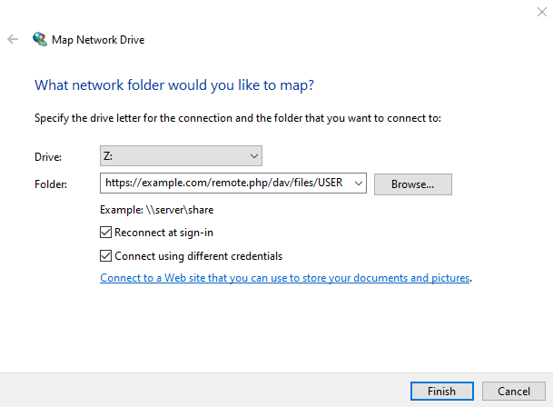

=====================================
Accessing ownCloud Files Using WebDAV
=====================================

ownCloud fully supports the WebDAV protocol, and you can
connect and synchronize with your ownCloud files over WebDAV.  In this 
chapter you will learn how to connect Linux, Mac OS X, Windows, and mobile 
devices to your ownCloud server via WebDAV. Before we get into configuring 
WebDAV, let's take a quick look at the recommended way of connecting client 
devices to your ownCloud servers.

ownCloud Desktop and Mobile Clients
-----------------------------------

The recommended method for keeping your desktop PC synchronized with your 
ownCloud server is by using the `ownCloud Desktop Client 
<http://doc.owncloud.org/desktop/1.7/>`_. You can configure the ownCloud client 
to save files in any local directory you want, and you choose which directories 
on the ownCloud server to sync with. The client displays the current connection 
status and logs all activity, so you always know which remote files have been 
downloaded to your PC, and you can verify that files created and updated on your 
local PC are properly synchronized with the server.

The recommended method for syncing your ownCloud server with Android and 
Apple iOS devices is by using the `ownCloud mobile apps 
<http://owncloud.org/install/#mobile>`_.

To connect to your ownCloud server with the **ownCloud** mobile apps, use the 
base URL and folder only::

    example.org/owncloud

In addition to the mobile apps provided by ownCloud, you can use other apps to 
connect to ownCloud from your mobile device using WebDAV. `WebDAV Navigator`_ is 
a good (proprietary) app for `Android devices`_, `iPhones`_, and `BlackBerry 
devices`_. The URL to use on these is::

    example.org/owncloud/remote.php/webdav
    
WebDAV Configuration
--------------------

If you prefer, you may also connect your desktop PC to your ownCloud server by 
using the WebDAV protocol rather than using a special client application. Web 
Distributed Authoring and Versioning (WebDAV) is a Hypertext Transfer Protocol 
(HTTP) extension that makes it easy to create, read, and edit files on Web 
servers. With WebDAV you can access your ownCloud shares on Linux, Mac OS X and 
Windows in the same way as any remote network share, and stay synchronized.

.. note:: In the following examples, You must adjust **example.org/** to the
   URL of your ownCloud server installation.

Accessing Files Using Linux
---------------------------

You can access files in Linux operating systems using the following methods:

Accessing Files with GNOME and Nautilus File Manager
~~~~~~~~~~~~~~~~~~~~~~~~~~~~~~~~~~~~~~~~~~~~~~~~~~~~

Use the ``davs://`` protocol to connect the Nautilus file manager to your 
ownCloud share::

  davs://example.org/owncloud/remote.php/webdav

.. note:: If your server connection is not HTTPS-secured, use `dav://` instead of `davs://`.

.. image:: ../images/webdav_gnome3_nautilus.png

Accessing Files with KDE and Dolphin File Manager
~~~~~~~~~~~~~~~~~~~~~~~~~~~~~~~~~~~~~~~~~~~~~~~~~

To access your ownCloud files using the Dolphin file manager in KDE, use 
the ``webdav://`` protocol::

    webdav://example.org/owncloud/remote.php/webdav

.. image:: ../images/webdav_dolphin.png

You can create a permanent link to your ownCloud server:

1. Open Dolphin and click "Network" in the left hand "Places" column.
2. Click on the icon labeled **Add a Network Folder**.
   The resulting dialog should appear with WebDAV already selected.
3. If WebDAV is not selected, select it.
4. Click **Next**.
5. Enter the following settings:

   * Name: The name you want to see in the **Places** bookmark, for example ownCloud.

   * User: The ownCloud username you used to log in, for example admin.
   
   * Server: The ownCloud domain name, for example **example.org** (without 
     **http://** before or directories afterwards).
   * Folder -- Enter the path ``owncloud/remote.php/webdav``.
6. (Optional) Check the "Create icon checkbox" for a bookmark to appear in the 
   Places column.
7. (Optional) Provide any special settings or an SSL certificate in the "Port & 
   Encrypted" checkbox.

Creating WebDAV Mounts on the Linux Command Line
------------------------------------------------

You can create WebDAV mounts from the Linux command line. This is useful if you 
prefer to access ownCloud the same way as any other remote filesystem mount.  
The following example shows how to create a personal mount and have it mounted 
automatically every time you log in to your Linux computer.

1. Install the ``davfs2`` WebDAV filesystem driver, which allows you to mount 
   WebDAV shares just like any other remote filesystem. Use this command to 
   install it on Debian/Ubuntu::
   
    # apt-get install davfs2
    
2. Use this command to install it on CentOS, Fedora, and openSUSE::

    # yum install davfs2    

3. Add yourself to the ``davfs2`` group::

    # usermod -aG davfs2 <username>

3. Then create an ``owncloud`` directory in your home directory for the 
   mountpoint, and ``.davfs2/`` for your personal configuration file::
   
    $ mkdir ~/owncloud
    $ mkdir ~/.davfs2
    
4. Copy ``/etc/davfs2/secrets`` to ``~/.davfs2`` :: 

    # cp  /etc/davfs2/secrets ~/.davfs2/secrets 
   
5. Set yourself as the owner and make the permissions read-write owner only::
    
    # chown <username>:<username>  ~/.davfs2/secrets
    # chmod 600 ~/.davfs2/secrets
 
6. Add your ownCloud login credentials to the end of the ``secrets`` file, 
   using your ownCloud server URL and your ownCloud username and password::

    example.org/owncloud/remote.php/webdav <username> <password>

7. Add the mount information to ``/etc/fstab``::

    example.org/owncloud/remote.php/webdav /home/<username>/owncloud 
    davfs user,rw,auto 0 0

8. Then test that it mounts and authenticates by running the following 
   command. If you set it up correctly you won't need root permissions::

    $ mount ~/owncloud
    
9. You should also be able to unmount it::
 
    $ umount ~/owncloud
    
Now every time you login to your Linux system your ownCloud share should 
automatically mount via WebDAV in your ``~/owncloud`` directory. If you 
prefer to mount it manually, change ``auto`` to ``noauto`` in 
``/etc/fstab``.

Known Issues
~~~~~~~~~~~~

**Problem:** Resource temporarily unavailable

**Solution:** If you experience trouble when you create a file in the directory, 
edit ``/etc/davfs2/davfs2.conf`` and add::

    use_locks 0

**Problem:** Certificate warnings

**Solution:** If you use a self-signed certificate, you will get a warning. To 
change this, you need to configure ``davfs2`` to recognize your certificate. 
Copy ``mycertificate.pem`` to ``/etc/davfs2/certs/``. Then edit 
``/etc/davfs2/davfs2.conf`` and uncomment the line ``servercert``. Now add the 
path of your certificate as in this example::

 servercert   /etc/davfs2/certs/mycertificate.pem

Accessing Files Using Mac OS X
------------------------------

.. note:: The Mac OS X Finder suffers from a `series of implementation problems 
   <http://sabre.io/dav/clients/finder/>`_ and should only be used if the 
   ownCloud server runs on **Apache** and **mod_php**.

To access files through the Mac OS X Finder:

1. Choose **Go > Connect to Server**.

  The "Connect to Server" window opens.

2. Specify the address of the server in the **Server Address** field.

  .. image:: ../images/osx_webdav1.png

  For example, the URL used to connect to the ownCloud server 
  from the Mac OS X Finder is::

    http://example.org/owncloud/remote.php/webdav

  .. image:: ../images/osx_webdav2.png

3. Click **Connect**.

  The device connects to the server.

For added details about how to connect to an external server using Mac OS X, 
check the `vendor documentation 
<http://docs.info.apple.com/article.html?path=Mac/10.6/en/8160.html>`_

Accessing Files Using Microsoft Windows
---------------------------------------

It is best to use a suitable WebDAV client from the
`WebDAV Project page <http://www.webdav.org/projects/>`_ .

If you must use the native Windows implementation, you can map ownCloud to a new 
drive. Mapping to a drive enables you to browse files stored on an ownCloud 
server the way you would files stored in a mapped network drive.

Using this feature requires network connectivity. If you want to store your 
files offline, use the ownCloud Desktop Client to sync all files on your 
ownCloud to one or more directories of your local hard drive.

.. note:: Prior to mapping your drive, you must permit the use of Basic
  Authentication in the Windows Registry. The procedure is documented in
  KB841215_ and differs between Windows XP/Server 2003 and Windows Vista/7.
  Please follow the Knowledge Base article before proceeding, and follow the
  Vista instructions if you run Windows 7.

.. _KB841215: http://support.microsoft.com/kb/841215

Mapping Drives With the Command Line
~~~~~~~~~~~~~~~~~~~~~~~~~~~~~~~~~~~~

The following example shows how to map a drive using the command line.  To map 
the drive:

1. Open a command prompt in Windows.
2. Enter the following line in the command prompt to map to the computer Z 
   drive::

    net use Z: https://<drive_path>/remote.php/webdav /user:youruser 
    yourpassword

  where <drive_path> is the URL to your ownCloud server.

For example: ``net use Z: https://example.org/owncloud/remote.php/webdav 
/user:youruser yourpassword``

  The computer maps the files of your ownCloud account to the drive letter Z.

.. note:: Though not recommended, you can also mount the ownCloud server
     using HTTP, leaving the connection unencrypted.  If you plan to use HTTP
     connections on devices while in public place, we strongly recommend using a 
     VPN tunnel to provide the necessary security.

An alternative command syntax is::

  net use Z: \\example.org@ssl\owncloud\remote.php\webdav /user:youruser 
  yourpassword

You can also mount your ownCloud via HTTP, leaving the connection unencrypted.

Mapping Drives With Windows Explorer
~~~~~~~~~~~~~~~~~~~~~~~~~~~~~~~~~~~~

To map a drive using the Microsoft Windows Explorer:

1. Migrate to your computer in Windows Explorer.
2. Right-click on **Computer** entry and select **Map network drive...** from 
   the drop-down menu.
3. Choose a local network drive to which you want to map ownCloud.
4. Specify the address to your ownCloud instance, followed by 
   **/remote.php/webdav**.

  For example::

    https://example.org/owncloud/remote.php/webdav

.. note:: For SSL protected servers, check **Reconnect at logon** to ensure
     that the mapping is persistent upon subsequent reboots. If you want to 
     connect to the ownCloud server as a different user, check **Connect using 
     different credentials**.

   **Mapping WebDAV on Windows Explorer**

5. Click the ``Finish`` button.

  Windows Explorer maps the network drive, making your ownCloud instance 
  available.

Accessing Files Using Cyberduck
-------------------------------

`Cyberduck <https://cyberduck.io/?l=en>`_ is an open source FTP and SFTP, 
WebDAV, OpenStack Swift, and Amazon S3 browser designed for file transfers on 
Mac OS X and Windows.

.. note:: This example uses Cyberduck version 4.2.1.

To use Cyberduck:

1. Specify a server without any leading protocol information. For example:

  ``example.org``

2. Specify the appropriate port.  The port you choose depends on whether or not
your ownCloud server supports SSL. Cyberduck requires that you select a
different connection type if you plan to use SSL.  For example:

  80 (for WebDAV)
  
  443 (for WebDAV (HTTPS/SSL))

3. Use the 'More Options' drop-down menu to add the rest of your WebDAV URL into 
the 'Path' field. For example:

  ``remote.php/webdav``

Now Cyberduck enables file access to the ownCloud server.

Known Problems
~~~~~~~~~~~~~~

**Problem**
  Windows does not connect using HTTPS.

**Solution 1**
  The Windows WebDAV Client might not support Server Name Indication (SNI) on
  encrypted connections. If you encounter an error mounting an SSL-encrypted
  ownCloud instance, contact your provider about assigning a dedicated IP 
  address for your SSL-based server.

**Solution 2**
  The Windows WebDAV Client might not support TSLv1.1 / TSLv1.2 connections.
  If you have restricted your server config to only provide TLSv1.1 and above
  the connection to your server might fail. Please refer to the WinHTTP_
  documentation for further information.

.. _WinHTTP: https://msdn.microsoft.com/en-us/library/windows/desktop/aa382925.aspx#WinHTTP_5.1_Features

**Problem**
  You receive the following error message:
  **Error 0x800700DF: The file size exceeds the limit allowed and cannot be 
  saved.**

**Solution**
  Windows limits the maximum size a file transferred from or to  a WebDAV share
  may have.  You can increase the value **FileSizeLimitInBytes** in
  **HKEY_LOCAL_MacHINE\SYSTEM\CurrentControlSet\Services\WebClient\Parameters**
  by clicking on **Modify**.

  To increase the limit to the maximum value of 4GB, select **Decimal**, enter
  a value of **4294967295**, and reboot Windows or restart the **WebClient**
  service.

**Problem**
  Accessing your files from Microsoft Office via WebDAV fails.

**Solution**
  Known problems and their solutions are documented in the KB2123563_ article.

.. _KB2123563: https://support.microsoft.com/kb/2123563
.. _in your file manager: http://en.wikipedia.org/wiki/Webdav#WebDAV_client_applications
.. _ownCloud sync clients: http://doc.owncloud.org/desktop/1.7/
.. _Mount ownCloud to a local folder without sync: http://owncloud.org/use/webdav/
.. _Android: http://github.com/owncloud/android
.. _WebDAV Navigator: http://seanashton.net/webdav/
.. _Android devices: https://play.google.com/store/apps/details?id=com.schimera.webdavnavlite
.. _iPhones: https://itunes.apple.com/app/webdav-navigator/id382551345
.. _BlackBerry devices: http://appworld.blackberry.com/webstore/content/46816
