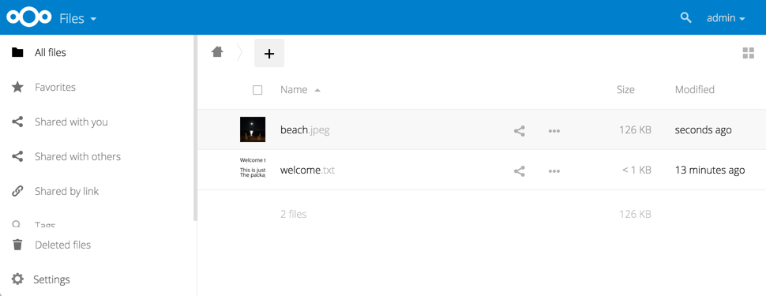
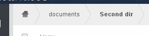
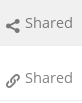
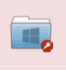
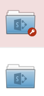
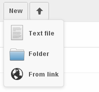
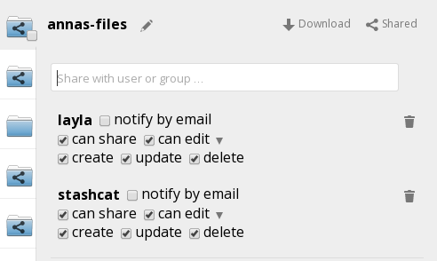
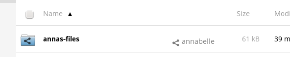
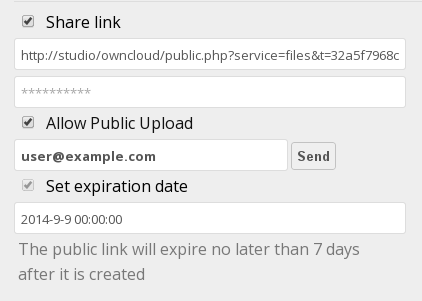

=====================================================
Accessing your Files Using the ownCloud Web Interface
=====================================================

You can access your ownCloud files with the ownCloud web interface and create, 
preview, edit, delete, share, and re-share files. Your ownCloud administrator 
has the option to disable these features, so if any of them are missing on your 
system ask your server administrator.

   
ownCloud can display thumbnail previews for image files, MP3 covers, 
and text files, if this enabled by your server administrator. Hover your cursor 
over a file or folder to expose the controls for the following operations:

Favorites
  Click the star to the left of the file icon to mark it as a favorite.

Pencil icon
  Rename a file or folder. This does not alter the filename on the original 
  document.

Download
  Download the file to your computer.
  
Versions
  Displays older versions, if there are any, and you can revert to an older 
  file version.
  
Edit
  The Edit button appears on files that are editable inside ownCloud, in the 
  Documents app. Supported file formats are ``.odt``, ``.doc``, and ``.docx``.

Share
  Share the file or folder with a group or other users, and create public 
  shares with hyperlinks.

Trash
  Delete the selected file or folder, or unshare a shared file or folder.

Previewing Files
----------------

You can display uncompressed text files, OpenDocument files, videos, and image files in 
the ownCloud embedded viewers  by clicking on the file name. There may be other file types 
you can preview if your ownCloud administrator has enabled them. If ownCloud cannot 
display a file, it starts a download process and downloads the file to your computer. 

Video streaming by the native ownCloud video player depends on your Web browser and the 
video format. If your ownCloud administrator has enabled video streaming, and it doesn't 
work in your Web browser, it may be a browser issue.  

Navigating Inside Your ownCloud
-------------------------------

Navigating through folders in ownCloud is as simple as clicking on a folder to 
open it and using the back button on your browser to move to a previous level. 
ownCloud also provides a navigation bar at the top of the Files field for quick 
navigation.

    **Navigation bar**

The navigation bar functions as a "breadcrumb" locator.  It displays your
current directory and enables you to migrate back to one of the upper
directories or, using the home icon, to navigate back into your root folder.

Overlay Icons Show Sharing Status
---------------------------------
Any folder that has been shared is marked with the ``Shared`` overlay icon. 
Public link shares are marked with a chain link. Un-shared folders are blank.

If your ownCloud server is the Enterprise Subscription, you may also have access 
to Sharepoint and Windows Network Drive file shares. These also have special 
overlay icons, and a red plugin means you have to enter a login to get access to 
the share.

Creating or Uploading Files and Directories
-------------------------------------------

ownCloud enables you to create new files or folders directly in an ownCloud
folder by clicking on the *New* button in the Files app.

    **New button options**

The *New* button provides the following three options from which to choose:

Text file
  Creates a simple text file and adds the file to your current folder.
  
Folder
  Creates a new folder in the current folder.
  
From link
  Downloads a file from a URL that you type or copy into the form field, and 
  places it into the current folder.
 
Up arrow
  The upward-point arrow is for uploading files from your computer into 
  ownCloud.

You can also upload files by dragging and dropping them from your file manager.
  
Selecting Files or Folders
--------------------------

You can select one or more files or folders by clicking on the small thumbnails
or icons that represent them. When you select a file or folder, a small
checkbox is populated with a check to indicate that it is selected.  To select
all files in the current directory, you can click on the checkbox located at
the top of the Files app field, above the first file or folder on the list.

If you select multiple files, you can delete all of the selected files or
download them as a ZIP file by using the ``Delete`` or ``Download`` buttons at
the top right side of the Files app field.

.. note:: If the ``Download`` button is not visible, the administrator has
   disabled this feature.  Contact your administrator for further guidance.

Filtering the File Application View
-----------------------------------

ownCloud enables you to view files in the File Application View using filter 
options located in the Apps Information Field. This feature enables you to 
quickly and easily view and manage files based on their share status.

You can click on any of the filter options to view the files as follows:

All files
  The default view; displays all files that you have access to.
  
Favorites
  Files or folders marked with the yellow star. 

Shared with you
  Displays all files shared with you by another user or group.

Shared with others
  Displays all files that you have shared with other users or groups.

Shared by link
  Displays all files that are shared by you via public link.
  
External Storage
  Files that you have access to on external storage devices and services such 
  as Dropbox, Google, and Amazon S3.

Moving Files
------------

Using the ownCloud web interface, you can move files and folders by dragging
and dropping them into any directory.

Sharing Files Locally
---------------------

When enabled by your administrator, you can share files or folders on ownCloud 
with a local user, group, or any person online with a public link. Shared files 
and folders are labeled with the triangular share icon, and the status *Shared* 
in the file or folder row.

To create a local share with other users or groups on your ownCloud server:

1. Hover your cursor over an item on the Files page
2. Click the **Share** icon

The Share dialog box opens to show the following options:

  **Share dialog box**
  
Type the name of the user or group that you want to share with. If you want to 
share with more than one, you have to create each share separately. Check the 
permissions you want the user or group to have, and optionally send them an 
email notification. 

.. note:: Users must enter their email addresses on their Personal pages for 
   email notifications to work
   
Your new share appears on user's Files pages marked with a Share icon, and the 
name of the file owner.

  **Shared file**

When you want to revoke a share, simply click the Trashcan icon next to the 
name of the appropriate user or group in the Shared dialog.    
    
Creating a Public Link Share
----------------------------

You can share files outside of your organization with people who are not users 
on your ownCloud server by creating a public share link. Open the Share dialog 
and check Share Link.

  **Public share box**

This creates a public URL that anyone can use to access the share. You have the
options to send an email notification, protect it with a password, and put an 
expiration date on it. Your ownCloud administrator has the option to require 
passwords and expiration dates. 

Change in Share Expiration Date
-------------------------------

In older versions of ownCloud, you could set an expiration date on both local 
and public shares. Now you can set an expiration date only on public shares, 
and local shares do not expire when public shares expire. The only way to 
"expire" a local share is to click the trash can icon to un-share your files.

Creating or Connecting to a Federated Cloud Sharing Link
--------------------------------------------------------

Federated Cloud Sharing, introduced in ownCloud 7 as Server-to-Server sharing, 
allows you to mount file shares from remote ownCloud servers, and manage them 
just like a local share. In ownCloud 8 the process for creating a new 
sharing link is easier and more streamlined. See :doc:`federated_cloud_sharing` 
to learn to how to create and connect to new Federated Cloud shares.
