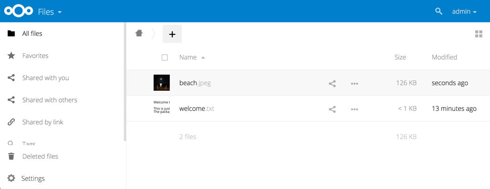
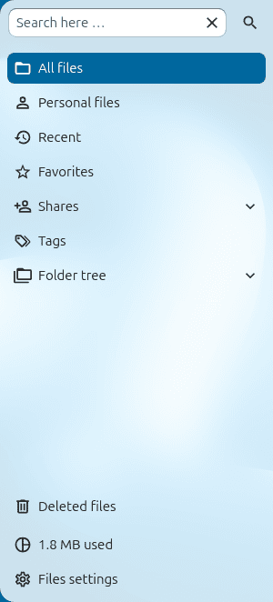
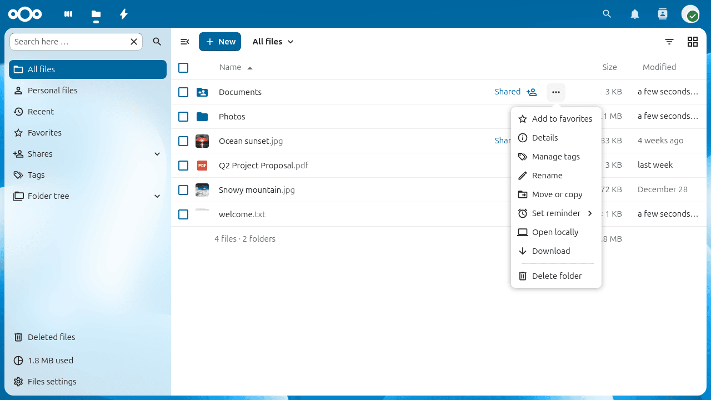
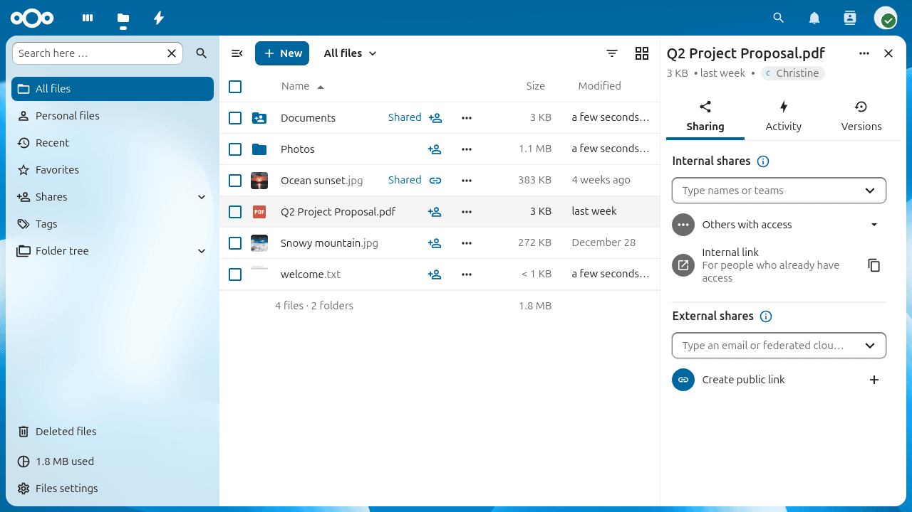
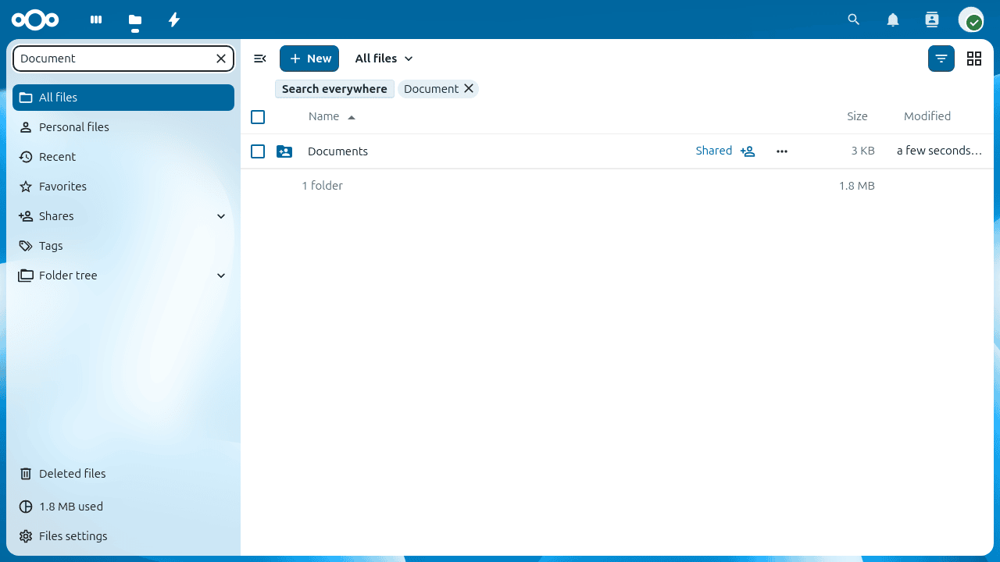
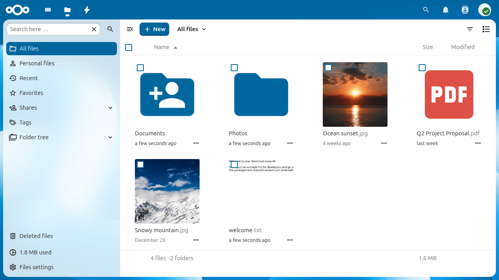
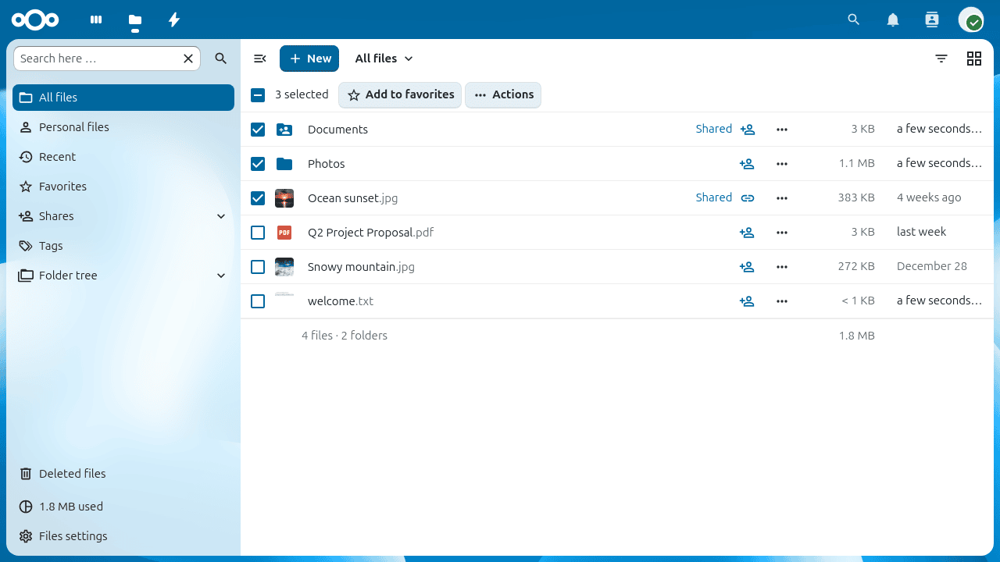
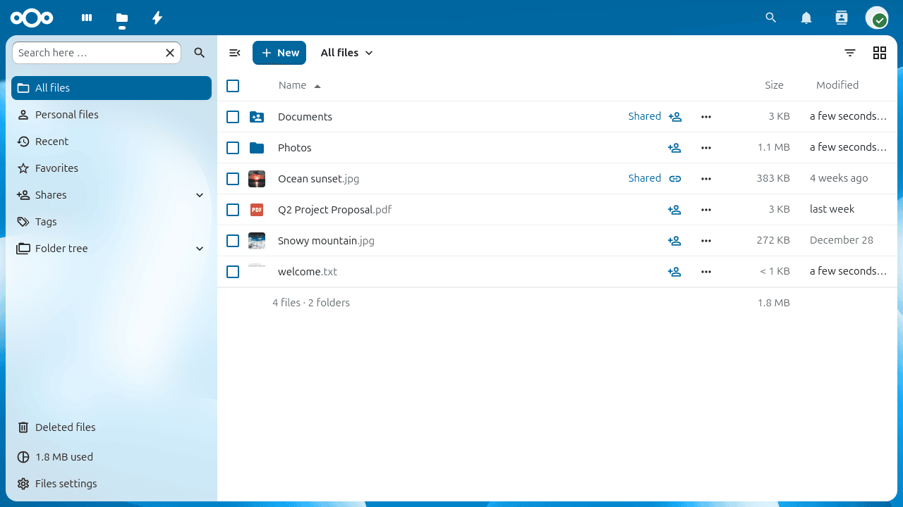

======================================================
Accessing your files using the Nextcloud web interface
======================================================

You can access your Nextcloud files with the Nextcloud Web interface and create,
preview, edit, delete, share, and re-share files. Your Nextcloud administrator
has the option to disable these features, so if any of them are missing on your
system ask your server administrator.

Navigating your files
---------------------

The left sidebar lets you switch between different views of your files. Click a
folder name in the file list to open it, and use your browser's back button or
the breadcrumb bar at the top of the file list to return to a previous level.

The sidebar contains the following entries:

All files
  The default view, showing every file and folder you have access to.

Recent
  Files you have viewed or modified recently.

Favorites
  Files and folders you have starred.

Shares
  Files shared with you, by you, or via a public link — all in one view.

Tags
  Browse files by system tag. See :doc:`tagging` for details on assigning
  tags and filtering your files.

Deleted files
  Files you have deleted that are still recoverable from the trash bin.

When you navigate into a folder, a breadcrumb trail appears at the top of the
file list so you can jump back to any parent folder with a single click:

File controls
-------------

Nextcloud displays thumbnail previews for images, text files, and other
supported types — the exact list depends on your server configuration.

Each file and folder row has a three-dot action menu button. Click it to
rename, move, copy, download, delete, or mark the item as a favorite.
Files that have been marked as a favorite display a star icon:

.. note:: You can quickly find all your favorites using the **Favorites**
   entry in the left sidebar.

Details sidebar
---------------

Select **Details** from the three-dot action menu to open the details sidebar. The sidebar
shows information about the selected file and provides tabbed access to its
activity history, sharing options, and version history:

Activity and comments
---------------------

The **Activity** tab in the details sidebar shows a chronological log of
changes to the file — uploads, edits, shares, and comments. You can leave
a comment directly in this tab; comments are visible to everyone who has
access to the file:

Searching and filtering
-----------------------

Use the search bar at the top of the page to find files by name across all your
files, or type in the search field inside the left sidebar to filter the current
view:

Grid view
---------

The Files app defaults to a list view. Click the grid toggle button above the
file list to switch to a thumbnail grid, which is useful for
browsing image folders:

Click the button again to return to the list view.

Uploading and creating files
----------------------------

Click the **+** button near the top of the file list to upload files from your
computer or create new items in the current folder:

The menu offers the following options:

Upload file
  Opens a file picker to upload one or more files from your computer. You can
  also drag and drop files directly from your file manager onto the file list.

Upload folder
  Uploads an entire folder, preserving its structure.

New folder
  Creates a new empty folder in the current location.

New document / New spreadsheet / New presentation
  Creates a new file using the built-in Nextcloud Text or Office editor,
  if enabled by your administrator.

Selecting files or folders
--------------------------

Click the checkbox to the left of a file or folder to select it. To select all
items in the current folder, click the checkbox in the column header.

With one or more items selected, action buttons appear at the top of the list.
You can delete or download all selected items at once. Downloading multiple items
produces a ZIP archive.

.. note:: If the **Download** button is not visible, your administrator has
   disabled this feature.

Sharing status icons
--------------------

Folders and files that have been shared display a **Shared** badge on their
thumbnail or icon. Items shared via a public link also show a chain-link icon.
Items that are not shared have no additional indicator.

See :doc:`sharing` for instructions on creating and managing shares.

Moving files
------------

Drag any file or folder and drop it onto a destination folder to move it.
You can also use **Move or copy** from the three-dot action menu to move or copy
items to a folder you choose from a picker dialog.

Previewing files
----------------

Click a file name to open a preview directly in Nextcloud. Supported formats
include images, plain text, PDF, and — depending on your server — office
documents and audio files. If Nextcloud cannot preview a file format, it
downloads the file to your computer instead.

Video player
------------

You can play videos directly in Nextcloud by clicking the file. Playback
depends on your browser and the video codec. See
`MDN: Supported media formats <https://developer.mozilla.org/en-US/docs/Web/HTML/Supported_media_formats#Browser_compatibility>`_
for a compatibility reference.

Connecting to a Federation Share
---------------------------------

Federated Cloud Sharing lets you mount file shares from remote Nextcloud
servers and manage them just like local shares. See
:doc:`federated_cloud_sharing` to learn how to create and connect to
Federated Cloud shares.
