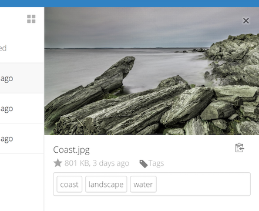
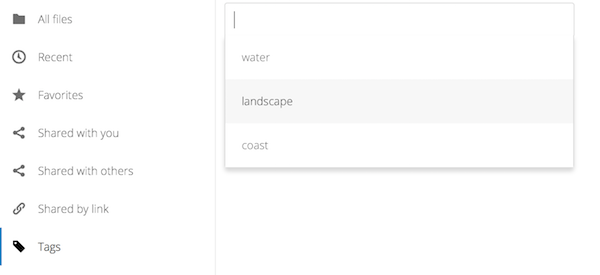
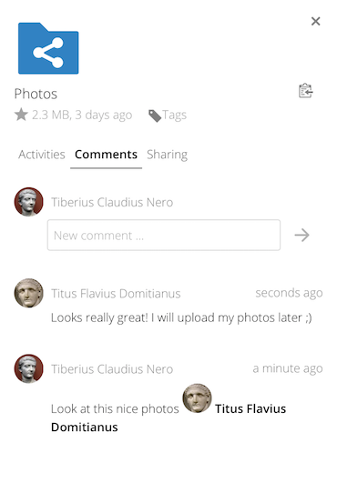
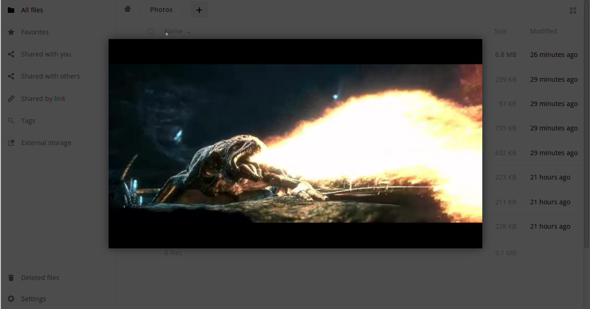

=====================================================
Accessing your Files Using the ownCloud Web Interface
=====================================================

You can access your ownCloud files with the ownCloud Web interface and create, 
preview, edit, delete, share, and re-share files. Your ownCloud administrator 
has the option to disable these features, so if any of them are missing on your 
system ask your server administrator.

.. figure:: ../images/files_page.png
   :scale: 75%
   :alt: The Files view screen.
   
Tagging Files
-------------

New for 9.0: file tagging. You can assign tags to files. To create tags, open a 
file to the Details view. Then type your tags. To enter more than one tag press 
the return key after creating each tag. All tags are system tags, and are 
shared by all users on your ownCloud server.

   
Then use the Tags filter on the left sidebar to filter files by tags.

 
Comments
--------
 
New for 9.0: Comments. Use the Details view to add and read comments on any 
file or folder. Comments are visible to everyone who has access to the file.

  
Video Player
------------

You can play videos in ownCloud with the Video Player app by simply clicking on 
the file. Video streaming by the native ownCloud video player depends on your Web browser 
and the video format. If your ownCloud administrator has enabled video 
streaming, and it doesn't work in your Web browser, it may be a browser issue. See https://developer.mozilla.org/en-US/docs/Web/HTML/Supported_media_formats#Browser_compatibility for supported multimedia formats in Web browsers. 

  
File Controls
-------------
   
ownCloud can display thumbnail previews for image files, MP3 covers, 
and text files, if this enabled by your server administrator. Hover your cursor 
over a file or folder to expose the controls for the following operations:

Favorites
  Click the star to the left of the file icon to mark it as a favorite, and 
  quickly find all of your favorites with the Favorites filter on the left 
  sidebar.
  
.. figure:: ../images/files_page-1.png
   :alt: Marking Favorite files.
  
Share
  Share the file or folder with a group or other users, and create public 
  shares with hyperlinks. You can also see who you have shared with already, 
  and revoke shares by clicking the trash can icon. 
  
.. note:: New in 9.0, you can see all re-shares of your original file shares.

  If username auto-completion 
  is enabled, when you start typing the user or group name ownCloud will 
  automatically complete it for you. If your administrator has enabled email 
  notifications, you can send an email notification of the new share from the 
  sharing screen.
  
.. figure:: ../images/files_page-2.png
   :alt: Sharing files.
   
You have five share permissions:
 
* Can share; allows the users you share with to re-share.
* Can edit; allows the users you share with to edit your shared files, and to collaborate using the Documents app.
* Create; allows the users you share with to create new files and add them to the share.
* Change; allows uploading a new version of a shared file and replacing it.
* Delete; allows the users you share with to delete shared files.

Overflow Menu  
  The Overflow menu (three dots) displays file details, and allows you to 
  rename, download, or delete files.
  
.. figure:: ../images/files_page-3.png
   :alt: Overflow menu.
   
   The Details view shows Activities, Sharing, and Versions information. 
  

 
Previewing Files
----------------

You can display uncompressed text files, OpenDocument files, videos, and image 
files in the ownCloud embedded viewers by clicking on the file name. There may 
be other file types you can preview if your ownCloud administrator has enabled 
them. If ownCloud cannot display a file, it starts a download process and 
downloads the file to your computer. 

Navigating Inside Your ownCloud
-------------------------------

Navigating through folders in ownCloud is as simple as clicking on a folder to 
open it and using the back button on your browser to move to a previous level. 
ownCloud also provides a navigation bar at the top of the Files field for quick 
navigation.

Sharing Status Icons
--------------------

Any folder that has been shared is marked with the ``Shared`` overlay icon. 
Public link shares are marked with a chain link. Un-shared folders are blank.

If your ownCloud server is the Enterprise edition, you may also have access 
to Sharepoint and Windows Network Drive file shares. These have special status 
icons. An icon with a red plugin and background means you have to enter a login 
to get access to the share.

.. figure:: ../images/users-overlays-win-net-drive.png

.. figure:: ../images/users-overlays-sharepoint.png

Creating or Uploading Files and Directories
-------------------------------------------

Upload or create new files or folders directly in an ownCloud folder by clicking 
on the *New* button in the Files app.

The *New* button provides the following options:

Up arrow
  Upload files from your computer into ownCloud. You can also upload files by 
  dragging and dropping them from your file manager.

Text file
  Creates a new text file and adds the file to your current folder.
  
Folder
  Creates a new folder in the current folder.
  
Selecting Files or Folders
--------------------------

You can select one or more files or folders by clicking on their checkboxes.  To 
select all files in the current directory, click on the checkbox located at the 
top of the files listing.

When you select multiple files, you can delete all of them, or download them as 
a ZIP file by using the ``Delete`` or ``Download`` buttons that appear at the 
top.

.. note:: If the ``Download`` button is not visible, the administrator has
   disabled this feature.

Filtering the Files View
------------------------

The right sidebar on the Files page contains several filters for quickly sorting 
and managing your files.

All files
  The default view; displays all files that you have access to.
  
Favorites
  Files or folders marked with the yellow star. 

Shared with you
  Displays all files shared with you by another user or group.

Shared with others
  Displays all files that you have shared with other users or groups.

Shared by link
  Displays all files that are shared by you via public link.
  
External Storage
  Files that you have access to on external storage devices and services such 
  as Dropbox, Google, and Amazon S3.

Moving Files
------------

You can move files and folders by dragging and dropping them into any directory.

Change in Share Expiration Date
-------------------------------

In older versions of ownCloud, you could set an expiration date on both local 
and public shares. Now you can set an expiration date only on public shares, 
and local shares do not expire when public shares expire. The only way to 
"expire" a local share is to click the trash can icon to un-share your files.

Creating or Connecting to a Federation Share Link
-------------------------------------------------

Federated Cloud Sharing allows you to mount file shares from remote ownCloud 
servers, and manage them just like a local share. In ownCloud 8 the process for 
creating a new sharing link is easier and more streamlined. See 
:doc:`federated_cloud_sharing` to learn to how to create and connect to new 
Federated Cloud shares.
