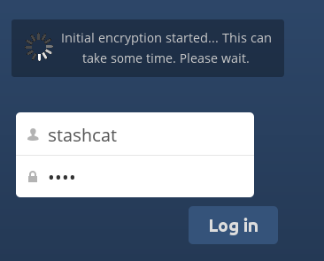
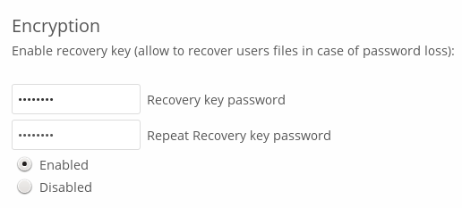
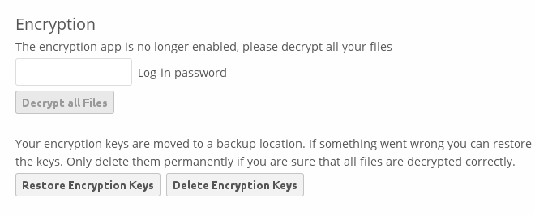

==============================
Encrypting Your ownCloud Files
==============================

ownCloud includes an Encryption app, and when it is enabled by your ownCloud 
administrator all of your ownCloud data files are automatically encrypted. 
Encryption is server-wide, so when it is enabled you cannot choose to keep your 
files unencrypted. You don't have to do anything special, as it uses your 
ownCloud login as the password for your unique private encryption key. Just log 
in and out and manage and share your files as you normally do, and you can 
still change your password whenever you want.

Its main purpose is to encrypt files on remote storage services that are 
connected to your ownCloud server, such as Dropbox and Google Drive. This is an 
easy and seamless way to protect your files on remote storage. You can share 
your remote files through ownCloud in the usual way, however you cannot share 
your encrypted files directly from Dropbox, Google Drive, or whatever remote 
service you are using, because the encryption keys are stored on your ownCloud 
server, and are never exposed to outside service providers. 

If your ownCloud server is not connected to any remote storage services, then 
it is better to use some other form of encryption such as file-level or whole 
disk encryption. Because the keys are kept on your ownCloud server, it is 
possible for your ownCloud admin to snoop in your files, and if the server is 
compromised the intruder may get access to your files. (Read 
`How ownCloud uses encryption to protect your data  
<https://owncloud.org/blog/how-owncloud-uses-encryption-to-protect-your-data/>`_ 
to learn more.)

Using Encryption
----------------

ownCloud encryption is pretty much set it and forget it, but you have a few 
options you can use. 

When your ownCloud admin enables encryption for the first time, you must log 
out and then log back in to create your encryption keys and encrypt your files. 
When encryption has been enabled on your ownCloud server you will see a yellow 
banner on your Files page warning you to log out and then log back in.

.. figure:: ../images/encryption1.png

When you log back it takes a few minutes to work, depending on how many 
files you have, and then you are returned to your default ownCloud page.

.. note:: You must never lose your ownCloud password, because you will lose 
   access to your files. Though there is an optional recovery option that your 
   ownCloud administrator may enable; see the Recovery Key Password section 
   (below) to learn about this.
   
Sharing Encrypted Files
-----------------------

Only users who have private encryption keys have access to shared encrypted 
files and folders. Users who have not yet created their private encryption keys 
will not have access to encrypted shared files; they will see folders and 
filenames, but will not be able to open or download the files. They will see a 
yellow warning banner that says "Encryption App is enabled but your keys are not 
initialized, please log-out and log-in again."

Share owners may need to re-share files after encryption is enabled; users 
trying to access the share will see a message advising them to ask the share 
owner to re-share the file with them. For individual shares, un-share and 
re-share the file. For group shares, share with any individuals who can't access 
the share. This updates the encryption, and then the share owner can remove the 
individual shares.

Recovery Key Password
~~~~~~~~~~~~~~~~~~~~~

If your ownCloud administrator has enabled the recovery key feature, you can 
choose to use this feature for your account. If you enable "Password recovery" 
the administrator can read your data with a special password. This feature 
enables the administrator to recover your files in the event you lose your 
ownCloud password. If the recovery key is not enabled, then there is no way to 
restore your files if you lose your login password.

Removing Encryption
-------------------

If your ownCloud administrator elects to disable the Encryption app, you will 
be prompted to go to your Personal page and enter your password on the 
Encryption form to decrypt your files.

If your files decrypt successfully, you can click the ``Delete encryption 
keys`` button. There is no reason to save them after disabling decryption, 
because if encryption is enabled again you'll generate a new set of keys. Your 
keys are preserved in case something goes wrong with the decryption and you 
need your keys to access your files.

Files Not Encrypted
-------------------

Only the data in your files is encrypted, and not the filenames or folder 
structures. These files are never encrypted:

- Old files in the trash bin.
- Image thumbnails from the Gallery app.
- Previews from the Files app.
- The search index from the full text search app.
- Third-party app data

There may be other files that are not encrypted; only files that are exposed to 
third-party storage providers are guaranteed to be encrypted.

Change Private Key Password
~~~~~~~~~~~~~~~~~~~~~~~~~~~

This option is only available if your log-in password, but not your encryption
password, was changed by your administrator. This can occur if your ownCloud
provider uses a external user back-end (for example, LDAP) and changed your
login password using that back-end configuration. In this case, you can set
your encryption password to your new login password by providing your old and
new login password. The Encryption app works only if your login password and
your encryption password are identical.
