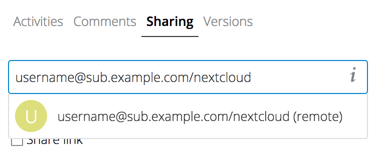
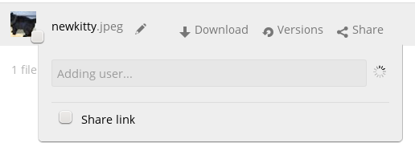
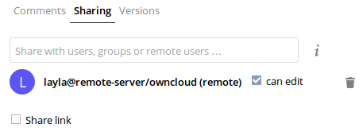
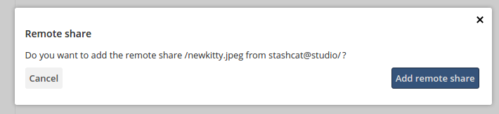
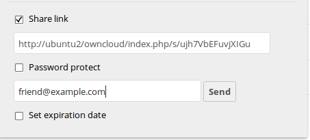
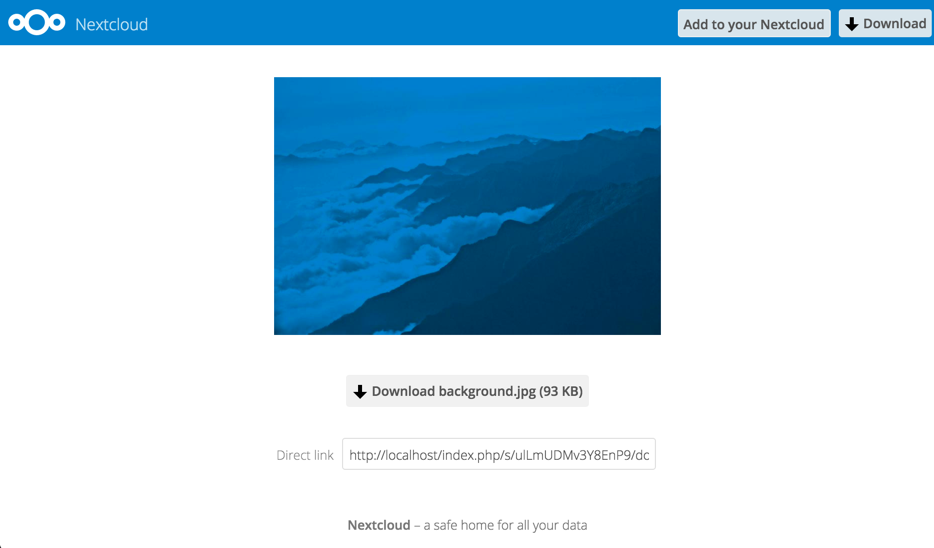
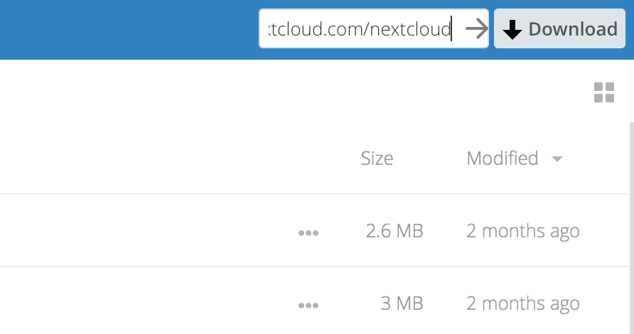

=============================
Using Federated Cloud Sharing
=============================

Federated Cloud Sharing, introduced in ownCloud 7 as Server-to-Server sharing, 
allows you to mount file shares from remote ownCloud servers, in effect 
creating your own cloud of ownClouds. You can create direct share links with 
users on other ownCloud servers.

Creating a New Federated Cloud Share
------------------------------------

Federated Cloud Sharing is enabled on new or upgraded ownCloud installations
by default. (See "Configuring Federated Cloud Sharing" in the ownCloud Server 
Administration Manual.) Follow these steps to create a new share:

1. Go to your ``Files`` page and click the Share icon on the file or directory 
you want to share. Enter the username and URL of the remote user in this form: 
``<username>@<oc-server-url>``. In this example, that is 
``layla@remote-server/owncloud``. The form automatically echoes the address 
that you type and labels it as "remote".

2. You'll see a status indicator as ownCloud looks for the remote server. 

When your local ownCloud server makes a successful connection with the remote 
ownCloud server you'll see a confirmation.
   

Your recipient on the other end of the link, on the remote ownCloud server, 
will see a dialog asking them to confirm the new share. All they have to do is 
click the **Add remote share** button, and it's done.

Click the Share button anytime to see who you have shared your file with. Remove 
your linked share anytime by clicking the trash can icon. This only unlinks the 
share, and does not delete any files.

Creating a New Federated Cloud Share via Email
----------------------------------------------

What if you do not know the username or URL? Then you can have ownCloud create 
the link for you and email it to your recipient. 

When your recipient receives your email they will have to take a number of 
steps to complete the share link. First they must open the link you sent them in 
a Web browser, and then click the **Add to your ownCloud** button.

The **Add to your ownCloud** button changes to a form field, and your recipient 
needs to enter the URL of their ownCloud server in this field and press the 
return key, or click the arrow.

Next, they will see a dialog asking to confirm. All they have to do is click 
the **Add remote share** button and they're finished.
 
Remove your linked share anytime by clicking the trash can icon. This only 
unlinks the share, and does not delete any files.
