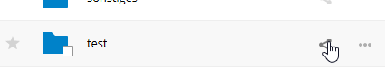
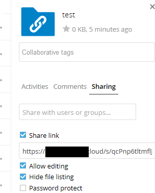
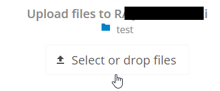
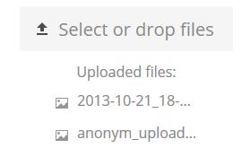

========================
Making anonymous uploads
========================

You may create your own special upload directories so that other people can upload
files to you without having to log in to the server, and without being a Nextcloud
user.
They will not be allowed to see the contents of this directory, or to make any
changes. This is an excellent alternative to sending large attachments via email,
using an FTP server, or using commercial file-sharing services.

Setting up your own file drop
-----------------------------

Go to Files and create or choose the folder, the anonymous upload should be
made to.

Check Share Link, Allow editing, Hide file listing.

Now you can send the link to the upload folder manually or by using the
Nextcloud send function, if your administrator has enabled it.

Uploading files
---------------

Using the anonymous upload function is simple. You receive a link to the upload
folder, click the link, and then you'll see a Nextcloud page with a **Click to
upload** button.

This opens a file picker, and you select the file or directory you want to
upload. You're also able to just drop files into the window.

When your upload is completed, the filenames are listed:

