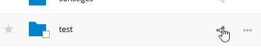
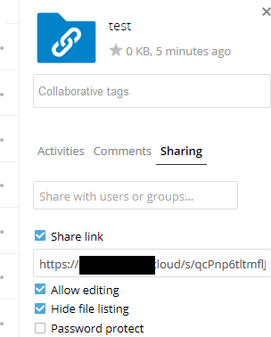
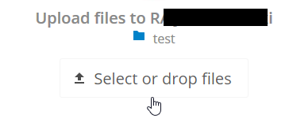
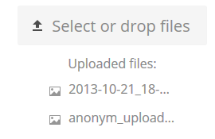

========================
Making anonymous uploads
========================

You may create your own special upload directories so that other people can upload
files to you without logging in to the server or having a Nextcloud account.
Uploaders cannot see the contents of the directory or make any changes. This is
an excellent alternative to sending large attachments via email, using an FTP
server, or using commercial file-sharing services.

Setting up your own file drop
-----------------------------

In the Files app, create or choose the folder to receive anonymous uploads:

Enable **Share Link**, **Allow editing**, and **Hide file listing**:

Now you can send the link to the upload folder manually or by using the
Nextcloud send function, if your administrator has enabled it.

Uploading files
---------------

Using the anonymous upload function is simple. You receive a link to the upload
folder, click the link, and then you'll see a Nextcloud page with a "**Click to
upload**" button:

This opens a file picker, and you select the file or directory you want to
upload. You can also drop files into the window.

When your upload is completed, the filenames are listed:

