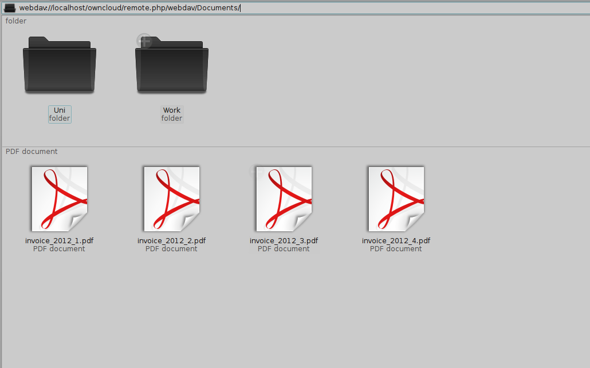
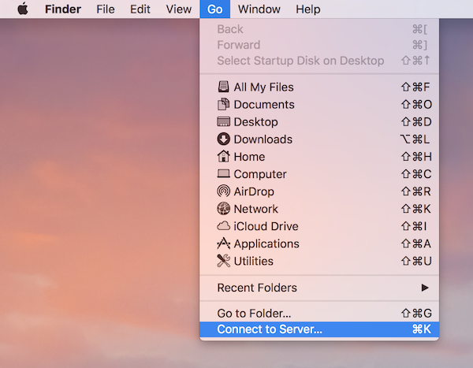
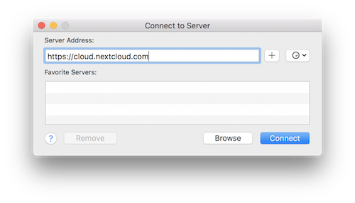

Accessing your Files (WebDav)
=============================

Your ownCloud instance can be accessed on every platform via the web interface. There are also options to integrate it with your desktop.

.. note:: You will have to adjust **youradress.com/** to the URL of your ownCloud server installation

Linux
-----

Gnome 3/Nautilus
~~~~~~~~~~~~~~~~

The URL that you have to use to connect to the owncloud installation in nautilus is::

  dav://youraddress.com/files/webdav.php

.. image:: ../images/gnome3_nautilus_webdav.png

KDE/Dolphin
~~~~~~~~~~~
Click in the adress area and enter::

    dav://youraddress.com/files/webdav.php

or:

1. Open Dolphin and click on where it says Network in the left hand Places column.
2. Click on the icon labeled **Add a Network Folder**.
3. It should come up with WebDAV already selected. Make sure it is and then click **Next**.
4. Enter the following settings:

* Name: The name you’ll see in the **Places** bookmark, for example ownCloud
* User: Your ownCloud username you use to log in, for example admin
* Server: Your ownCloud domain name, for example **youraddress.com** (without **http://** before or directories afterwards).
* Folder: Enter::

        owncloud/files/webdav.php

5. Create icon checkbox: Tick to get a bookmark in the Places column
6. Port & Encrypted checkbox: Leave as it is unless you have special settings or an SSL certificate.

Mounting from command line
~~~~~~~~~~~~~~~~~~~~~~~~~~
1. Install the WebDAV support using the davfs package. On Debian/Ubuntu, you can use::

	sudo apt-get install davfs2

2. Reconfigure davfs2 to allow access to normal users (select Yes when prompted)::

        sudo dpkg-reconfigure davfs2

3. Add the users you want to be able to mount the share to the davfs2 group::

        sudo usermod -aG davfs2 <user>

4. Edit :file:`/etc/fstab` and add the following line for each user who wants to mount the folder (with your details where appropriate)::

        youradress.com/files/webdav.php /home/<username>/owncloud davfs user,rw,noauto 0 0**.

Then, as each user who wants to mount the folder:

1. Create the folders **owncloud/** and **.davfs2/** in your home directory
2. Create the file secrets inside **.davfs2/**, fill it with the following (with your credentials where appropriate)::

        youradress.com/files/webdav.php <username> <password>

3. Ensure the file is only writable by you either through the file manager, or via::

        chmod 600 ~/.davfs2/secrets

4. Run the command::

        mount ~/owncloud

5. To automatically mount the folder on login, add the command you used in step 4 to :file:`./.bashrc`

Known Issues
^^^^^^^^^^^^

**Problem:** Resource temporarily unavailable

**Solution:** If you experience trouble when you create a file in the directory, edit :file:`/etc/davfs2/davfs2.conf` and add::

        use_locks 0

**Problem:** Certificate warnings

**Solution:** If you use a self-signed certificate, you will get a warning. If you are willing to take the risk of a man in the middle attack, run this command instead::

        echo "y" | mount ~/owncloud > /dev/null 2>&1

MacOS
-----

.. note:: Finder suffers from a `series of implementation problems <http://code.google.com/p/sabredav/wiki/Finder>`_ and should only be used if the ownCloud server runs on **Apache** and **mod_php**

In the Finder, choose **Go > Connect to Server,** type the address of the server in the **Server Address** field, and click **Connect**.

The URL that you have to use to connect to the owncloud installation in finder is::

  http://youraddress.com/files/webdav.php

For details, check the respective `vendor documentation`_ at the Apple website.

.. _`vendor documentation`: http://docs.info.apple.com/article.html?path=Mac/10.6/en/8160.html

Windows
-------
For Windows a seperate webdav client is recommended to access the files from your server. Choose one from the `WebDav Project page <http://www.webdav.org/projects/>`_

Should you have to use the native implementation then you can assign ownCloud a drive letter.  This allows you to browse files stored on an ownCloudserver the way you would files stored in a mapped network drive.

Using this feature requires network connectivity. If you want to store
your files offline, use the ownCloud Client to sync all files on your
ownCloud to one or more directories of your local hard drive.

.. note:: Prior to mapping your drive, you will need to permit the use of Basic Authentication in the Windows Registry. The procedure is documented in KB841215_ and differs between Windows XP/Server 2003 and Windows Vista/7. Please follow the Knowledge Base article before proceeding, and follow the Vista instructions if you run Windows 7.

.. _KB841215: http://support.microsoft.com/kb/841215

Mapping via the command line
~~~~~~~~~~~~~~~~~~~~~~~~~~~~

Suppose your ownCloud is installed at **https://www.yourserver.com/owncloud**,
that is, entering this URL in your webbrowser will bring up the login screen.
Running::

  net use Z: https://www.yourserver.com/owncloud/remote.php/webdav /user:youruser yourpassword

will map the files of your ownCloud account to the drive letter Z:. An alternative
syntax is::

  net use Z: \\www.yourserver.com@ssl\owncloud\remote.php\webdav /user:youruser yourpassword

Appending **/persistent** makes the connection persistent across reboots.

You can also mount your ownCloud via HTTP, leaving the connection unencrypted.
Use either of the following syntaxes::

  net use Z: http://www.yourserver.com/owncloud/remote.php/webdav /user:youruser yourpassword
  net use Z: \\www.yourserver.com\owncloud\remote.php\webdav /user:youruser yourpassword

Please note that this allows anyone to sniff your ownCloud data with ease, especially on public WiFi hotspots. Plain HTTP should therefore only be used in conjunction with a VPN tunnel when used on Laptops.

Using Windows Explorer
~~~~~~~~~~~~~~~~~~~~~~

Right-click on **Computer** entry and select **Map network drive...**. Choose a local network drive to map ownCloud to. Finally, enter the address to your ownCloud instance, followed by **/remote.php/webdav**, e.g. ::

  https://www.yourserver.com/owncloud/remote.php/webdav

for an SSL protected server. Check **Reconnect at logon** to make this mapping persistent across reboots. If you want to connect as another user, check **Connect using different credentials**.

.. figure:: ../images/explorer_webdav.png
   :scale: 80%

   Mapping WebDAV on Windows Explorer.

After pressing **Finish**, Windows Explorer will map the network drive and your ownCloud instance should be available

Using Cyberduck (4.2.1)
~~~~~~~~~~~~~~~~~~~~~~~

Specify a server without any leading protocol information. e.g.:

Server
  owncloudhost.com

The port depends on whether your ownCloud server supports SSL or not. Cyberduck requires that you select a different connection type depending on whethr SSL is to be used ('WebDAV' or 'WebDAV (HTTPS/SSL)'):

Port
  80 (for WebDAV)
  443 (for WebDAV (HTTPS/SSL))

Use the 'More Options' drop-down menu to add the rest of your webdav URL into the 'Path' field. e.g.:

Path
  remote.php/webdav

Known Problems
~~~~~~~~~~~~~~

Problem
  Windows refuses to connect via HTTPS

Solution
  The Windows WebDAV Client does not support Server Name Indication (SNI) on
  encrypted connections. If you encounter an error mounting an SSL-encrypted
  ownCloud instance, please contact your provider about assigning a dedicated
  IP address for your SSL-based server.

Problem
  I receive the error **Error 0x800700DF: The file size exceeds the limit allowed and cannot be saved.**

Solution
  Windows limits the maximum size a file transferred from or to  a WebDAV
  share may have.  You can increase the value **FileSizeLimitInBytes** in
  **HKEY_LOCAL_MACHINE\SYSTEM\CurrentControlSet\Services\WebClient\Parameters**.
  by clicking on **Modify**. In order to increase the limit to the maximum
  value of 4GB, pick **Decimal** and enter **4294967295** as value. Afterwards,
  reboot Windows or restart the **WebClient** service.

.. todo::

   document registry keys on file size limit and not complaining in no network cases

Sync Client
-----------
However, some applications only allow you to save to a local folder. To
get around this issue, you can use the :doc:`ownCloud sync clients <../files/index>`

Mobile
-------
To connect to your ownCloud server with the **ownCloud** mobile apps, use the base URL and folder only::

    example.com/owncloud

No need to add remote.php/webdav as you do for any other WebDAV client.

There are apps in development for both `Android`_ and `webOS`_. Feel
free to `contribute, if you can`_! Right now you can use other apps to
connect to ownCloud from your phone via WebDAV. `WebDAV Navigator`_ is a
good (proprietary) app for `Android App`_ , `iPhone`_ & `BlackBerry`_.

The URL for these is::

    example.com/owncloud/remote.php/webdav

.. _in your file manager: http://en.wikipedia.org/wiki/Webdav#WebDAV_client_applications
.. _Sync your ownCloud folders and local folders: http://owncloud.org/documentation/sync-clients/
.. _Mount ownCloud to a local folder without sync: http://owncloud.org/use/webdav/
.. _ownCloud Mirall repository: https://gitorious.org/owncloud/mirall
.. _Android: http://gitorious.org/owncloud/android
.. _webOS: http://gitorious.org/owncloud/webos
.. _contribute, if you can: /contribute/
.. _WebDAV Navigator: http://seanashton.net/webdav/
.. _Android App: http://market.android.com/details?id=com.schimera.webdavnavlite
.. _iPhone: http://itunes.apple.com/app/webdav-navigator/id382551345
.. _BlackBerry: http://appworld.blackberry.com/webstore/content/46279
