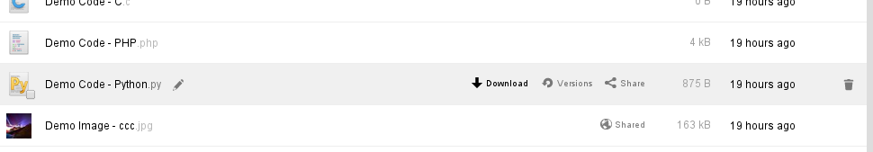
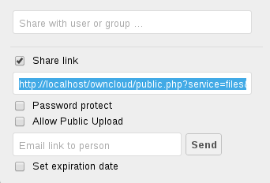

Accessing your Files (Web Interface)
====================================

Your ownCloud files can be accessed from anywhere by using your ownCloud's web interface. In the files app,
you can view (if a common type), move, rename, download, share and delete your files easily. If versioning app is
enabled, you can also revert a file to specific version. See :doc:`versioncontrol` for details.

Files app on ownCloud web interface

With ownCloud 6, you can now see file thumbnails next to the filenames. By hovering your cursor on a file, you
will be provided with some file operations. You can use rename, download, share buttons to perform those actions
or click on the cross icon at the rightmost location to remove the hovered file. If the file is an editable
office file, it will also show *Edit* button to open the file in documents app (if this app is enabled).

Navigating inside your ownCloud
-------------------------------

To navigate through folders in your ownCloud, you can simply click on a folder name. The navigation bar
will show your current directory:

.. figure:: ../images/oc_filesweb_navigate.png
Navigation bar

You can click on one of the upper directories to navigate up or use home icon to navigate back into your root
folder.

Creating/uploading files
------------------------

You can create files by simply clicking on *New* button on files app. The *New* button will provide three
options to choose from:

.. figure:: ../images/oc_filesweb_new.png
New button options

* *Text file* will create a simple text file and add into the current folder in your ownCloud.
* *Folder* will create a folder in current folder.
* *From link* will download the file from the provided link and place it into the current folder.

Selecting files
---------------

You can select one or more files by clicking on small thumbnails or icons of the files. To select all files in
the current directory, use the checkbox just above the first file/folder on the list.

If you select multiple files, selected files can be deleted or downloaded as ZIP by using the buttons just above of the file list.
If download button is not visible, this means that administrator had disabled this feature.

Viewing files
-------------

ownCloud can display uncompressed text files, OpenDocument files, PDFs, and image files by simply clicking on
the file name. If displaying of a file is not possible, a download process will start.

Moving files
------------

In ownCloud web interface, file(s) can be moved by dragging and dropping them into a sub-directory. If you would like to move a directory to an upper directory, drag the file(s) into one of the folders shown in navigation bar (depicted above).

Sharing files
-------------

Any file/folder on ownCloud can be shared to download with a local user, group or any person online with a public link. Shared files/folders will show a *Shared* text next to their names.

To share a file/folder, hover your cursor on an item in the files app and click *Share*. You will be provided with some options:

Share dialog

* The first field is to share this file/folder with local users/groups. This is very useful
  if you are in a company and want to create a quick share with a collegue.
* If you click on *Share link*, the other options will be visible. Since this link allows everyone
  to download this file/folder, you may want to protect this share with a password. To do that,
  click on *Password protect* and set a password.
* If this share is a folder, you will also have an option to enable uploads into this folder using
  the provided link. This is very useful to collect files from multiple users into same place easily.
* If your server is configured with a mail server, you can type e-mail addresses seperated with space to send the link to multiple users.
* Finally, setting an expiration date will expiry the share after the specified date.

If you type a user and/or group to the *share with* field, you will be given extra sharing options such as informing via e-mail,
letting users edit (create, update, delete, re-share) the share. To revoke permissions from users, simply click on cross icon
on the same line with the users.
