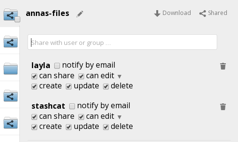
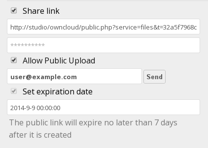

Accessing your Files Using the Web Interface
============================================

You can access your ownCloud files with the ownCloud web interface and create, 
preview, edit, delete, share, and re-share files. Your ownCloud administrator 
has the option to disable these features, so if any of them are missing on your 
system ask your server administrator.

.. figure:: ../images/users-files.png

    **ownCloud web interface Files app**

ownCloud version 7 enables you to see file thumbnails next to the filenames.
Hovering over a file or folder provides the following operations:

* :guilabel:`Pencil icon` -- Enables you to rename a file or folder.
* :guilabel:`Download` -- Downloads a file to your system.
* :guilabel:`Versions` -- Enables you to revert the file or folder to any 
   available older versions.
* :guilabel:`Share` -- Enables you to share the file or folder with a group or a 
   specific user.  Also enables you to create a public share with a hyperlink.
* :guilabel:`Edit` -- Edit the file in ownCloud.
* :guilabel:`Trash icon` -- Deletes the selected file or folder.

.. Note:: The Shared folder has been removed from ownCloud 7. If you are 
   upgrading from older ownCloud versions you will still have your old Shared 
   folder, but new shares will appear in the top-level of your Files page, and 
   the Shared folder is no longer required. You can now create your own folders 
   for storing shared files, and organize and move them around like any other 
   files. You may rename folders shared with you without changing the original
   folder name.

Navigating Inside Your ownCloud
-------------------------------

Navigating through folders in ownCloud is as simple as clicking on a folder to
open it and using the back button on your browser to move to a previous level.
For added convenience, ownCloud also provides a navigation bar at the top of
the Files field for quick navigation.

.. figure:: ../images/oc_filesweb_navigate.png

    **Navigation bar**

The navigation bar functions as a "breadcrumb" locator.  It indicates your
current directory and enables you to migrate back to one of the upper
directories or, using the home icon, to navigate back into your root folder.

Creating or Uploading Files and Directories
-------------------------------------------

ownCloud enables you to create new files or folders directly in an ownCloud
folder by clicking on the *New* button in the Files app.

.. figure:: ../images/oc_filesweb_new.png

    **New button options**

The *New* button provides the following three options from which to choose:

* *Text file* -- Creates a simple text file and adds the file to the current 
   folder in your ownCloud.
* *Folder* -- Creates a new folder in the current folder.
* *From link* -- Downloads a file from a provided link path and places it into 
   the current folder.

Selecting Files or Folders
--------------------------

You can select one or more files or folders by clicking on the small thumbnails
or icons that represent them. When you select a file or folder, a small
checkbox is populated with a check to indicate that it is selected.  To select
all files in the current directory, you can click on the checkbox located at
the top of the Files app field, above the first file or folder on the list.

If you select multiple files, you can deleted all of the selected files or
download them as a ZIP file by using the ``Delete`` or ``Download`` buttons at
the top right side of the Files app field.

.. note:: If the ``Download`` button is not visible, the administrator has
   disabled this feature.  Contact your administrator for further guidance.

Filtering the File Application View
-----------------------------------

ownCloud enables you to view files in the File Application View using filter 
options located in the Apps Information Field. This feature enables you to 
quickly and easily view and manage files based on their share status.

You can click on any of the filter options to view the files as follows:

* ``All files`` -- The default view; displays all files in the Application View 
   window.

* ``Shared with you`` -- Displays all files shared with you by another user or 
   group.

* ``Shared with others`` -- Displays all files that you have shared with other 
    users or groups.

* ``Shared by link`` -- Displays all files that are shared by you through the 
    use of a link.

Previewing Files
----------------

You can display uncompressed text files, OpenDocument files, PDFs, and image
files from the ownCloud server by clicking on the file name. If ownCloud cannot
display a file, a download process starts and the file is downloaded to your
system.

Moving Files
------------

Using the ownCloud web interface, you can move files and folders by dragging
and dropping them into any directory. If you want to move a file or folder to
an upper directory, click and drag them to one of the folders shown in the
navigation bar.

Sharing Files Locally
-------------

When enabled by your administrator, you can share files or folders on ownCloud 
with a local user, group, or any person online with a public link. Shared files 
and folders are labeled with the triangular share icon, and the status *Shared* 
in the file or folder row.

To create a local share with other users or groups on your ownCloud server:

1. Hover your cursor over an item on the Files page
2. Click the **Share** icon

The Share dialog box opens to show the following options:

  
Type the name of the user or group that you want to share with. If you want to 
share with more than one, you have to create each share separately. Check the 
permissions you want the user or group to have, and optionally send them an 
email notification. 

.. note:: Users must enter their email addresses on their Personal pages for 
   email notifications to work
   
Your new share appears on user's Files pages marked with a Share icon, and the 
name of the file owner.

.. figure:: ../images/users-share-local2.png
    
When you want to revoke a share, simply click the Trashcan icon next to the 
name of the appropriate user or group in the Shared dialog.    
    
Creating a Public Share
----------------------

You can share files outside of your organization with people who are not users 
on your ownCloud server by creating a public share link. Open the Share dialog 
and check Share Link.

    
This creates a public URL that anyone can use to access the share. You have the 
options to send an email notification, protect it with a password, and put an 
expiration date on it. Your ownCloud administrator has the option to require 
passwords and expiration dates.  
