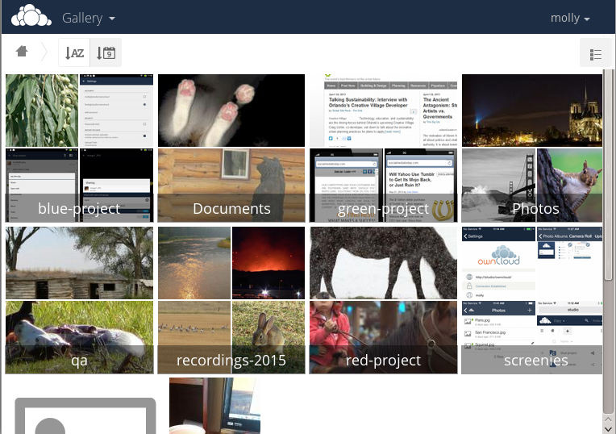

===========
Gallery App
===========

The Pictures app has been rewritten and improved, and is now called the Gallery 
app. It supports more image formats, sorting, zoom, and scrolling. It also 
supports advanced customizations via a simple text file.

On your mail ownCloud Files page, click the little icon at the top right, 
underneath your username, to open your Gallery. The Gallery app automatically 
finds all images in your ownCloud folders, and overlays the thumbnails with the 
folder names. Click on the folder thumbnails to open the folders. At the top 
left you have two sorting options, alphabetical and by date.

After entering any folder, click on any image to open it in slideshow mode. 
This has the following features: a download button at the top center, forward 
and back buttons at the right and left sides, an automatic slideshow button at 
the bottom right, and a close button at the top right.

.. figure:: ../images/gallery-2.png
   :alt: Gallery in slideshow mode.

Custom Configuration
--------------------
   
You may customize a Gallery album with a simple text file named 
**gallery.cnf**, which contains parameters structured using the 
`Yaml <https://en.wikipedia.org/wiki/YAML>`_ markup language.

Features
^^^^^^^^

The following general features are currently implemented:

* Native SVG support
* Access to external shares

The following album features are currently implemented:

* Adding a link to a file containing a description
* Typing a simple copyright statement directly in the configuration file
* Adding a link to a file containing a copyright statement
* Defining a sort type and order
* Defining the colour of the background
* Defining if sub-albums will inherit the configuration

The following slideshow features are currently implemented:

* Showing a button which lets you pick which background, between black and 
  white, should be used for the picture you are currently viewing in the 
  slideshow

Setup
^^^^^

The configuration file has to be named **gallery.cnf**

You need a `gallery.cnf` file in your root ownCloud folder to activate it, and 
users may create their own per-album configurations.

.. note:: You need to refresh the browser after changing your configuration to 
   see your changes.

Format
^^^^^^

UTF-8, **without BOM**. A file created from within the ownCloud Web GUI works.

Structure
^^^^^^^^^

You should include a comment in the file, so that people stumbling upon 
the file know what it's for. Comments start with #.

Spacing is created using 2 spaces. **Do not use tabs.**

Take a look at the `YAML Format documentation 
<http://symfony.com/doc/current/components/yaml/yaml_format.html>`_ if you are 
getting error messages.

Here is an example `gallery.cnf`::

  # Gallery configuration file
  # Created on 31 Jan 2016 by ownCloud User
 features:
   external_shares: yes
   native_svg: yes
   background_colour_toggle: yes
 design:
   background: "#ff9f00"
   inherit: yes
 information:
   description: This is an **album description** which is only shown if there 
   is no `description_link`
   description_link: readme.md
   copyright: Copyright 2003-2016 [interfaSys sàrl](http://www.interfasys.ch), 
 Switzerland
   copyright_link: copyright.md
   inherit: yes
 sorting:
   type: date
   order: des
   inherit: yes

Supported Variables
^^^^^^^^^^^^^^^^^^^

**Global features**

Used to configure the app. Only supported if the ownCloud 
administrator places a `gallery.cnf` in the root of the instance.

* **external_shares**: Set to **yes** in your root configuration file if you 
  want to be able to load images stored on external locations, when using the 
  **files_external** app.
* **native_svg**: Set to **yes** in your root configuration file if you want to 
  be able to see SVG images rendered by the browser. This may represent a 
  security risk if you can't fully trust your SVG files.
* **background_colour_toggle**: Set to **yes** in your root configuration file 
  if you want to have an additional button in the slideshow, enabling users to 
  toggle the colour of the background of transparent images between black and 
  white.

.. note:: External shares are 20-50 times slower than local shares. Be prepared 
   to wait a long time before being able to see all the images contained in a 
   shared album.

**Album configuration**

Each album can be individually configured using the following configuration 
sections. It's possible to use the **inherit** parameter to make sure all 
sub-albums are configured the same way.

**Design**

* **background**: Defines the colour of the background of the photowall 
  using the RGB hexadecimal representation of that colour. For example: 
  **"#ffa033"**. You must use quotes around the value or it will 
  be ignored. It is strongly recommended to use a custom theme, with a CSS 
  loading spinner if you intend to use this feature. You can use `this colour 
  wheel <http://paletton.com/>`_ to find a colour you like.
* **inherit**: Set to **yes** if you want sub-folders to inherit this part of 
  the configuration.

**Album presentation**

* **description**: A markdown-formatted string which will be displayed in the 
  info box. It can spread over multiple lines using the Yaml markers.
* **description_link**: A markdown file located within the album which will 
  be parsed and displayed in the info box instead of the description.
* **copyright**: A markdown-formatted string. This supports links to external 
  resources.
* **copyright_link**: Any file (e.g. copyright.html), in the album itself, 
  which will be downloaded when the user clicks on the link
* **inherit**: Set to **yes** if you want sub-folders to inherit this part of 
  the configuration.

See `<http://www.markitdown.net/markdown>`_ for the markdown syntax.

.. note:: Do not add links to your `copyright` string if you use the  
   **copyright_link** variable.

**Sorting**

* **sorting**: **date** or **name**. **date** only works for files.
* **sort_order**: **asc** or **des** (Ascending or descending).
* **inherit**: Set to **yes** if you want sub-folders to inherit this part of 
  the configuration.

Possible Future Extensions
--------------------------

Different sorting parameters for albums.

* When only the sort **type** variable has been set, the default sort order 
  will be used.
* When only the sort **order** variable has been found, the sort configuration 
  will be ignored and the script will keep looking for a valid configuration in 
  upper folders.
* To enable a feature such as native SVG in a public share, you need to create 
  in that folder a configuration file containing that feature.
* If you share a folder publicly, don't forget to add all the files you link to 
  (e.g. description.md or copyright.md) inside the shared folder as 
  the user won't have access to files stored in the parent folder.
* Since people can download a whole folder as an archive, it's usually best to 
  include all files within a shared folder, rather than adding text directly 
  in the configuration file.

Examples
^^^^^^^^

**Sorting Only**

Applies to the current folder only::

 # Gallery configuration file
   sorting:
   type: date
   order: asc

Short description and link to copyright document, applies to the current folder 
and all of its sub-folders. This also shows you the syntax you can use to 
spread a description over multiple lines::

 # Gallery configuration file
   information:
   description: | # La Maison Bleue, Winter '16
     This is our Winter 2016 collection shot in **Kyoto**
     Visit our [website](http://www.secretdesigner.ninja) for more information
   copyright: Copyright 2015 La Maison Bleue, France
   copyright_link: copyright_2015_lmb.html
   inherit: yes

**Load images from external clouds**

.. note:: Features can only be defined in the root folder.

You can add standard configuration items to the same configuration file::

 # Gallery configuration file
   features:
   external_shares: yes

**Enabling native SVG**

.. note:: Special features can only be defined in the root folder.

You can add standard configuration items to the same configuration file::

 # Gallery configuration file
  features:
  native_svg: yes
