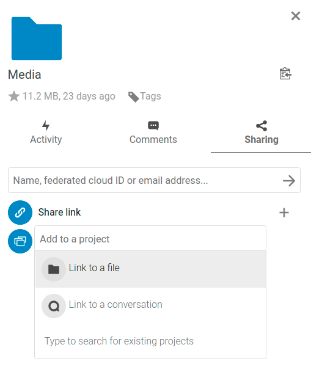
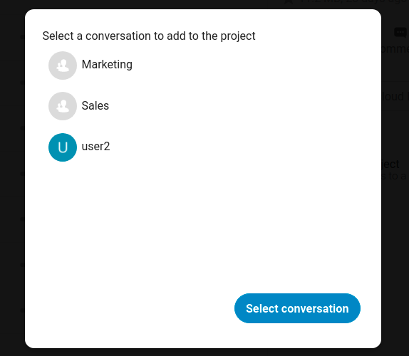
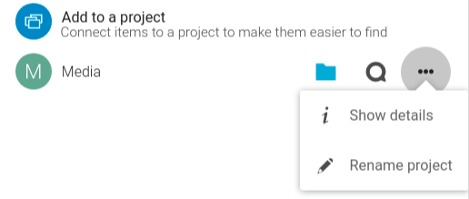
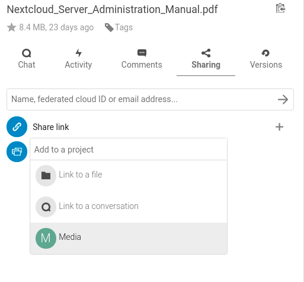

========
Projects
========

Users can associate files, chats and other items with each other in projects. The various apps will present these items in a list, allowing users to immediately jump to them. Projects are Nextcloud wide. When a user shares a file that is part of a project, the share recipient can see that project, too. A click on any of the items in a project leads right to it, be it a chat, a file or a task.

Create a new project
--------------------

A new project can be created by linking two items together. Start off by opening a file or folders sharing sidebar. 

Click *Add to a project* and select the type of item you want to link with the current file/folder. A selector will open that allows you selecting a Talk conversation for example.

Once the item has been selected a new project is being created and listed in the sharing tab of the sidebar. The same project will also appear in the sharing sidebar of the linked items.

The list entry shows quick links to a limited number of items. By opening the context menu, the project can be renamed and the full list of items can be expanded.

Adding more entries to a project
--------------------------------

If another item should be added to an already existing project this can be done by searching for the project name in the *Add to a project* picker.

Visibility of projects
----------------------

Projects do not influence the access and visibility of the different items. Users will only see projects of other users if they have access to all contained items.
