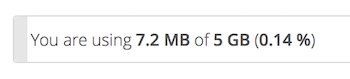

Storage Quota
=============
Your ownCloud admin has the option to set a storage quota on users. Look at 
the top of your Personal page to see what your quota is, and how much you have 
used.

It may be helpful to understand how your quota is calculated. 

Metadata (thumbnails, temporary files, cache, and encryption keys) takes up 
about 10% of disk space, but is not counted against user quotas. Some apps 
store information in the database, such as the Calendar and Contacts apps. This 
data is excluded from your quota.

Only files that originate with users count against their quotas, and not files 
shared with them that originate from other users. For example, if you upload 
files to another user's share, those files count against your quota. If you 
re-share a file that another user shared with you, that file does not count 
against your quota, but the originating user's.

Encrypted files are a little larger than unencrypted files; the unencrypted size 
is calculated against your quota.

Deleted files that are still in the trash bin do not count against quotas. The 
trash bin is set at 50% of quota. Deleted file aging is set at 30 days. When 
deleted files exceed 50% of quota then the oldest files are removed until the 
total is below 50%.

When version control is enabled, the older file versions are not counted against 
quotas.

If you create a public share via URL, and allow uploads, any uploaded files 
count against your quota.
