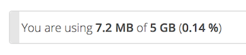

=============
Storage quota
=============

Your Nextcloud administrator can set a storage quota for your account. Open
your Personal settings page to see your quota and how much storage you have
used.

It may be helpful to understand how your quota is calculated.

Metadata such as thumbnails, temporary files, caches, and encryption keys can
use disk space without counting against your user quota. Some apps store data
in the database, such as the Calendar and Contacts apps. This data is not
included in the file-storage quota.

When other users share files with you, the shared files normally count against
the original owner's quota. When you share a folder and allow other users or
groups to upload or edit files in it, those files count against your quota.
When you re-share files shared with you, the re-share normally continues to
count against the original owner's quota.

Encrypted files can use more physical storage than unencrypted files. The
quota calculation uses the file size reported by Nextcloud's storage layer.

When the Versions app is enabled, older file versions are managed separately
from the normal storage quota according to the app's retention and storage
rules.

If you create a public share through a URL and allow uploads, uploaded files
count against your quota.

Deleted files and the trash bin
-------------------------------

Files and folders in your trash bin do not count against your normal storage
quota. The trash bin nevertheless has its own storage limit.

For accounts with a quota, the default amount of space available to the trash
bin is calculated as 50% of the account's remaining quota space. This is
calculated after the account's active files have been taken into account; it is
not 50% of the total quota.

For accounts without a quota, the default trash-bin limit is calculated using
available filesystem space instead. An administrator can configure a global or
per-account trash-bin size that overrides the calculated default.

Your administrator can also configure minimum and maximum trash-bin retention
periods, or disable automatic expiration. See the
:doc:`Deleted Files <../../admin_manual/configuration_files/trashbin_configuration>`
section of the Administrator Manual for details.
