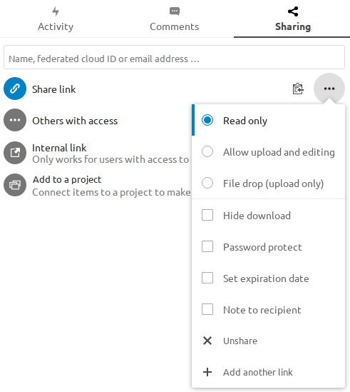

============
File Sharing
============

Nextcloud users can share files and folders. Possible targets are

* public links
* users
* groups
* circles
* talk conversations
* users or groups on federated Nextcloud servers

.. note:: Some options may note be available due to administrative configuration.
   See :doc:`admin documentation <file_sharing_configuration>` for details.

Public link shares
------------------

You can share files and folders via public links.

A random 15-digit token will be created. The link will look like ``https://cloud.example.com/s/yxcFKRWBJqYYzp4``.

A number of options are available for public *folder* shares:

* **Read only** to allow viewing and downloading
* ** Allow upload and editing**
* With ** File drop**, the sharee can only upload files to a folder without seeing the files that are already in that folder.
* **Hide download** prevents the sharee from downloading
* **Password protect**
* **Set expiration date** will automatically disable the share
* **Note to recipient**
* **Unshare** to revert the share
* **Add another link** to create multiple public links with different rights

For public *file* shares, you may allow editing the file with one of Nextcloud's collaborative editing solutions.

.. note:: Password protection as well as file expiration are not propagated using Federated File Sharing in current Nextcloud releases. This will be adjusted in Nextcloud 22.

Internal shares with users and groups
-------------------------------------

When sharing with users, groups, circles or members of a Talk conversation, rights for the files or folder contents are adjustable:

.. figure:: ../images/sharing_internal.png

As a sharee, you can configure if you automatically want to accept all incoming shares and have them added to your root folder, or if you 
want to be asked each time if you want to accept or decline the share.

.. figure:: ../images/sharing_internal_acceptNotification.png

For adjusting the acceptance setting, go to **Settings** > **Personal** > **Sharing**

Others with access
------------------

In order to find out if a file or folder is accessible to others through sharing of a superior folder 
hierarchy level, click on **Others with access** in the sharing tab.

The list shows all users, groups, chats etc. that the current object has been given access to through
sharing of a superior folder in the hierarchy.

Click on the three dots to

* see who initiated the share
* see where the share was initiated (click to navigate to the folder, as far as you have access there)
* unshare the initial share (only accessible for the share owner)

.. note:: This information is only visible to the owner of a file/folder or sharees with resharing rights.

================
Federated Shares
================

Federation Sharing allows you to mount file shares from remote Nextcloud servers, in effect 
creating your own cloud of Nextclouds. You can create direct share links with 
users on other Nextcloud servers.

Creating a new Federation Share
-------------------------------

Federation sharing is enabled by default. Follow these steps to create a new share with other Nextcloud or ownCloud servers:

Go to your ``Files`` page and click the Share icon on the file or directory 
you want to share. In the sidebar enter the username and URL of the remote user
in this form: ``<username>@<nc-server-url>``. In this example, that is
``bob@cloud.example.com``.

The sharee is receiving a notification in their Nextcloud, allowing them to either accept or decline the incoming share.

Adding a public share to your Nextcloud
---------------------------------------

Nextcloud public link share pages offer an option to add that file or folder as a federated share into your own Nextcloud instance.
Just enter your ``<username>@<nc-server-url>`` just like shown for outbound shares above:

