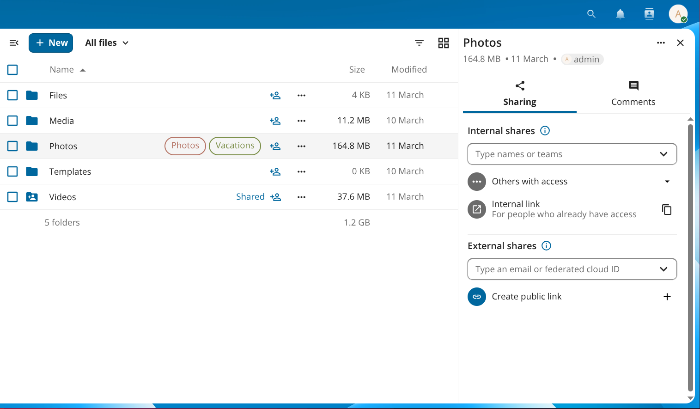
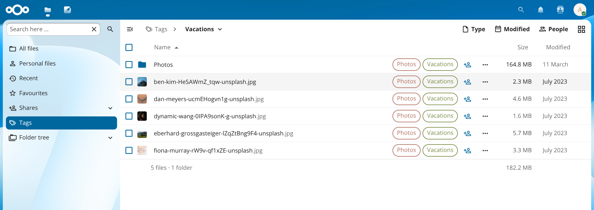
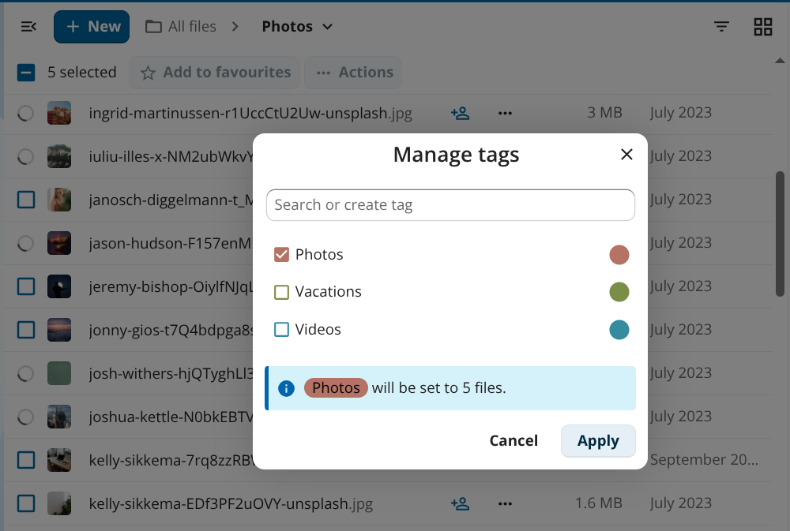

===========
System tags
===========

System tags are server-wide labels you can attach to files and folders to
organise them, filter your file list, and drive automated workflows such as
retention rules and access control.

Tags appear directly on file and folder rows in the **Files** app so you can
see at a glance which labels are assigned:

   *Figure 1: Tags are shown inline on files and folders.*

Tags are created by administrators in the server settings. Depending on your
server configuration, regular users may also be able to create tags — your
administrator can restrict tag creation to admins only.

Tag access levels
-----------------

Every tag has one of three access levels that control what regular users can
see and do:

============ ============================== =====================================
Level        Visible to users               Users can assign / remove
============ ============================== =====================================
Public       Yes                            Yes
Restricted   Yes                            No
Invisible    No                             No
============ ============================== =====================================

Restricted and invisible tags are used by administrators for automated
workflows. You cannot work around them by removing the tag yourself.

Browsing files by tag
---------------------

Click the navigation icon (≡) at the top left of the **Files** app to open
the navigation panel, then click **Tags**. The view lists all tags visible to
you. Click a tag name to see every file and folder that has that tag assigned.

   *Figure 2: Clicking a tag in the navigation panel filters the file list to files with that tag.*

Assigning tags to files
-----------------------

You can assign or remove tags on one file at a time or across a selection of
files in one step.

**Single file**

1. Click the three-dot action menu (**…**) next to a file or folder and select
   **Details** to open the details sidebar.
2. In the details sidebar, click **Add tags**.
3. Type a tag name in the search field and select the tag from the list.
4. Click outside the picker to close it. Changes are saved immediately.

To remove a tag, open the same picker and click the **×** next to the tag
name.

.. note::

   Only public tags appear in the picker for regular users. Restricted and
   invisible tags can only be assigned by administrators.

**Multiple files**

1. Select two or more files by clicking the checkbox to the left of each row.
2. Click **··· Actions** in the toolbar above the file list, then select
   **Manage tags**.
3. Check or uncheck tags in the dialog that appears. An info line shows how
   the change will be applied across the selected files.
4. Click **Apply**.

   *Figure 3: Manage tags lets you apply or remove tags across multiple files at once.*

Creating and managing tags
--------------------------

If your administrator has not restricted tag creation, you can create a new
tag directly from the **Manage tags** dialog or the single-file tag picker:
type a new name in the **Search or create tag** field and select the
**Create tag** option that appears.

Administrators create, rename, and delete tags under
:menuselection:`Administration settings --> Server`.
For details on tag management and command-line tools, see the
`Automated tagging
<https://docs.nextcloud.com/server/latest/admin_manual/file_workflows/automated_tagging.html>`_
section of the administration manual.
