=============================================
Using end-to-end encryption
=============================================

If enabled server side, Nextcloud provides the possibility to encrypt your files on your devices.
This is called end-to-end encryption, or E2EE, because the files are encrypted on your device and only decrypted on your device.
The server never sees the unencrypted files, further protecting user privacy and data security.

Enabling E2EE
-------------

If your administrator enabled the [End-to-End Encryption app](https://apps.nextcloud.com/apps/end_to_end_encryption), you can start using it from one of your devices.
Open the settings of the Nextcloud client and look for the EE2E encryption settings.

.. raw:: html

   

   
Desktop

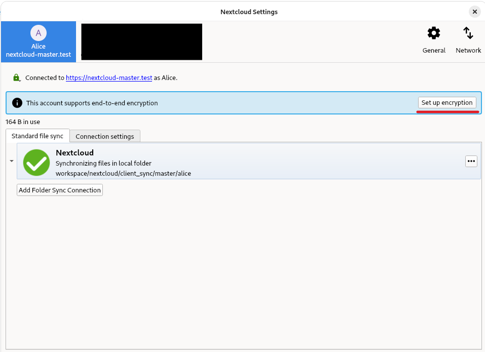

.. raw:: html

   

.. raw:: html

   

   
Android

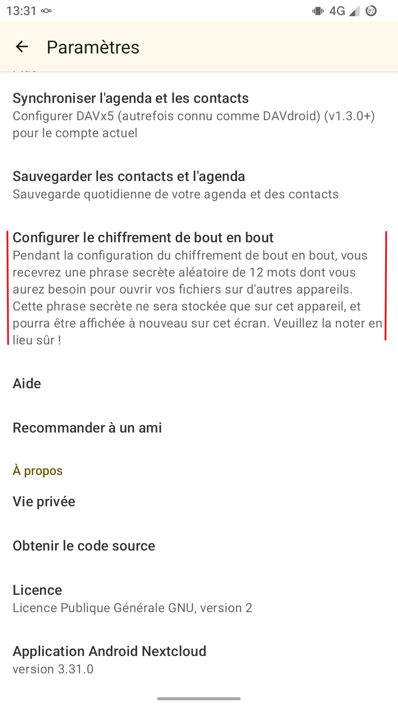

.. raw:: html

   

.. raw:: html

   

   
iOS

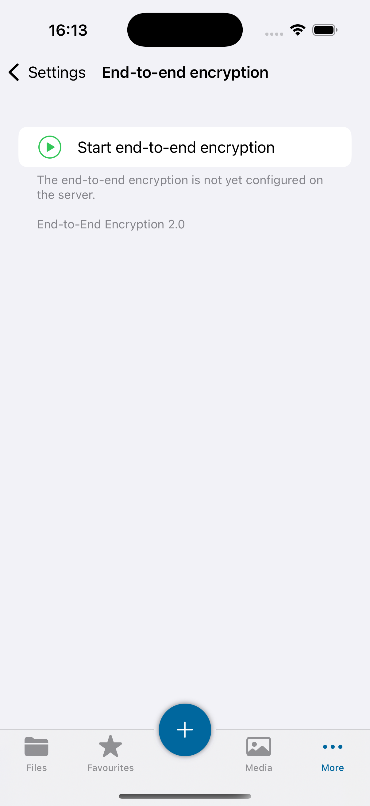

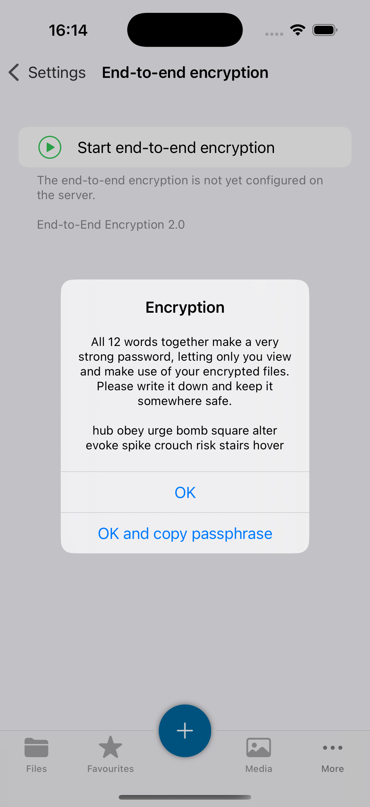

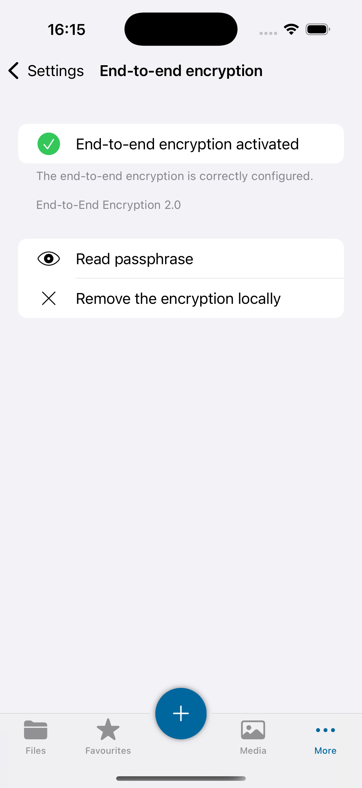

.. raw:: html

   

.. raw:: html

   

   
Web

.. warning::
    It is not possible to enable encryption on a folder in the browser. This must be done on a client app, either a desktop or mobile client.

.. raw:: html

   

.. raw:: html

     

Encrypting a folder
-----------------------

.. warning::

    You can only enable encryption on empty folders.

.. raw:: html

   

   
Desktop

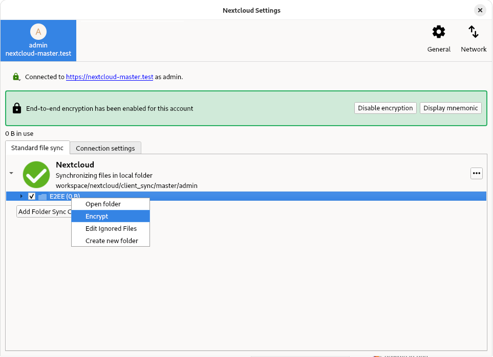

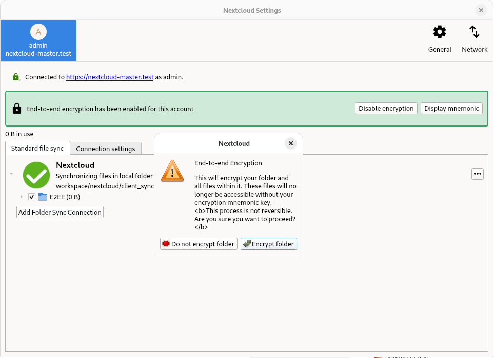

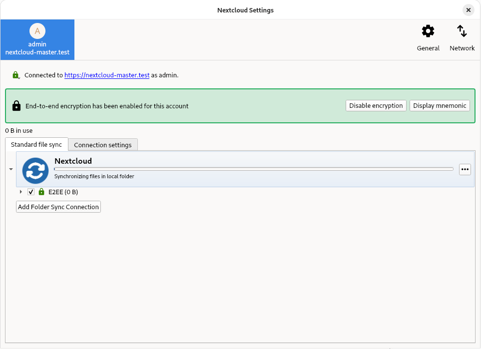

.. raw:: html

   

.. raw:: html

   

   
Android

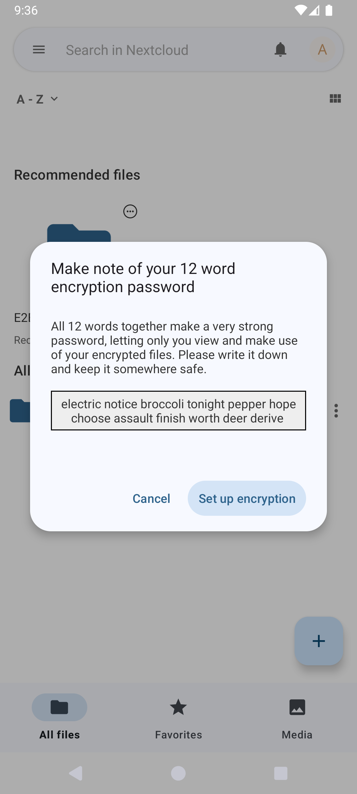

.. raw:: html

   

.. raw:: html

   

   
iOS

.. image:: ../images/e2ee-ios-encrypt.png
    :width: 400px
    :alt: Encrypting a folder on an iOS device

.. raw:: html

   

.. raw:: html

   

   
Web

.. warning::

    It is not possible to enable encryption on a folder in the browser. This must be done on a client app, either a desktop or mobile client.

.. raw:: html

   

.. raw:: html

     

Adding an E2EE device
---------------------

.. raw:: html

   

   
Desktop

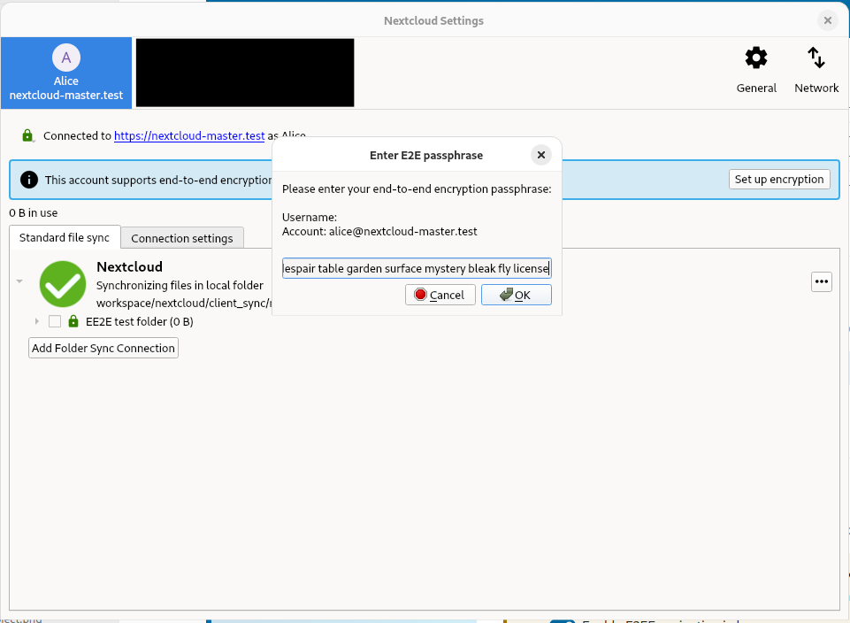

.. raw:: html

   

.. raw:: html

   

   
Android

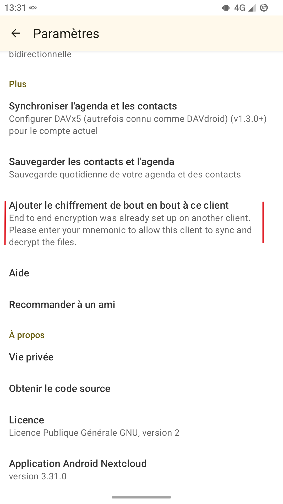

.. raw:: html

   

.. raw:: html

   

   
iOS

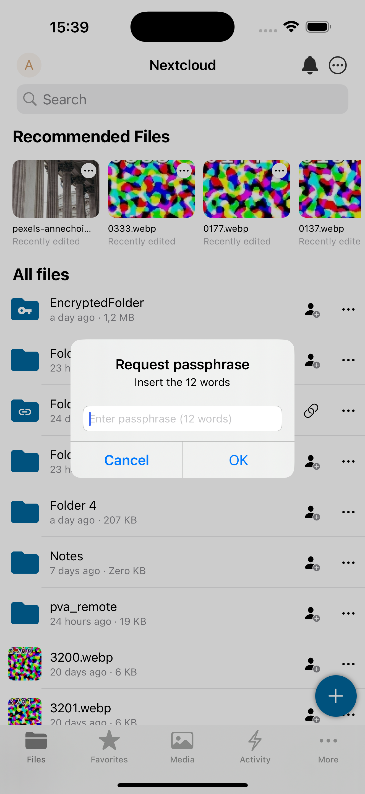

.. raw:: html

   

.. raw:: html

   

   
Web

In the browser, first enable E2EE in the personal settings. This is needed, as E2EE is less secure in the browser, requiring you to fully trust the administrator to not alter the source code the browser will execute.
E2EE folders are currently read-only. Therefore, it is not possible to add, remove, edit, or share an E2EE file from the browser.

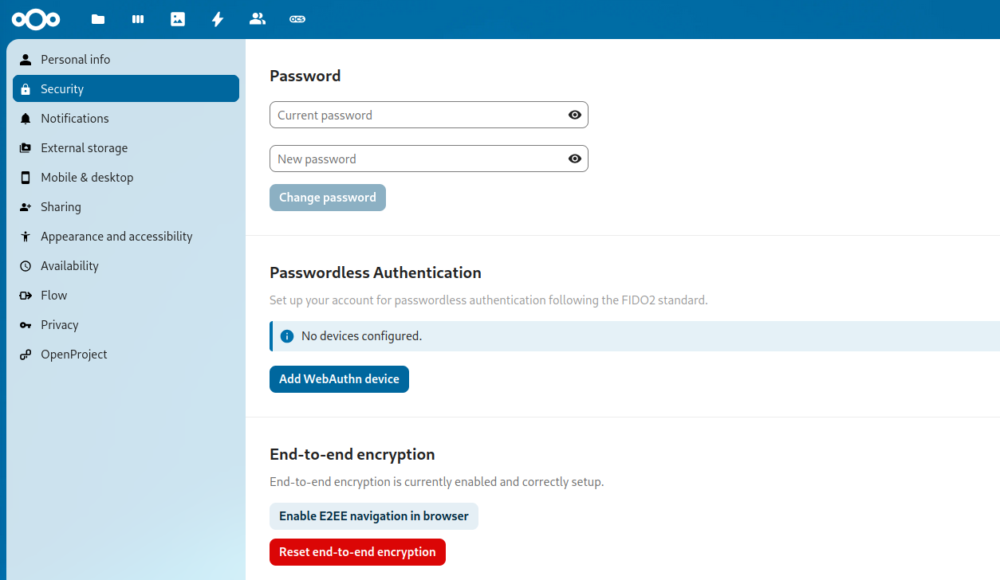

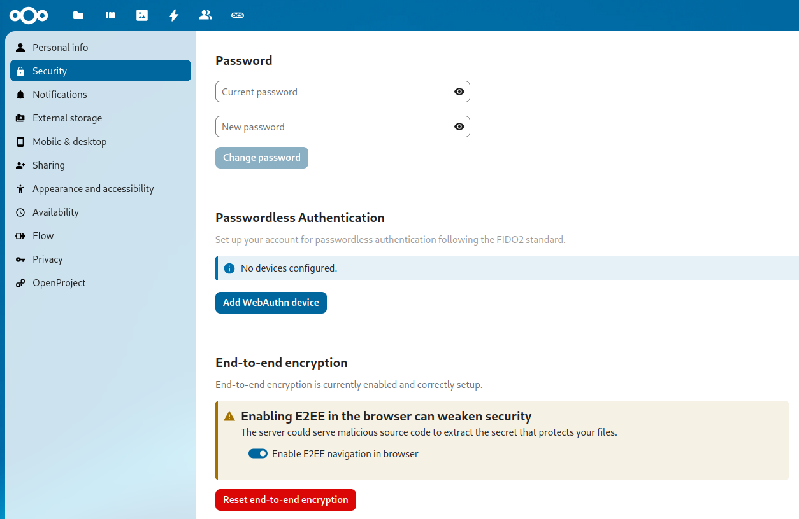

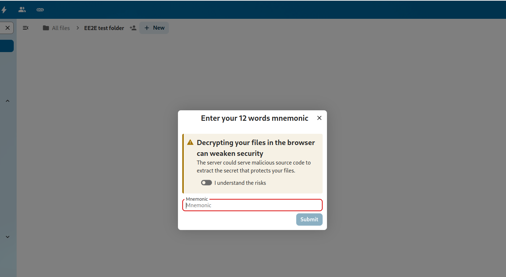

.. raw:: html

   

.. raw:: html

     

Displaying the mnemonic
-----------------------

The mnemonic is a list of words that is used to encrypt and decrypt your files. It is important to keep this mnemonic safe, as it is the only way to access your files if you lose access to your device. If you lose access to your mnemonic, you will lose access to your files.

.. raw:: html

   

   
Desktop

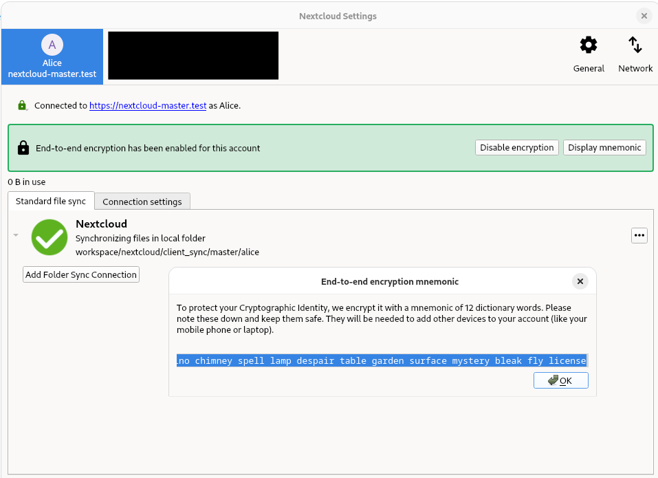

.. raw:: html

   

.. raw:: html

   

   
Android

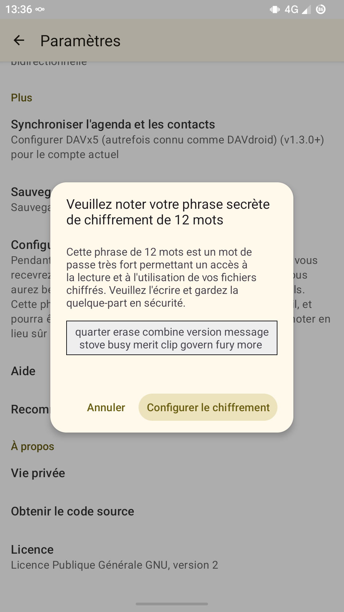

.. raw:: html

   

.. raw:: html

   

   
iOS

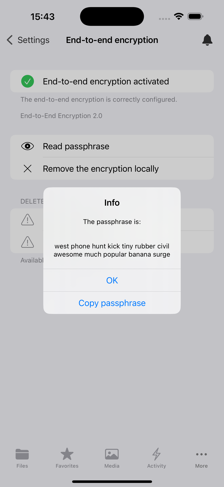

.. raw:: html

   

.. raw:: html

   

   
Web

.. warning::

    It is not possible to display the mnemonic in the browser.

.. raw:: html

   

.. raw:: html

     
