=============================================
Using end-to-end encryption
=============================================

If enabled server side, Nextcloud provides the possibility to encrypt your files on your devices.
This is called end-to-end encryption, or E2EE, because the files are encrypted on your device and only decrypted on your device.
This means that the server never sees the unencrypted files.

Enabling E2EE
-------------

If your administrator enabled the end-to-end encryption app, you can start using it from one of your device.
Open the settings of the Nextcloud client and look for the EE2E encryption settings.

Desktop
^^^^^^^

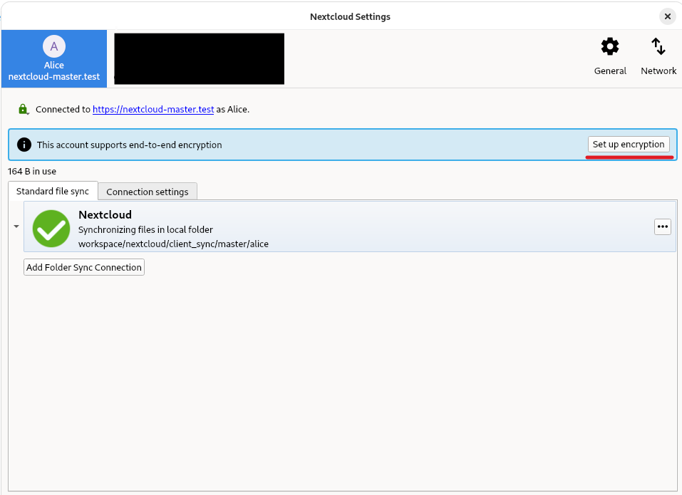

Android
^^^^^^^

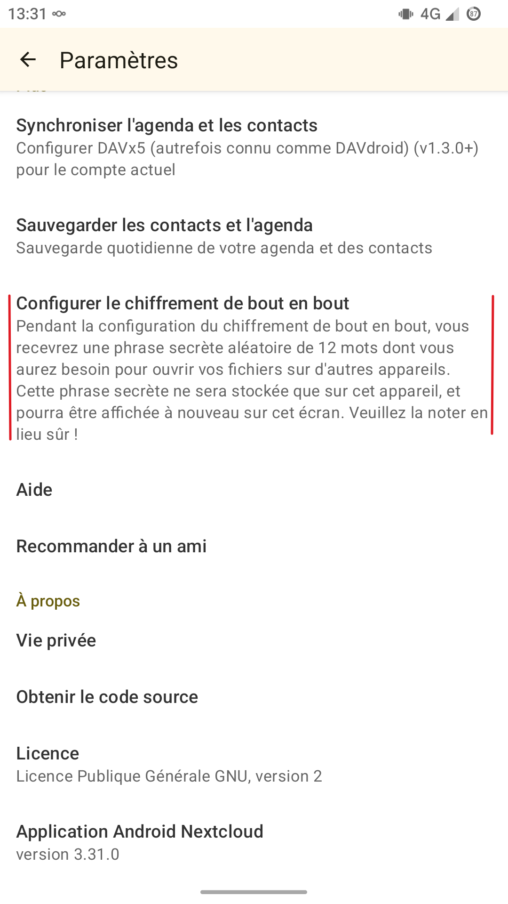

iOS
^^^

.. image:: ../images/e2ee-ios-setup.png
    :width: 400px
    :alt: Setup E2EE on iOS

Web
^^^

.. warning::

    It is not possible to enable E2EE in the browser.

Adding an E2EE device
---------------------

Desktop
^^^^^^^

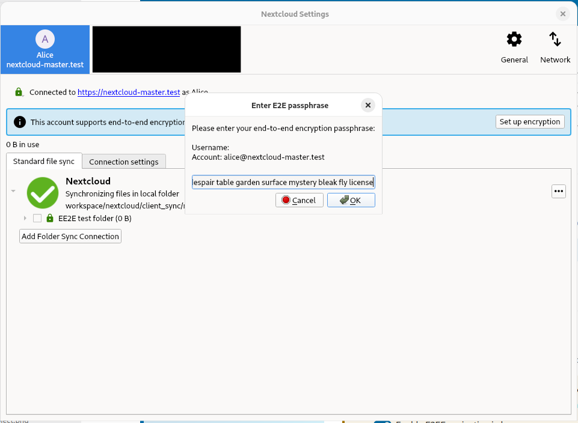

Android
^^^^^^^

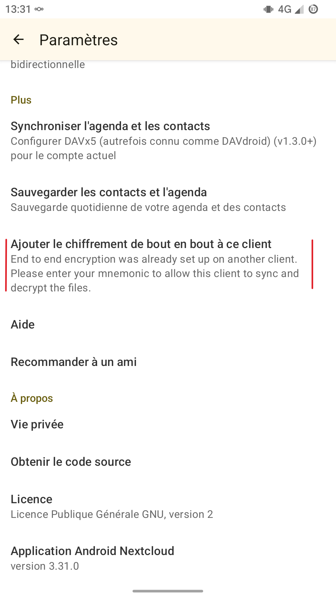

iOS
^^^

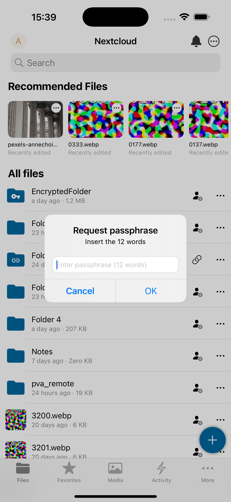

Web
^^^

On the browser, you'll first have to enable E2EE in the browser. This needed, as E2EE is less secure in the browser as you need to fully trust your administrator to not alter the source code that your browser will execute.

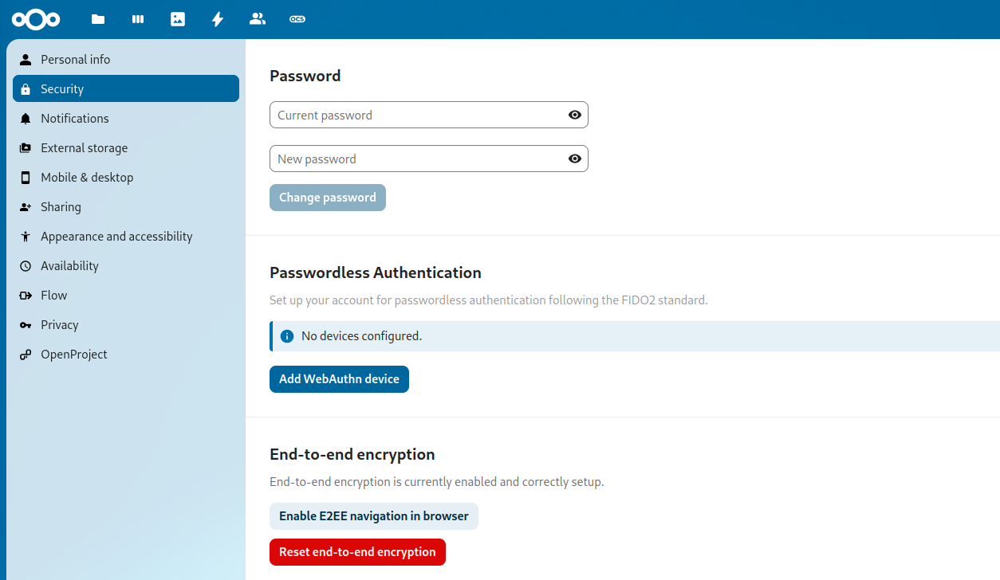

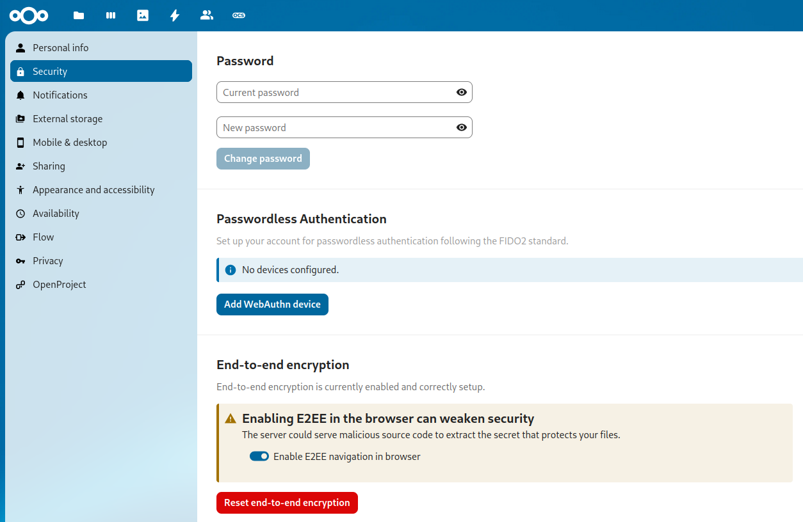

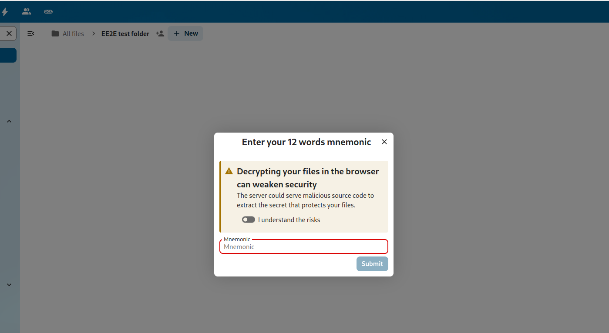

Displaying the mnemonic
-----------------------

Desktop
^^^^^^^

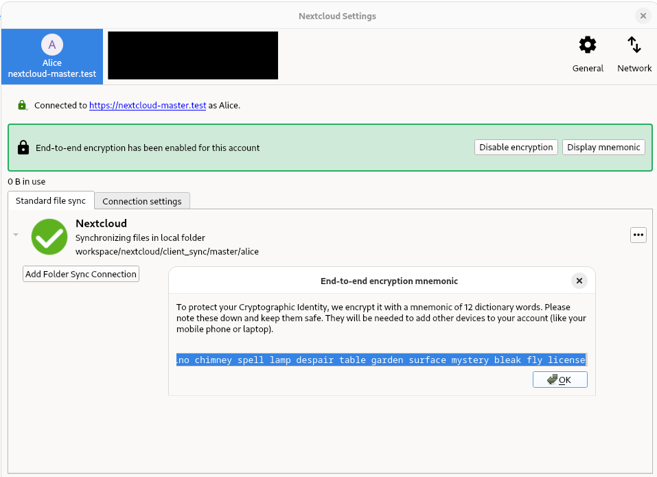

Android
^^^^^^^

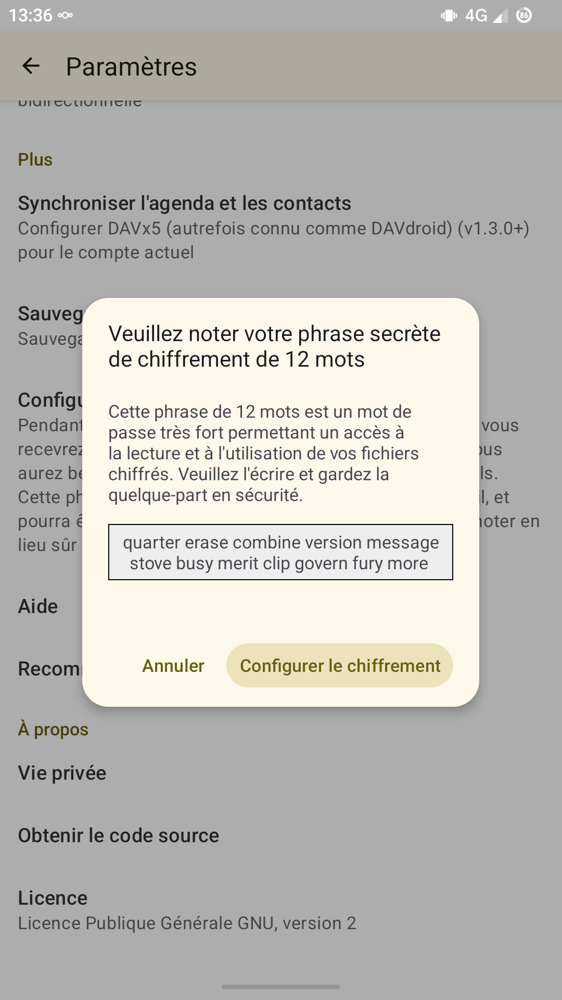

iOS
^^^

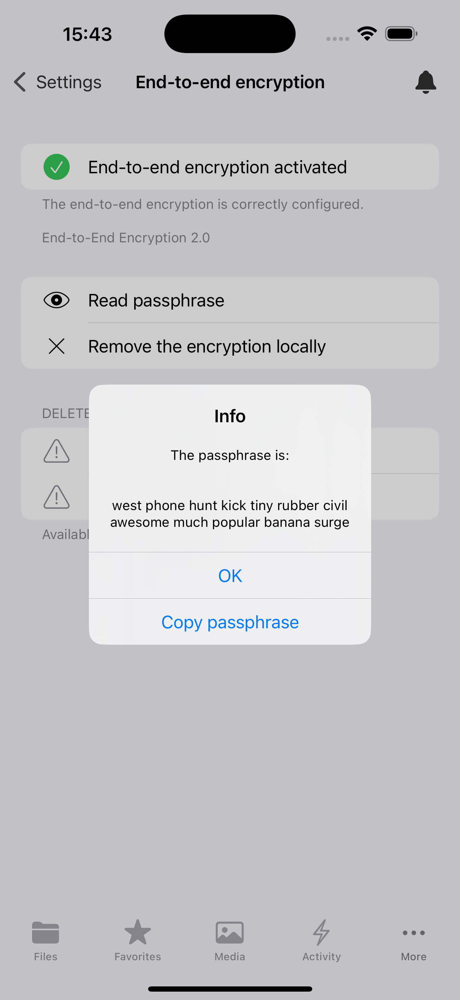

Web
^^^

.. warning::

    It is not possible to display the mnemonic in the browser.

Encrypting a folder
-----------------------

.. warning::

    You can only encrypt empty folders.

Desktop
^^^^^^^

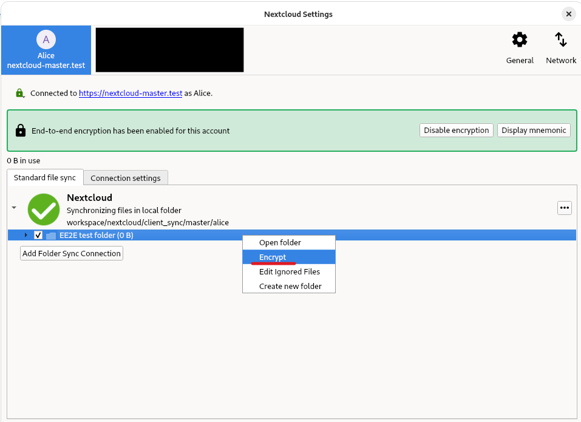

Android
^^^^^^^

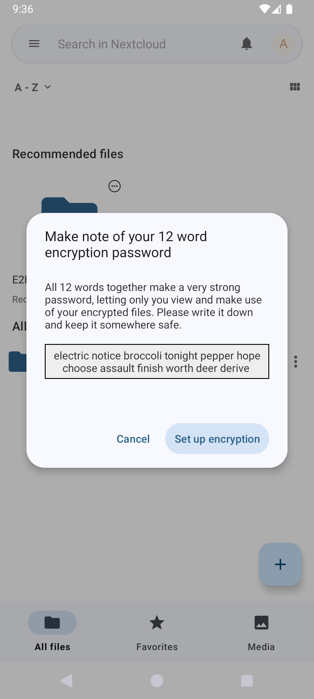

iOS
^^^

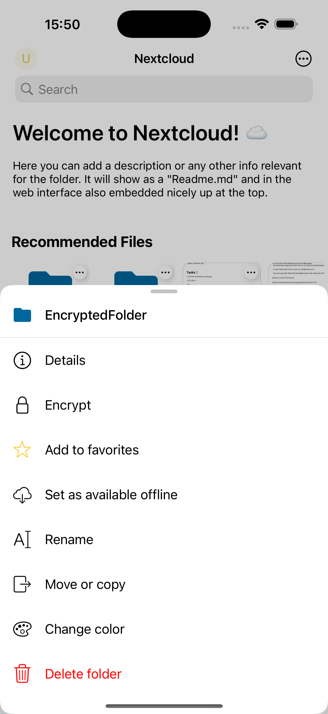

Web
^^^

.. warning::

    It is not possible to encrypt a folder in the browser.
