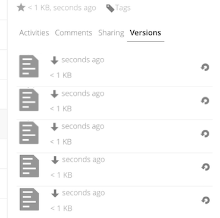
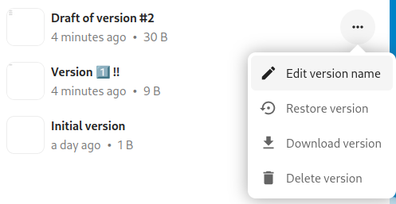
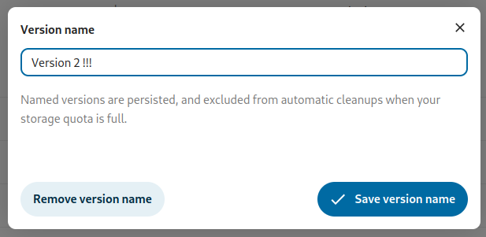

===============
Version control
===============

Nextcloud supports a simple version control system for files. Whenever a file
is changed on the server or uploaded again by a client, Nextcloud keeps the
previous content as a version so you can restore it later. Versions appear in
the **Versions** tab on the Details sidebar, where you can restore or download
any earlier copy. A new version is stored only if at least two minutes have
passed since the last version was created. Desktop and mobile clients do not
manage the version list themselves; they upload a new file and the server
records the version. Versions are stored under ``data/[user]/files_versions``.

To restore a specific version of a file, click the circular arrow to the right.
Click on the timestamp to download it.

The versioning app expires old versions automatically to make sure that
you don't run out of space. This pattern is used to delete
old versions:

* For the first second we keep one version
* For the first 10 seconds Nextcloud keeps one version every 2 seconds
* For the first minute Nextcloud keeps one version every 10 seconds
* For the first hour Nextcloud keeps one version every minute
* For the first 24 hours Nextcloud keeps one version every hour
* For the first 30 days Nextcloud keeps one version every day
* After the first 30 days Nextcloud keeps one version every week

The versions are adjusted along this pattern every time a new version gets
created.

The version app never uses more than 50% of the user's currently available free
space. If the stored versions exceed this limit, Nextcloud deletes the oldest
versions until it meets the disk space limit again.

Naming a version
----------------

You can give a name to a version.

When a version has a name, it will be excluded from the automatic expiration process.

Deleting a version
------------------

You can also manually delete a version without waiting for the automatic expiration process.
