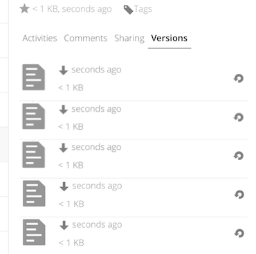

===============
Version Control
===============

ownCloud supports simple version control system for files. Versioning creates 
backups of files which are accessible via the Versions tab on the Details 
sidebar. This tab contains the history of the file where you can roll back a 
file to any previous version. Changes made at intervals greater than two minutes 
are saved in data/[user]/versions.

To restore a specific version of a file, click the circular arrow to the left. 
Click on the timestamp to download it.

The versioning app expires old versions automatically to make sure that
the user doesn't run out of space. This pattern is used to delete
old versions:

* For the first second we keep one version
* For the first 10 seconds ownCloud keeps one version every 2 seconds
* For the first minute ownCloud keeps one version every 10 seconds
* For the first hour ownCloud keeps one version every minute
* For the first 24 hours ownCloud keeps one version every hour
* For the first 30 days ownCloud keeps one version every day
* After the first 30 days ownCloud keeps one version every week

The versions are adjusted along this pattern every time a new version gets
created.

The version app never uses more that 50% of the user's currently available free 
space. If the stored versions exceed this limit, ownCloud deletes the oldest 
versions until it meets the disk space limit again.
