.. _calendar-app:

======================
Using the Calendar app
======================

.. note:: The Calendar app comes installed with Nextcloud Hub by default, but can be disabled.
          Please ask your Administrator for it.

The Nextcloud Calendar app works similar to other calendar applications you can
sync your Nextcloud calendars and events with.

When you first access the Calendar app, a default first calendar will be created for you.

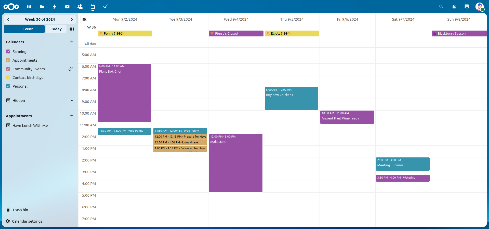

Managing your calendars
-----------------------

Create a new Calendar
~~~~~~~~~~~~~~~~~~~~~

If you plan on setting up a new calendar without transferring any old data from your
previous calendar, creating a new calendar is the way you should go.

.. figure:: images/calendar_create_1.png
            :scale: 80%

1. Click on ``+ New Calendar`` in the left sidebar.

2. Type in a name for your new calendar, e.g. "Work", "Home" or "Marketing planning".

3. After clicking on the checkmark, your new calendar is created and can be
   synced across your devices, filled with new events and shared with your friends
   and colleagues.

.. figure:: images/calendar_create_2.png
            :scale: 80%

Import a Calendar
~~~~~~~~~~~~~~~~~

If you want to transfer your calendar and their respective events to your Nextcloud
instance, importing is the best way to do so.

.. figure:: images/calendar_settings_sidebar.png
            :scale: 80%

1. Click on the settings-icon labeled with ``Settings & Import`` at the left-bottom.

2. After clicking on ``+ Import Calendar`` you can select one or more calendar files
   from your local device to upload.

3. The upload can take some time and depends on how big the calendar you import
   is.

4. A blue progress bar will appear below "Calendar Settings".

.. note:: The Nextcloud Calendar application only supports iCalendar-compatible
          ``.ics``-files, defined in RFC 5545.

Edit, Export or Delete a Calendar
~~~~~~~~~~~~~~~~~~~~~~~~~~~~~~~~~~~

Sometimes you may want to change the color or the entire name of a previous
imported or created calendar. You may also want to export it to your local
hard drive or delete it forever.

.. note:: Please keep in mind that deleting a calendar is a irreversible action.
          After deletion, there is no way of restoring the calendar unless you
          have a local backup.

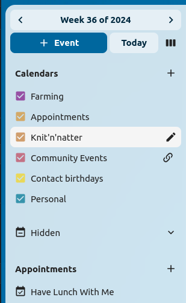

Click on the "pen" icon of the respective calendar. You will see a new popup that will allow you to change 
the calendar name and color, and buttons to delete or export the calendar.

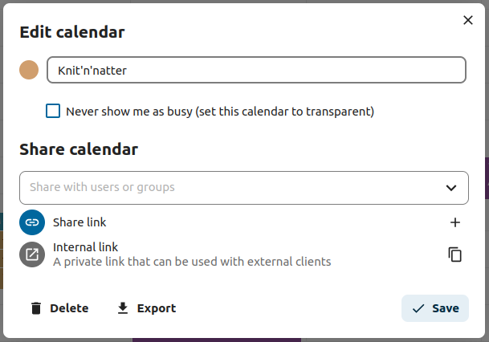

Calendar Transparency
~~~~~~~~~~~~~~~~~~~~~

You can toggle the checkbox "Never show me as busy (set calendar to transparent)" to influence if this calendars' events
are taken into account in Free/Busy calculations. If checked, no events in this calendar will be taken into account, your schedule will 
always be free, regardless of an events' settings.

.. figure:: images/calendar_transparency.png

Sharing calendars
~~~~~~~~~~~~~~~~~

You may share your calendar with other users or groups.

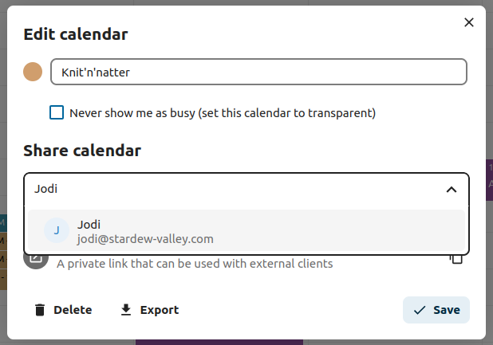

Calendars may be shared with write access or read-only. When sharing a calendar with write access, users with whom the calendar is shared will be able to create new events into the calendar as well as edit and delete existing ones.

.. figure:: images/calendar_sharing_2.png

.. note:: Calendar shares currently cannot be accepted or rejected. If you want to stop having a calendar that someone shared with you, you can click on the 3-dot menu next to the calendar in the calendar list and click on "Unshare from me". To restore a share, the calendar can be reshared again, either for the whole group, resetting all unshares, or for a single user.

Publishing a calendar
~~~~~~~~~~~~~~~~~~~~~

Calendars can be published through a public link to make them viewable (read-only) to external users. You may create a public link by opening the share menu for a calendar and clicking on « + » next to « Share link ». Once created you can copy the public link to your clipboard or send it through email.

There's also an « embedding code » that provides an HTML iframe to embed your calendar into public pages.

Multiple calendars can be shared together by adding their unique tokens to the end of an embed link. Individual tokens can be found at the end of each calendar's public link. The full address will look like
``https://cloud.example.com/index.php/apps/calendar/embed/<token1>-<token2>-<token3>``

To change the default view or date of an embedded calendar, you need to provide a URL that looks like ``https://cloud.example.com/index.php/apps/calendar/embed/<token>/<view>/<date>``.
In this url you need to replace the following variables:

- ``<token>`` with the calendar's token,
- ``<view>`` with one of ``dayGridMonth``, ``timeGridWeek``, ``timeGridDay``, ``listMonth``, ``listWeek``, ``listDay``. The default view is ``dayGridMonth`` and the normally used list is ``listMonth``,
- ``<date>`` with ``now`` or any date with the following format ``<year>-<month>-<day>`` (e.g. ``2019-12-28``).

On the public page, users are able to get the subscription link for the calendar and export the whole calendar directly.

Calendar Widget
~~~~~~~~~~~~~~~

You can embed your calendars into supported apps like ``Talk``, ``Notes``, etc... 
by either sharing the public link to make the embed viewable (read-only) to all users 
or by using the internal link to make it private.

Subscribe to a Calendar
~~~~~~~~~~~~~~~~~~~~~~~

You can subscribe to iCal calendars directly inside of your Nextcloud. By
supporting this interoperable standard (RFC 5545) we made Nextcloud calendar
compatible to Google Calendar, Apple iCloud and many other calendar-servers
you can exchange your calendars with, including subscription links from calendar published on other Nextcloud instances, as described above.

1. Click on ``+ New calendar`` in the left sidebar
2. Click on ``+ New subscription from link (read-only)``
3. Type in or paste the link of the shared calendar you want to subscribe to.

Finished. Your calendar subscriptions will be updated regularly.

.. note:: Subscriptions are refreshed every week by default. Your administrator may have changed this setting.

Subscribe to a Holiday Calendar
~~~~~~~~~~~~~~~~~~~~~~~~~~~~~~~

.. versionadded:: 4.4

You can subscribe to a read-only holiday calendar provided by `Thunderbird <https://www.thunderbird.net/calendar/holidays/>`_.

1. Click on ``+ New calendar`` in the left sidebar
2. Click on ``+ Add holiday calendar``
3. Find your country or region and click ``Subscribe``

Managing Events
---------------

Create a new event
~~~~~~~~~~~~~~~~~~

Events can be created by clicking in the area when the event is scheduled.
In the day- and week-view of the calendar you just click, pull and release your
cursor over the area when the event is taking place.

Clicking on the globe button brings up the timezone selector. You are able to choose different timezones for the start and end of your event. This is useful when travelling.

.. figure:: images/calendar_new-event_week.png

The month-view only requires a single click into the area of the target day.

.. figure:: images/calendar_new-event_month.png

After that, you can type in the event's name (e.g. **Meeting with Linus**), choose
the calendar in which you want to save the event to (e.g. **Personal**, **Community Events**),
check and concretize the time span or set the event as an all-day event. Optionally
you can specify a location and a description.

If you want to edit advanced details such as the **Attendees** or **Reminders**, or if you
want to set the event as a repeating-event, click on the ``More`` button to open the advanced
sidebar editor.

.. note:: If you always want to open the advanced sidebar editor instead of the
          simple event editor popup, you can set a ``Skip simple event
          editor`` checkmark in the ``Settings & Import`` section of the app.

Clicking on the blue ``Create`` button will finally create the event.

Edit, duplicate or delete an event
~~~~~~~~~~~~~~~~~~~~~~~~~~~~~~~~~~

If you want to edit, duplicate or delete a specific event, you first need to click on the event.

After that you will be able to re-set all event details and open the
advanced sidebar-editor by clicking on ``More``.

Clicking on the ``Update`` button will update the event. To cancel your changes, click on the close icon on top right of the popup or sidebar editor.

If you open the sidebar view and click the three dot menu next to the event name, you have an option to export the event as an ``.ics`` file or remove the event from your calendar.

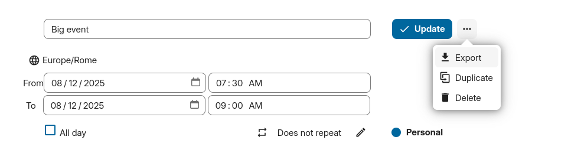

.. tip:: If you delete events they will go into your :ref:`trash bin<calendar-trash-bin>`. You can restore accidentally deleted events there.

You can also export, duplicate or delete an event from the basic editor.

.. figure:: images/calendar_event_menu_modal.png

.. _calendar-attendees:

Invite attendees to an event
~~~~~~~~~~~~~~~~~~~~~~~~~~~~

You may add attendees to an event to let them know they're invited. They will receive an email invitation and will be able to confirm or cancel their participation to the event.
Attendees may be other users on your Nextcloud instances, contacts in your address books and direct email addresses. You may also change the level of participation per attendees, or disable the email information for a specific attendee.

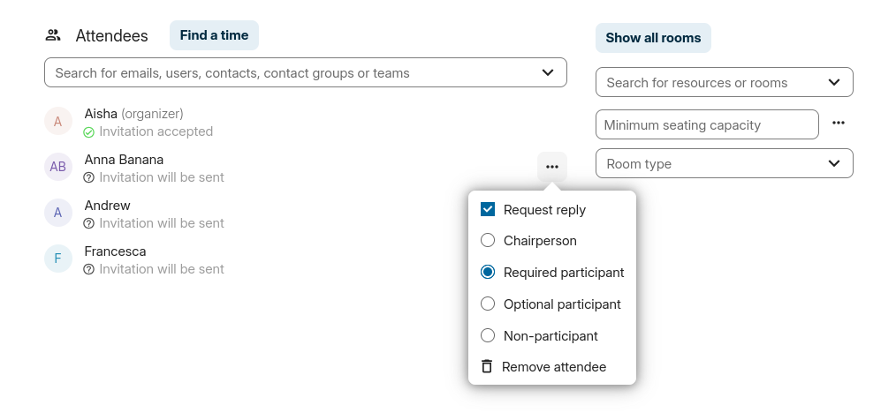

.. versionchanged:: 25
   Attendee email response links no longer offer inputs to add a comment or invite additional guests to the event.

.. tip:: When adding other Nextcloud users as attendees to an event, you may access their free-busy information if available, helping you determine when the best time slot for your event is. Set your :ref:`working hours<calendar-working-hours>` to let others know when you are available. Free-busy information is only available for other users on the same Nextcloud instance.

.. attention:: The server administration needs to setup the e-mail server in the ``Basic settings`` tab, as this mail will be used to send invitations.

Checking attendees' busy times
~~~~~~~~~~~~~~~~~~~~~~~~~~~~~~

After adding attendees to an event you can click on ``Find a time`` to bring up the "Free / Busy" modal. It allows you to see when each attendee has other events, and can help you decide on a time when everyone is free.

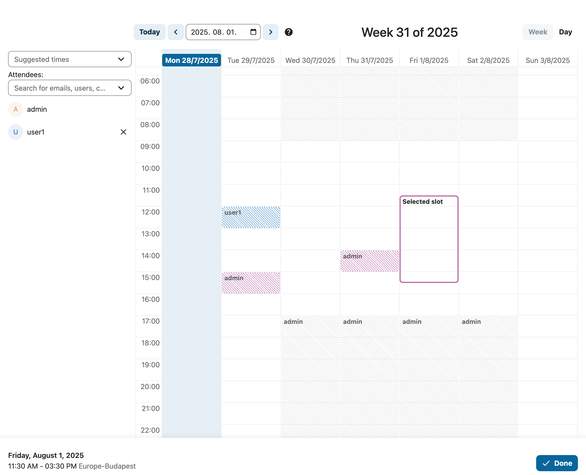

By pressing the ``?`` icon you can see the legend for the colors in the timeline, and by clicking and dragging you can modify the start and end times of your event. By pressing ``Suggest automatic slot`` you can also get suggestions on slots when everyone invited is free and available.

Assign rooms and resources to an event
~~~~~~~~~~~~~~~~~~~~~~~~~~~~~~~~~~~~~~

Similar to attendees you can add rooms and resources to your events. The system will make sure that each room and resource is booked without conflict. The first time a user adds the room or resource to an event, it will show as accepted. Any further events at overlapping times will show the room or resource as rejected.

.. note:: Rooms and resources are not managed by Nextcloud itself and the Calendar app will not allow you to add or change a resource. Your Administrator has to install and possibly configure resource back ends before you can use them as a user.

Room availability
~~~~~~~~~~~~~~~~~
.. versionadded:: 5.0

If the "Calendar Rooms and Resources" app is installed on your instance, you can now find ``Room availability``  the ``Resources`` section. It lists all the existing rooms. You can check the availability of each room in a manner similar to checking the free/busy status of event attendees.

.. figure:: images/room_availability.png

Add attachments to events
~~~~~~~~~~~~~~~~~~~~~~~~~
You can import attachments to your events either by uploading them or adding them from files

.. note:: Attachments can be added while creating new events or editing existent ones.
   Newly uploaded files will be saved in files by default in the calendar folder in the root directory.

You can change the attachment folder by going to ``Calendar settings`` in the bottom left corner and changing ``default attachments location``.

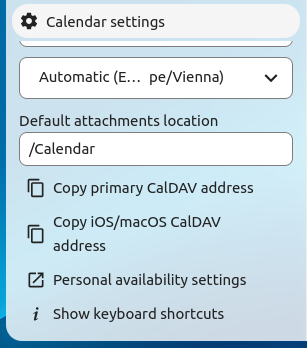

Set up reminders
~~~~~~~~~~~~~~~~

You can set up reminders to be notified before an event occurs. Currently supported notification methods are:

* Email notifications
* Nextcloud notifications

You may set reminders at a time relative to the event or at a specific date.

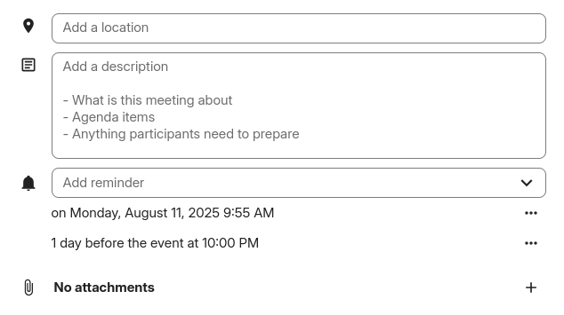

.. note:: Only the calendar owner and people or groups with whom the calendar is shared with write access will get notifications. If you don't get any notifications but think you should, your Administrator could also have disabled this for your server.

.. note:: If you synchronize your calendar with mobile devices or other 3rd-party
          clients, notifications may also show up there.

Add recurring options
~~~~~~~~~~~~~~~~~~~~~

An event may be set as "recurring", so that it can happen every day, week, month or year. Specific rules can be added to set which day of the week the event happens or more complex rules, such as every fourth Wednesday of each month.

You can also tell when the recurrence ends.

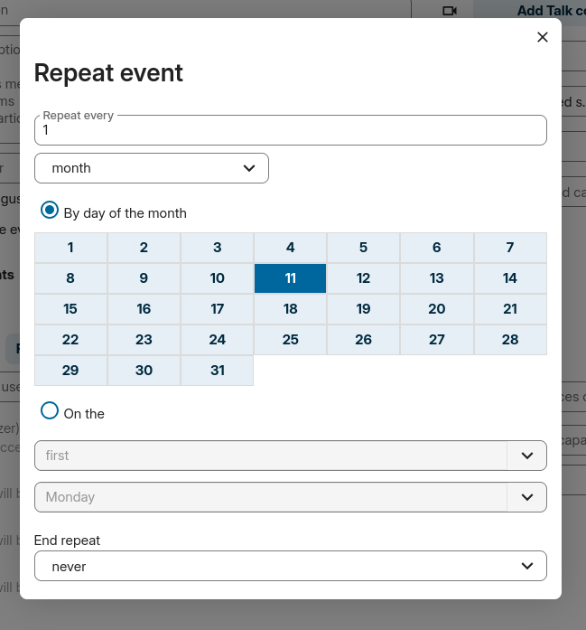

.. _calendar-trash-bin:

Trash bin
~~~~~~~~~

If you delete events, tasks or a calendar in Calendar, your data is not gone yet. Instead, those items will be collected in a *trash bin*. This offers you to undo a deletion. After a period which defaults to 30 days (your administration may have changed this setting), those items will be deleted permanently. You can also permanently delete items earlier if you wish.

.. figure:: images/calendar_trash_bin.png

The ``Empty trash bin`` buttons will wipe all trash bin contents in one step.

.. tip:: The trash bin is only accessible from the Calendar app. Any connected application or app won't be able to display its contents. However, events, tasks and calendars deleted in connected applications or app will also end up in the trash bin.

.. _calendar-working-hours:

Automated User Status
~~~~~~~~~~~~~~~~~~~~~

When you have a calendar event scheduled that has a "BUSY" status, your user status will be automatically set to "In a meeting" unless you have set yourself to "Do Not Disturb" or "Invisible".
You can overwrite the status with a custom message any time, or set your calendar events to "FREE".
Calendars that are transparent will be ignored.

Responding to invitations
-------------------------

You can directly respond to invitations inside the app. Click on the event and select your participation status. You can respond to an invitation by accepting, declining or accepting tentatively.

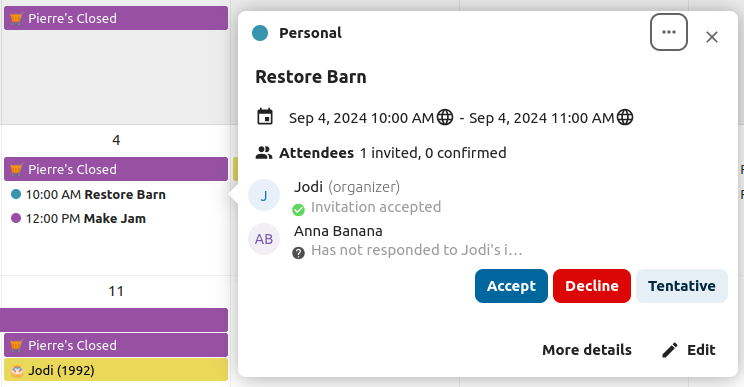

You can respond to an invitation from the sidebar too.

.. figure:: images/calendar_accept_sidebar_editor.png
   :scale: 80%

Availability (Working Hours)
----------------------------

The general availability independent of scheduled events can be set in the groupware settings of Nextcloud. These settings will be reflected in the free-busy view when you :ref:`schedule a meeting with other people<calendar-attendees>` in Calendar. Some connected clients like Thunderbird will show this data as well.

.. figure:: images/caldav_availability.png

You can configure one-time absences on top of your regular availability in the :ref:`Absence settings section <groupware-absence>`.

Birthday calendar
-----------------

The birthday calendar is a auto-generated calendar which will automatically
fetch the birthdays from your contacts. The only way to edit this calendar is by
filing your contacts with birthday dates. You can not directly edit this calendar
from the calendar-app.

.. note:: If you do not see the birthday calendar, your Administrator may have
          disabled this for your server.

Appointments
------------

As of Calendar v3 the app can generate appointment slots which other Nextcloud users but also people without an account on the instance can book. Appointments offer fine-granular control over when you are possibly free to meet up. This can eliminate the need to send emails back and forth to settle on a date and time.

In this section we'll use the term *organizer* for the person who owns the calendar and sets up appointment slots. The *attendee* is the person who books one of the slots.

Creating an appointment configuration
~~~~~~~~~~~~~~~~~~~~~~~~~~~~~~~~~~~~~

As an organizer of appointments you open the main Calendar web UI. In the left sidebar you'll find a section for appointments, were you can open the dialogue to create a new one.

.. figure:: images/appointment_new.png

One of the basic infos of every appointment is a title describing what the appointment is about (e.g. "One-on-one" when an organizer wants to offer colleagues a personal call), where an
appointment will take place and a more detailed description of what this appointment is about.

.. figure:: images/appointment_config_basics.png

The duration of the appointment can be picked from a predefined list. Next, you can set the desired increment. The increment is the rate at which possible slots are available.
For example, you could have one hour long slots, but you give them away at 30 minute increments so an attendee can book at 9:00AM but also at 9:30AM.
Optional infos about location and a description give the attendees some more context.Every booked appointment will be written into one of your calendars, so you can chose which one that should be. Appointments can be *public* or *private*.
Public appointments can be discovered through the profile page of a Nextcloud user. Private appointments are only accessible to the people who receive the secret URL.

.. figure:: images/appointment_config_calendar_settings.png

.. note:: Only slots that do not conflict with existing events in your calendars will be shown to attendees.

The organizer of an appointment can specify at which times of the week it's generally possible to book a slot. This could be the working hours but also any other customized schedule.

.. figure:: images/appointment_config_booking_hours.png

Some appointments require time to prepare, e.g. when you meet at a venue and you have to drive there.
The organizer can chose to select a time duration that must be free. Only slots that do not conflict with other events during the preparation time will be available. Moreover there is the option to specify a time after each appointment that has to be free.
To prevent an attendee from booking too short notice it's possible to configure how soon the next possible appointment might take place.
Setting a maximum number of slots per day can limit how many appointments are possibly booked by attendees.

.. figure:: images/appointment_config_limits.png

The configured appointment will then be listed in the left sidebar. Via the three dot menu, you can preview the appointment. You can copy the link to the appointment and share it with your target attendees,
or let them discover your public appointment via the profile page. You can also edit or delete the appointment configuration.

.. figure:: images/appointment_config_options.png

Booking an appointment
~~~~~~~~~~~~~~~~~~~~~~

The booking page shows an attendee the title, location, description and length of an appointment.
For a selected day there will be a list with all the possible time slots. On days with no available slots,
too many conflicts or a reached daily maximum limit of already booked appointments, the list might be empty.

.. figure:: images/appointment_booking_1.png
      :scale: 80%

For the booking, attendees have to enter a name and an email address. Optionally they can also add a comment.

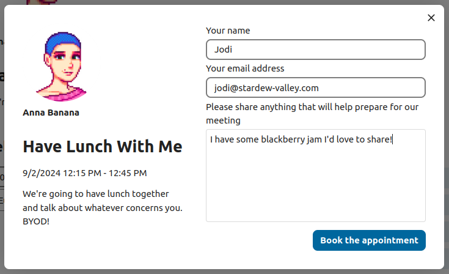

When the booking was successful, a confirmation dialogue will be shown to the attendee.

.. figure:: images/appointment_booking_3.png

To verify that the attendee email address is valid, a confirmation email will be sent to them.

.. figure:: images/appointment_booking_confirmation_email.png

Only after the attendee clicks the confirmation link from the email the appointment booking will be accepted and forwarded to the organizer.

.. figure:: images/appointment_booking_confirmation_dialogue.png

The attendee will receive another email confirming the details of their appointment.

.. figure:: images/appointment_booking_email_2.png

.. note:: If a slot has not been confirmed, it will still show up as bookable. Until then the time slot might also be booked by another user who confirms their booking earlier.
   The system will detect the conflict and offer to pick a new time slot.

Working with the booked appointment
~~~~~~~~~~~~~~~~~~~~~~~~~~~~~~~~~~~

Once the booking is done, the organizer will find an event in their calendar with the appointment details and the :ref:`attendee<calendar-attendees>`.

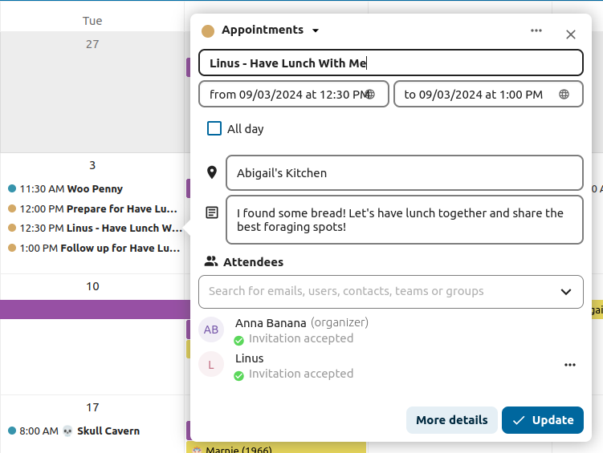

If the appointment has the setting "Add time before event" or "Add time after the event" enabled, they will show up as separate events in the calendar for the organizer.

.. figure:: images/appointment_calendar_prep.png

As with any other event that has attendees, changes and cancellations will trigger a notification to the attendee's email.

If attendees wish to cancel the appointment they have to get in contact with the organizer, so that the organizer can cancel or even delete the event.

Create Talk room for booked appointments
~~~~~~~~~~~~~~~~~~~~~~~~~~~~~~~~~~~~~~~~

You can create a Talk room directly from the calendar app for a booked appointment. The option can be found on the 'Create appointment' modal. A unique link will be generated for every booked appointment and sent via the confirmation email when you check this option.

