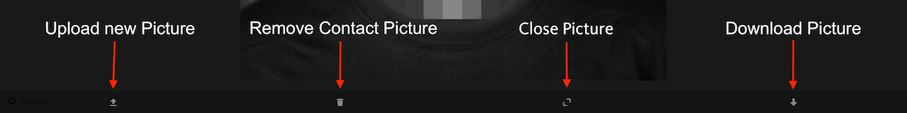
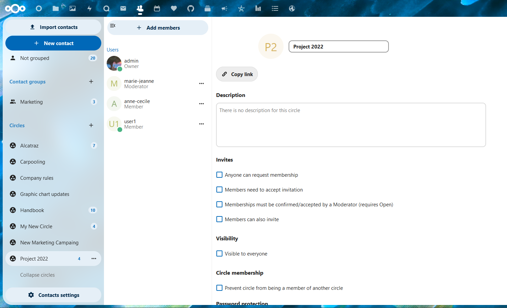
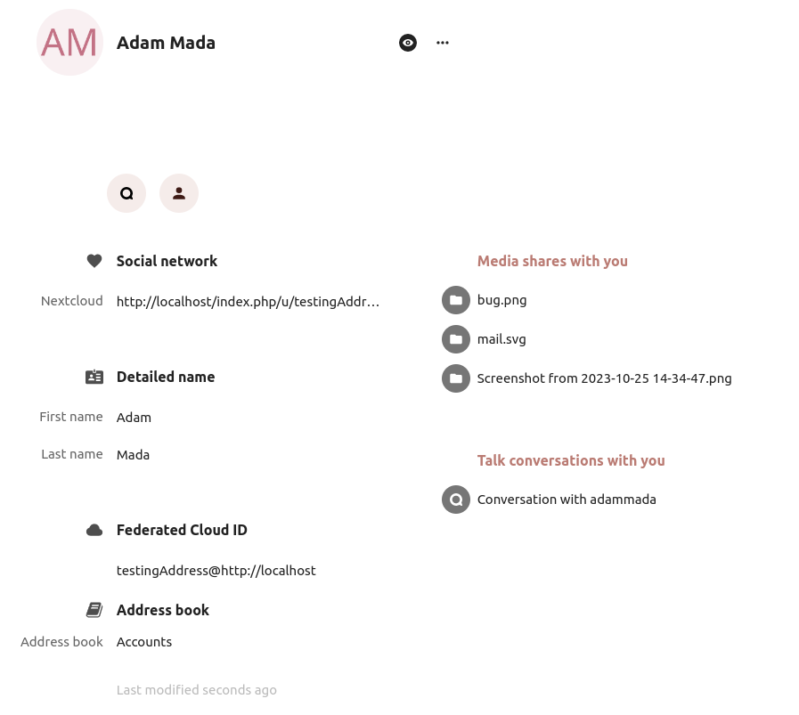

======================
Using the Contacts app
======================

The Contacts app is not enabled by default in Nextcloud |version| and needs to
be installed separately from our App Store.

The Nextcloud Contacts app is similar to other mobile contact applications, but
with more functionality.
Let's run through basic features that will help you maintain your address book
in the application.

Below, you will learn how to add contacts, edit or remove contacts, upload a
contact picture and manage your address books.

Adding Contacts
---------------

When you first access the Contacts app, the system address book containing all
users on the instance you are allowed to see, plus an empty default address book becomes available:

.. figure:: ../images/contacts_empty.png

  *Default Address Book (empty)*

To add contacts into your address book, you can use one of the following methods:

* Import contacts using a Virtual Contact File (VCF/vCard) file
* Add contacts manually

The fastest way to add a contact is to use a Virtual Contact File
(VCF/vCard) file.

Importing Virtual Contacts
~~~~~~~~~~~~~~~~~~~~~~~~~~

To Import Contacts Using a VCF/vCard File:

1. On top left of the screen you have "Import contacts" button that is shown only when you don't have any contacts yet.
2. Find "Settings" at the bottom of the left sidebar, next to the gear button:

	.. figure:: ../images/contact_bottombar.png
		:alt: Contact settings gear button

3. Click the gear button. The Contacts app "Import" button will appear:

	.. figure:: ../images/contact_uploadbutton.png
		:alt: Contacts Upload Field

.. note:: The Contacts app only supports import of vCards version 3.0 and 4.0.

4. Click the "Import" button and upload your VCF/vCard file.

After the import is complete, you will see your new contact in your address book.

Adding Contacts Manually
~~~~~~~~~~~~~~~~~~~~~~~~~~

If you can't import virtual contacts, the Contacts app enables you to **add contacts** manually.

To Create a New Contact:

1. Click the ``+ New contact`` button.

   The Edit View configuration opens in the Application View field:

  .. figure:: ../images/contact_new.png

2. Specify the new contact information then click Save.
3. The View mode will be shown with the data you added

  .. figure:: ../images/contact_view_mode.png

Edit or Remove Contact Information
~~~~~~~~~~~~~~~~~~~~~~~~~~~~~~~~~~

The Contacts app enables you to edit or remove contact information.

To edit or remove contact information:

1. Navigate to the specific contact that you want to modify.
2. Select the information in the field that you want to edit or remove.
3. Make your modifications or click on the trash bin.

Changes or removals that you made to any contact information are implemented immediately.

Not all contacts will be editable for you. The system address book does not allow you to modify
someone elses data, only your own. Your own data can also be modified in the :doc:`user settings <../userpreferences>`.

Contact Picture
~~~~~~~~~~~~~~~

To add a picture for your new contacts, click on the upload button:

.. figure:: ../images/contact_picture.png
	:alt: Contact picture (upload button)

After you have set a contact picture, it will look like this:

If you want to upload a new one, remove it, view it in full size or download it,
click on the contacts picture for the following options to appear:

Adding Contact Groups
---------------------

The Contacts app enables you to group contacts.

To create a new contact group, click on the plus sign next to "Contact groups" in the left sidebar.

.. note:: Contact groups need to have at least one member to be saved.

Adding and Managing Address Books
---------------------------------

Clicking on the "Settings" (gear) button at the bottom of the left sidebar
provides access to Contacts app settings. This field shows all
available address books, certain options for each address book, and enables you
to create new address books, simply by specifying an address books name:

.. figure:: ../images/contact_manageaddressbook.png
	:alt: Add address book in the contacts settings

The Contacts settings is also where you can share, export and delete addressbooks. You will find the CardDAV URLs there.

See :doc:`index` for more details about syncing your address books
with iOS, macOS, Thunderbird and other CardDAV clients.

Circles
-------

Informal collaboration takes place within organizations: an event to organize for a few weeks, a short ideation session between members from different entities, workshops, a place to joke around and support team building, or simply in very organic organizations where formal structure is kept to a minimum.

For all these reasons, Nextcloud supports Circles, a feature embedded in the Contacts app, where every user is able to create its own circle, a user-defined aggregate of accounts. Circles can be used later on to share files and folders, added to Talk conversations, like a regular group.

Create a circle
~~~~~~~~~~~~~~~

In the left menu, click on the + next to Circles.
Set a circle name
Landing on the circle configuration screen, you can:
- add members to your circle
- clicking on the three dot menu next to a user allow you to modify its role within the circle.

Circle roles
~~~~~~~~~~~~

Circles support 4 types of roles:

- Member
- Moderator
- Admin can configure circle options (+moderator permissions)
- Owner

**Member**

Member is the role with the lowest permissions. A member can only access the resources shared with the circle, and view the members of the circle.

**Moderator**

In addition to member permissions, a moderator can invite, confirm invitations and manage members of the circle.

**Admin**

In addition to moderator permissions, an admin can configure circle options.

**Owner**

In addition to admin permissions, an owner can transfer the circle ownership to another member of the circle. There can be only one single owner per circle.

Add members to a circle
~~~~~~~~~~~~~~~~~~~~~~~

Local accounts, groups, email addresses or other circles can be added as members to a circle.
For a group or a circle, the role applies to all members of the group or circle.

Circle options
~~~~~~~~~~~~~~

Various self-explanatory options are available to configure a circle, to manage invites and membership, visibility of the circle, allowance of other circle membership and password protection.

Shared items
~~~~~~~~~~~~
.. versionadded:: 5.5

Items that are shared between two contacts will be displayed in the contact app. This includes media, calendar events, chat rooms, and shared deck cards, all of which will be visible in the contact details. This functionality is limited to contacts listed in the system address book. Currently, our system only supports shared items between two contacts.
