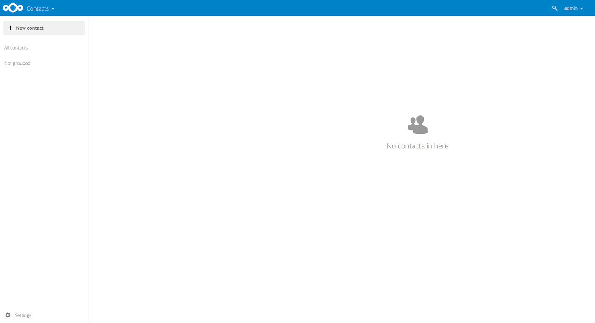

======================
Using the Contacts app
======================

The Contacts app is not enabled by default in Nextcloud |version| and needs to
be installed separately from our App Store.

The Nextcloud Contacts app is similar to other mobile contact applications, but
with more functionality.
Let's run through basic features that will help you maintain your address book
in the application.

Below, you will learn how to add contacts, edit or remove contacts, upload a
contact picture and manage your address books.

Adding Contacts
---------------

When you first access the Contacts app, the system address book containing all
users on the instance you are allowed to see, plus an empty default address book becomes available:

  *Default Address Book (empty)*

To add contacts into your address book, you can use one of the following methods:

* Import contacts using a Virtual Contact File (VCF/vCard) file
* Add contacts manually

The fastest way to add a contact is to use a Virtual Contact File
(VCF/vCard) file.

Importing Virtual Contacts
~~~~~~~~~~~~~~~~~~~~~~~~~~

To Import Contacts Using a VCF/vCard File:

1. On top left of the screen you have "Import contacts" button that is shown only when you don't have any contacts yet.
2. Find "Settings" at the bottom of the left sidebar, next to the gear button:

	.. figure:: ../images/contact_bottombar.png
		:alt: Contact settings gear button

3. Click the gear button. The Contacts app "Import" button will appear:

	.. figure:: ../images/contact_uploadbutton.png
		:alt: Contacts Upload Field

.. note:: The Contacts app only supports import of vCards version 3.0 and 4.0.

4. Click the "Import" button and upload your VCF/vCard file.

After the import is complete, you will see your new contact in your address book.

Adding Contacts Manually
~~~~~~~~~~~~~~~~~~~~~~~~

If you can't import virtual contacts, the Contacts app enables you to **add contacts** manually.

To Create a New Contact:

1. Click the ``+ New contact`` button.

   The Edit View configuration opens in the Application View field:

  .. figure:: ../images/contact_new.png

2. Specify the new contact information then click Save.
3. The View mode will be shown with the data you added

  .. figure:: ../images/contact_view_mode.png

Edit or Remove Contact Information
~~~~~~~~~~~~~~~~~~~~~~~~~~~~~~~~~~

The Contacts app enables you to edit or remove contact information.

To edit or remove contact information:

1. Navigate to the specific contact that you want to modify.
2. Select the information in the field that you want to edit or remove.
3. Make your modifications or click on the trash bin.

Changes or removals that you made to any contact information are implemented immediately.

Not all contacts will be editable for you. The system address book does not allow you to modify
someone elses data, only your own. Your own data can also be modified in the :doc:`user settings <../userpreferences>`.

Contact Picture
~~~~~~~~~~~~~~~

To add a picture for your new contacts, click on the upload button:

.. figure:: ../images/contact_picture.png
	:alt: Contact picture (upload button)

After you have set a contact picture, it will look like this:

.. figure:: ../images/contact_picture_set.png
	:alt: Contact picture (set)

If you want to upload a new one, remove it, view it in full size or download it,
click on the contacts picture for the following options to appear:

If the administrator allows updates from social media in the admin groupware settings,
users can also retrieve contact pictures directly from social networks.
In that case the contact needs to have stored a user name in the social media section.
Each entry of a supported social network adds a download entry for the respective
network. Currently, the following social networks are supported:

- Instagram
- Mastodon
- Tumblr
- Diaspora
- Xing
- Telegram
- Gravatar

Social avatars are only retrieved if publicly available without login to the
respective social network. In the contact user settings on the contacts page,
you can activate auto-updates from social media. This will update avatars
with social profile data on a weekly basis. Social networks are checked in the
order listed above.

Managing multiple Contacts at a time
------------------------------------

The Contacts app enables you to select multiple contacts and to perform batch actions on them. To select multiple contacts, either click on each contacts profile picture individually, or click on the profile picture on the first contact then while holding the shift key click on another contact in the list to select all contacts in between the first and second one.

This will bring up a menu at the top of the contacts list with various actions you can perform on the selected contacts:

.. figure:: images/contact_multiselect.png
    :alt: Contact multiselect actions

In batch mode, the cross icon button will unselect all selected contacts, while the trash bin icon button will delete all selected contacts.

.. note:: You might not be able to modify or delete certain contacts, for example if they are in a read-only address book. In that case, relevant actions will be disabled.

Merging duplicate Contacts
~~~~~~~~~~~~~~~~~~~~~~~~~~

To merge contacts, select two contacts then click the "Merge contacts" icon button at the top of the contacts list, this will open a dialog that helps you merge duplicate contacts. The merging dialog will show the details of both contacts side by side, and you can choose which details to keep in the merged contact.

Any properties with a Radio (circular) button can only have one value, so one of the two values must be selected (like the name of the contact, which can only have one value), meanwhile checkboxes (square buttons) allow you to keep both values if desired (like phone numbers or email addresses, which can have multiple values).

If either of the contacts are part of a group(s), by default the merged contact will be part of all groups that the two contacts were part of. You can uncheck any groups while merging if you don't want the merged contact to be part of them.

.. note:: Currently you are only able to merge two contacts at a time, and you are naturally only able to merge contacts that can be modified by you. If the merging action is disabled, check that you selected contacts that match those conditions.

Organize your Contacts with Contact Groups
------------------------------------------

Contact Groups help you to organize your contacts into groups.

To create a new contact group, click on the plus sign next to "Contact groups" in the left sidebar.

.. note:: Contact groups need to have at least one member to be saved. Please note that you can only add contacts from writable address books to contact groups. Contacts from read-only address books, such as the system address book, cannot be added.

Adding and Managing Address Books
---------------------------------

Clicking on the "Settings" (gear) button at the bottom of the left sidebar
provides access to Contacts app settings. This field shows all
available address books, certain options for each address book, and enables you
to create new address books, simply by specifying an address books name:

.. figure:: ../images/contact_manageaddressbook.png
	:alt: Add address book in the contacts settings

The Contacts settings is also where you can share, export and delete addressbooks. You will find the CardDAV URLs there.

.. note:: Contacts in disabled address books are not shown in the Contacts app and the Contact menu.

See :doc:`index` for more details about syncing your address books
with iOS, macOS, Thunderbird and other CardDAV clients.

Teams
-----

Informal collaboration takes place within organizations: an event to organize for a few weeks, a short ideation session between members from different entities, workshops, a place to joke around and support team building, or simply in very organic organizations where formal structure is kept to a minimum.

For all these reasons, Nextcloud supports Teams, a feature embedded in the Contacts app, where every user is able to create its own team, a user-defined aggregate of accounts. Teams can be used later on to share files and folders, added to Talk conversations, like a regular group.

.. figure:: ./images/circle.png
	:alt: Teams in the Contacts app left menu

Create a team
~~~~~~~~~~~~~

In the left menu, click on the + next to Teams.
Set a team name.
Landing on the team configuration screen, you can:

- add members to your team
- clicking on the three dot menu next to a user allow you to modify its role within the team.

Team roles
~~~~~~~~~~

Teams support 4 types of roles:

- Member
- Moderator
- Admin can configure team options (+moderator permissions)
- Owner

**Member**

Member is the role with the lowest permissions. A member can only access the resources shared with the team, and view the members of the team.

**Moderator**

In addition to member permissions, a moderator can invite, confirm invitations and manage members of the team.

**Admin**

In addition to moderator permissions, an admin can configure team options.

**Owner**

In addition to admin permissions, an owner can transfer the team ownership to another member of the team. There can be only one single owner per team.

Add members to a team
~~~~~~~~~~~~~~~~~~~~~

Local accounts, groups, email addresses or other teams can be added as members to a team.
For a group or a team, the role applies to all members of the group or team.

Team options
~~~~~~~~~~~~

Various self-explanatory options are available to configure a team, to manage invites and membership, visibility of the team, allowance of other team membership and password protection.

Shared items
~~~~~~~~~~~~
.. versionadded:: 5.5

.. figure:: ./images/shared-items.png

Items that are shared between two contacts will be displayed in the contact app. This includes media, calendar events, chat rooms, and shared deck cards, all of which will be visible in the contact details. This functionality is limited to contacts listed in the system address book. Currently, our system only supports shared items between two contacts.
