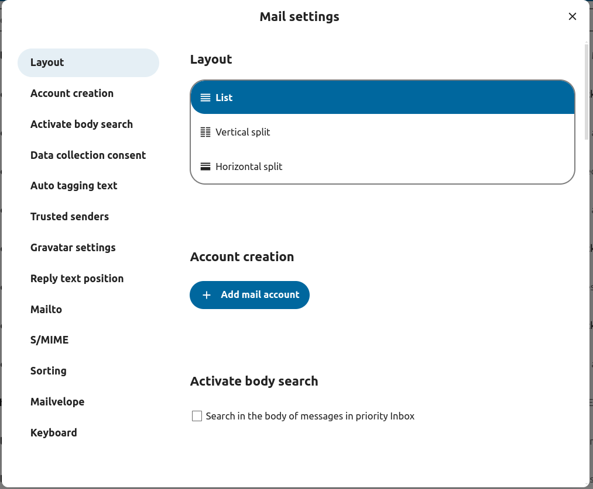
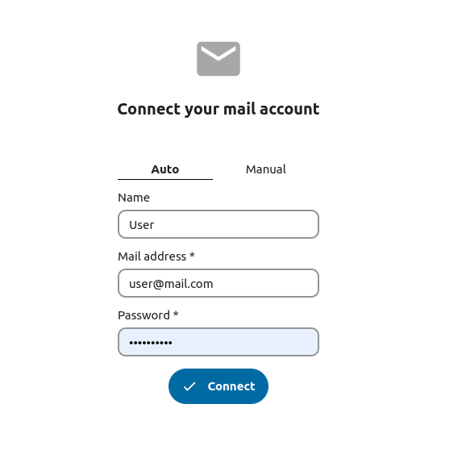
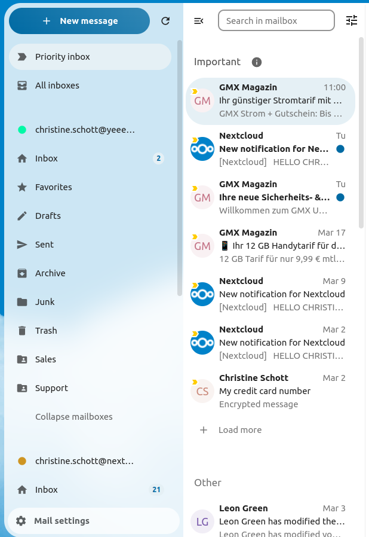
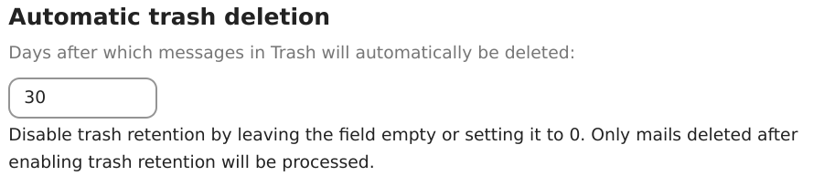
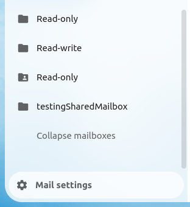
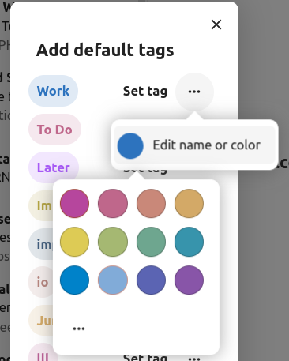
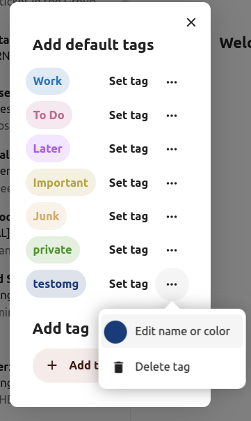

===================
Using the Mail app
===================

.. note:: The Mail app comes installed with Nextcloud Hub by default, but can be disabled.
          Please ask your Administrator for it.

.. figure:: images/mail.png

Managing your mail account
---------------------------

Switch layout
~~~~~~~~~~~~~
 .. versionadded:: 3.6

1. Visit mail settings
2. Choose between *List*, *Vertical split* and *Horizontal split*

Add a new mail account
~~~~~~~~~~~~~~~~~~~~~~~

1. Enable mail app from the apps
2. Click the mail icon on the header
3. Fill up the login form (auto or manual)

Change sort order
~~~~~~~~~~~~~~~~~

 .. versionadded:: 3.5

1. Visit mail settings
2. Go to *Sorting*
3. You can choose *Oldest* or *Newest* mail first

.. note:: This change will apply across all your accounts and mailboxes

.. _mail-scheduled-messages:

Scheduled messages
~~~~~~~~~~~~~~~~~~~
1. Click new message button on top left of your screen
2. Click the (...) action menu on the modal composer
3. Click *send later*

.. figure:: images/scheduled-msg.png

Priority inbox
~~~~~~~~~~~~~~
Priority inbox has 2 section *Important* and *Others*.
Messages will automatically be marked as important based on which messages you interacted with or marked as important. In the beginning you might have to manually change the importance to teach the system, but it will improve over time.

All inboxes
~~~~~~~~~~~~
All messages from all the accounts you have logged in, will be shown here chronologically.

.. _mail-account-settings:

Account settings
~~~~~~~~~~~~~~~~
Your account settings such as:

1. Aliases
2. Signature
3. Default Folders
4. Autoresponder
5. Trusted senders
6. ..and more

Can be found in the action menu of a mail account. There you can edit, add or remove settings depending on your need.

Move messages to Junk folder
~~~~~~~~~~~~~~~~~~~~~~~~~~~~

   .. versionadded:: 3.4

Mail can move a message to a different folder when it is marked as junk.

1) Visit Account settings
2) Go to Default folders
3) Check that a folder is selected for the junk messages
4) Go to Junk settings
5) Click Move messages to Junk folder

   .. figure:: images/mail_move-message-to-junk-folder.png

Search in mailbox
~~~~~~~~~~~~~~~~~
.. versionadded:: 2.1

At the top of the envelope list in any mail layout, there is a search field shortcut for searching email subjects. Starting from ``version 3.7``, this shortcut allows you to search by subject, recipient (to), or sender (from) by default.

Advance search in mailbox
~~~~~~~~~~~~~~~~~~~~~~~~~

.. versionadded:: 3.4

You can access our advanced search feature through a modal located at the end of the search shortcut.

Enable mail body search
~~~~~~~~~~~~~~~~~~~~~~~~~~
   .. versionadded:: 3.5

Mail bodies can now be searched, this feature is opt-in because of potential performance issues.

To enable it:

1) Visit Account settings
2) Go to Mailbox search
3) Enable mail body search

.. warning:: If you want to also enable it for unified mailboxes you have to do so in Mail settings

By enabling it the main search box will now search in both subjects and mail bodies, and a separate *Body* option
will appear in advanced search.

Account delegation
~~~~~~~~~~~~~~~~~~

The app allows account delegation so that one user can send emails from the address of another.

1) The delegation has to be configured on the mail server by an admin
2) Add the other email address as an alias for your own email account
3) When sending an email, select the alias as sender

.. warning:: The sent email might not be visible to the original account if it's stored in your personal *Sent* mailbox.

Automatic trash deletion
~~~~~~~~~~~~~~~~~~~~~~~~

.. versionadded:: 3.4

The Mail app can automatically delete messages in the trash folder after a certain number of days.

1) Visit Account settings
2) Go to Automatic trash deletion
3) Enter the number of days after which messages should be deleted

Disable trash retention by leaving the field empty or setting it to 0.

.. note::  Only mails deleted after enabling trash retention will be processed.

Compose messages
----------------

1. Click new message on the top left of your screen
2. Start writing your message

Recipient info on composer
--------------------------

.. versionadded:: 4.2

When you add your first recipient or contact in the "To" field, a right pane will appear displaying the saved profile details of that contact.
Adding a second contact will collapse the list, allowing you to select and expand any contact you added to view their details.
If you prefer to focus solely on writing in the composer, you can hide the right pane by clicking the expand icon in the top-right corner.
To show the right pane again, simply click the minimize icon in the same location.

Mention contacts
----------------

.. versionadded:: 4.2

You can mention contacts in your message by typing ``@`` and then selecting the contact from the list.
By doing so the contact will be automatically added as a recipient.

.. note::  Only contacts with a valid email address will be suggested.

Minimize the composer modal
~~~~~~~~~~~~~~~~~~~~~~~~~~~

   .. versionadded:: 3.2

The composer modal can be minimized while writing a new message, editing an existing draft or editing a message from the outbox. Simply click the minimize button on the top right of the modal or click anywhere outside the modal.

   .. figure:: images/mail-minimize-composer.png

You can resume your minimized message by clicking anywhere on the indicator on the bottom right of your screen.

   .. figure:: images/mail-composer-indicator.png

Press the close button on the modal or the indicator in the bottom right corner to stop editing a message. A draft will be saved automatically into your draft mailbox.

Outbox
------

When a message has been composed and the "Send" button was clicked, the message is added to the outbox which can be found in the bottom left corner of the left sidebar.

You can also set the date and time for the send operation to a point in the future (see :ref:`Scheduled messages <mail-scheduled-messages>`)- the message will be kept in the outbox until your chosen date and time arrives, then it will be sent automatically.

The outbox is only visible when there is a message waiting to be handled by the outbox.

You can re- open the composer for a message in the outbox any time before the "send"- operation is triggered.

.. note::
   When an error occurs during sending, three error messages are possible:

   Could not copy to "Sent" mailbox
      The mail was sent but couldn't be copied to the "Sent" mailbox. This error will be handled by the outbox and the copy operation will be tried again.
   Mail server error
      Sending was unsuccessful with a state than can be retried (ex: the SMTP server couldn't be reached). The outbox will retry sending the message.
   Message could not be sent
      Sending might or might not have failed. The mail server can't tell us the state of the message. Since the Mail app has no way to determine the state of the message (sent or unsent) the message will stay in the outbox and the account user has to decide how to proceed.

Mailbox actions
---------------

Add a mailbox
~~~~~~~~~~~~~~
1. Open the action menu of an account
2. Click add mailbox

Add a submailbox
~~~~~~~~~~~~~~~~~
1. Open the action menu of a mailbox
2. Click add submailbox

Shared mailbox
~~~~~~~~~~~~~~~
If a mailbox was shared with you with some specific rights, that mailbox will show as a new mailbox with a shared icon as below:

Envelope actions
----------------

Create an event
~~~~~~~~~~~~~~~
Create an event for a certain message/thread directly via mail app

1. Open action menu of an envelope
2. Click *More actions*
3. Click *Create event*

.. note:: Event title and an agenda is created for you if the administrator has enabled it.

Create a task
~~~~~~~~~~~~~

.. versionadded:: 3.2

Create an task for a certain message/thread directly via mail app

1. Open action menu of an envelope
2. Click *more actions*
3. Click *create task*

.. note:: Tasks are stored in supported calendars. If there is no compatible calendar you can create a new one with the :ref:`calendar app<calendar-app>`.

Edit tags
~~~~~~~~~~
1. Open action menu of an envelope
2. Click *Edit tags*
3. On the tags modal, set/unset tags

Change color for tags
~~~~~~~~~~~~~~~~~~~~~

.. versionadded:: 3.5

Upon creating a tag, a randomly assigned color is automatically chosen. Once the tag is saved, you have the flexibility to customize its color according to your preferences. This feature can be found on the Tag modal action menu.

Delete tags
~~~~~~~~~~~

.. versionadded:: 3.5

You now have the ability to delete tags that you have previously created. To access this feature:

1. Open the action menu of an envelope/thread.
2. Select Edit tags.
3. Within the tags modal, open the action menu for the specific tag you wish to delete.

.. note:: Please note that default tags such as Work, To do, Personal, and Later cannot be deleted, they can only be renamed.

AI summary
~~~~~~~~~~

.. versionadded:: 4.2

When looking through your mailbox you will see a short AI generated summary of your emails as a preview.

.. note:: Please note that the feature has to be enabled by the administrator

Message actions
---------------

Unsubscribe from a mailing list
~~~~~~~~~~~~~~~~~~~~~~~~~~~~~~~

.. versionadded:: 3.1

Some mailing lists and newsletters allow to be unsubscribed easily. If the Mail app detects messages from such a sender, it will show an *Unsubscribe* button next to the sender information. Click and confirm to unsubscribe from the list.

Snooze
~~~~~~

.. versionadded:: 3.4

Snoozing a message or thread moves it into a dedicated mailbox until the selected snooze date is reached and the message or thread is moved back to the original mailbox.

1. Open action menu of an envelope or thread
2. Click *Snooze*
3. Select how long the message or thread should be snoozed

Smart replies
~~~~~~~~~~~~~

.. versionadded:: 3.6

When you open a message in the Mail app, it proposes AI-generated replies. By simply clicking on a suggested reply, the composer opens with the response pre-filled.

.. note:: Please note that the feature has to be enabled by the administrator

.. note:: Supported languages depend on the used large language model

Thread summary
--------------

The mail app supports summarizing message threads that contain 3 or more messages.

.. versionadded:: 3.4

.. note:: Please note that the feature has to be enabled by the administrator

.. note:: Please note that this feature only works well with integration_openai. Local LLMs take too long to respond and the summary request is likely to time out and still create significant system load.

Filtering and autoresponder
---------------------------

The Mail app has a simple editor for Sieve scripts and an interface to configure autoresponders. Sieve has to be enabled in the :ref:`account settings <mail-account-settings>`.

Autoresponders
~~~~~~~~~~~~~~

.. versionadded:: 3.5 Autoresponder can follow system settings.

The autoresponder is off by default. It can be set manually, or follow the system settings. Following system settings means that the long absence message entered on the :ref:`Absence settings section <groupware-absence>` is applied automatically.

Follow-up reminders
-------------------

.. versionadded:: 4.0

The Mail app will automatically remind you when an outgoing email did not receive a response.
Each sent email will be analyzed by an AI to check whether a reply is expected.
After four days all relevant emails will be shown in your priority inbox.

When clicking on such an email a button will be shown to quickly follow up with all recipients.
It is also possible to disable follow-up reminders for a sent email.

.. note:: Please note that the feature has to be enabled by the administrator.

Security
--------

Phishing detection
~~~~~~~~~~~~~~~~~~

.. versionadded:: 4.0

The Mail app will check for potential phishing attempts and will display a warning to the user.

The checks are the following:

* The sender address saved in the addressbook is not the same as the one in the mail account
* The sender is using a custom email address that doesn't match the from address
* The sent date is set in the future
* Links in the message body are not pointing to the displayed text
* The reply-to address is not the same as the sender address

.. note:: Please note that the warning does not mean that the message is a phishing attempt. It only means that the Mail app detected a potential phishing attempt.

Internal addresses
~~~~~~~~~~~~~~~~~~

.. versionadded:: 4.0

The Mail app allows adding internal addresses and domains, and will warn the user if the address is not in the list, when sending and upon receiving a message.

To add an internal address:

1. Open the mail settings
2. Navigate to Privacy and security section
3. Enable the internal addresses by ckicjin on the checkbox
4. Click the Add internal address button
5. Enter the address or domain and click Add
