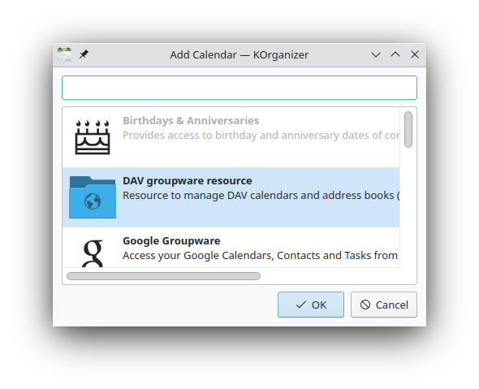
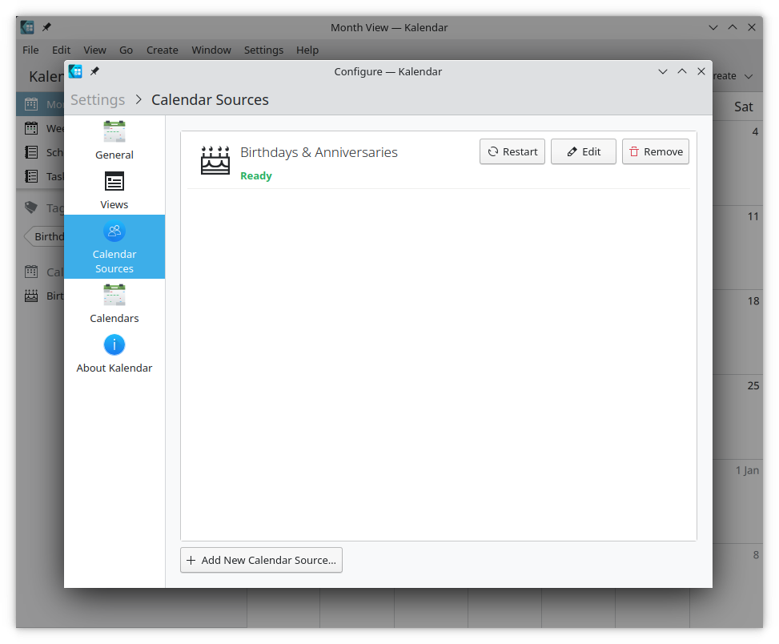
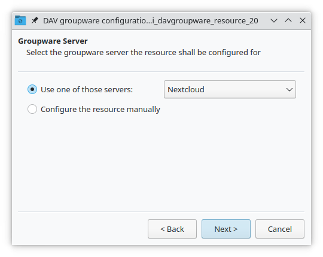
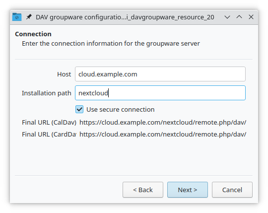
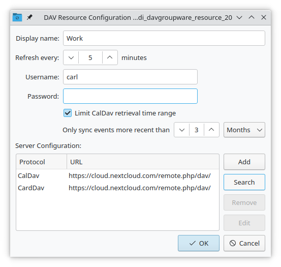
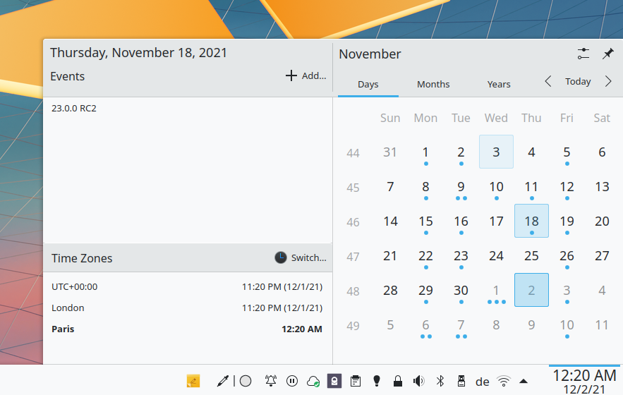
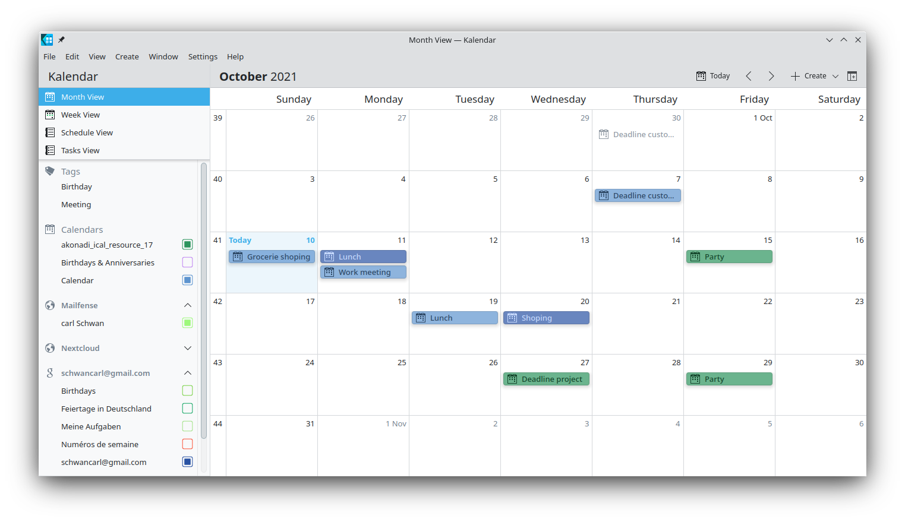
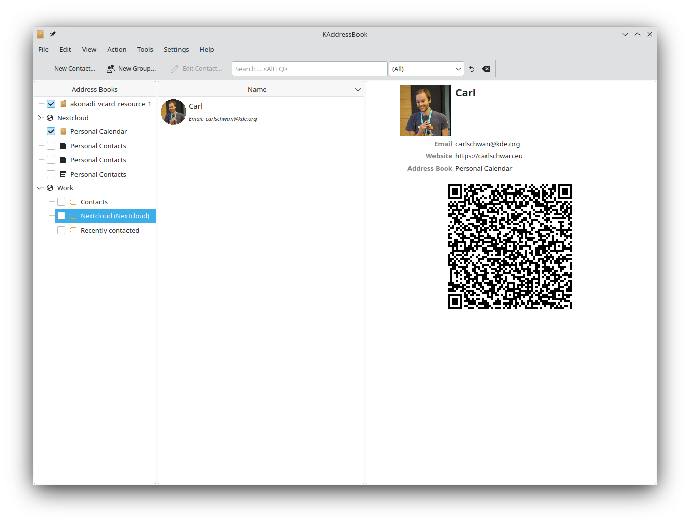

==============================
Synchronizing with KDE Kontact
==============================

KOrganizer, Kalendar and KAddressBook can synchronize your calendar, contacts and tasks with a Nextcloud server.

This can be done by following these steps depending on if you use KOrganizer or Kalendar:

In KOrganizer:

1. Open KOrganizer and in the calendar list (bottom left) right-click and choose ``Add Calendar``:

.. image:: ../images/KOrganizer_add_calendar.png

2. In the resulting list of resources, pick ``DAV groupware resource``:

In Kalendar:

1. Open Kalendar and in the menu bar open the setting and then choose ``Calendar Sources`` -> ``Add Calendar``:

2. In the resulting list of resources, pick ``DAV groupware resource``:

.. image:: ../images/kalendar_resource_choice.png

In KOrganizer and Kalendar:

3. Enter your username. As password, you need to generate an app-password/token (`Learn more <https://docs.nextcloud.com/server/latest/user_manual/en/session_management.html#managing-devices>`_):

.. TODO ON RELEASE: Update version number above on release

.. image:: ../images/korganizer_credentials.png

4. Choose ``Nextcloud`` as Groupware server option:

5. Enter your Nextcloud server URL and, if needed, installation path (anything that comes after the first /, for example ``mynextcloud`` in ``https://example.com/mynextcloud``). Then click next:

6. You can now test the connection, which can take some time for the initial connection. If it does not work, you can go back and try to fix it with other settings:

.. image:: ../images/KOrganizer_test1.png

.. image:: ../images/KOrganizer_test2.png

7. Pick a name for this resource, for example ``Work`` or ``Home``. By default, both CalDAV (Calendar) and CardDAV (Contacts) are synced:

.. note:: You can set a manual refresh rate for your calendar and contacts resources. By default this setting is set to 5 minutes and should be fine for the most use cases. When you create a new appointment it is synced to Nextcloud right away. You may want to change this for saving your power or cellular data plan, so that you can update with a right-click on the item in the calendar list.

8. After a few seconds to minutes depending on your internet connection, you will find your calendars and contacts inside the KDE Kontact applications KOrganizer, Kalendar and KAddressBook as well as Plasma calendar applet:

.. image:: ../images/KOrganizer.png

