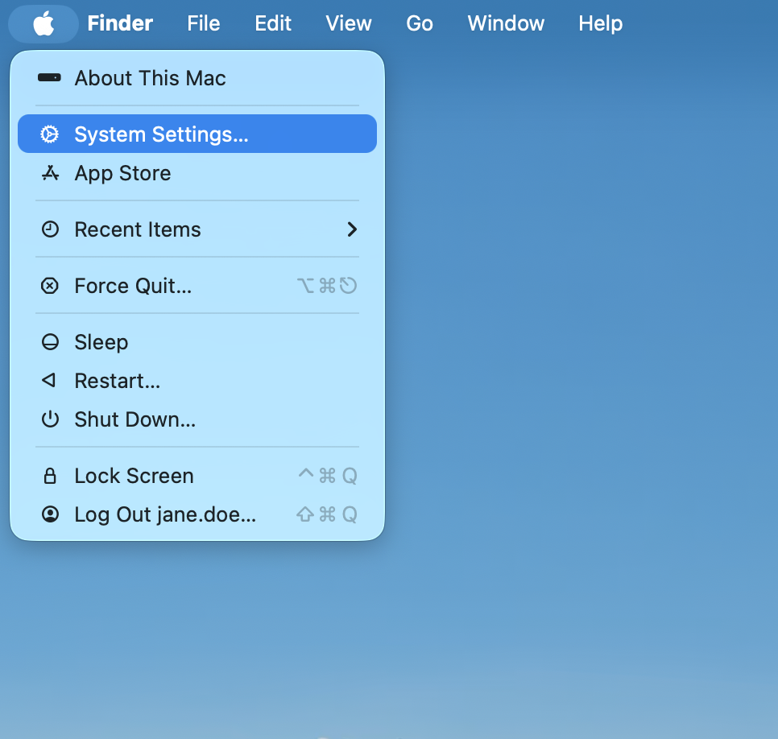
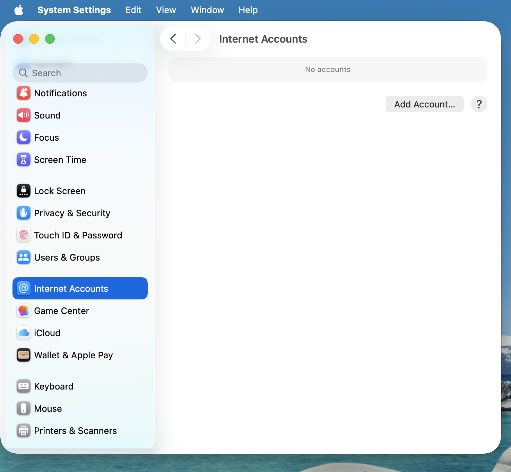
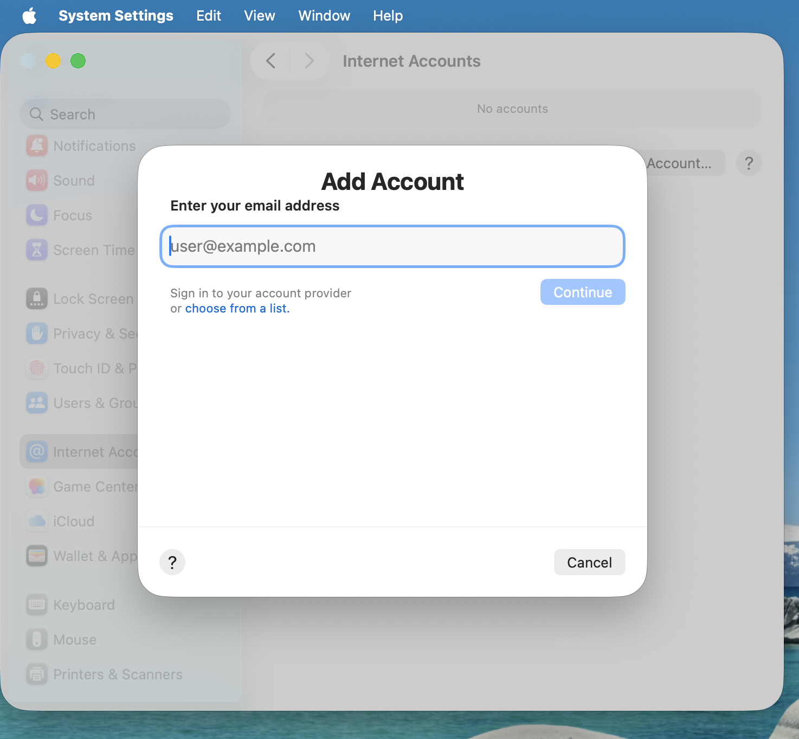
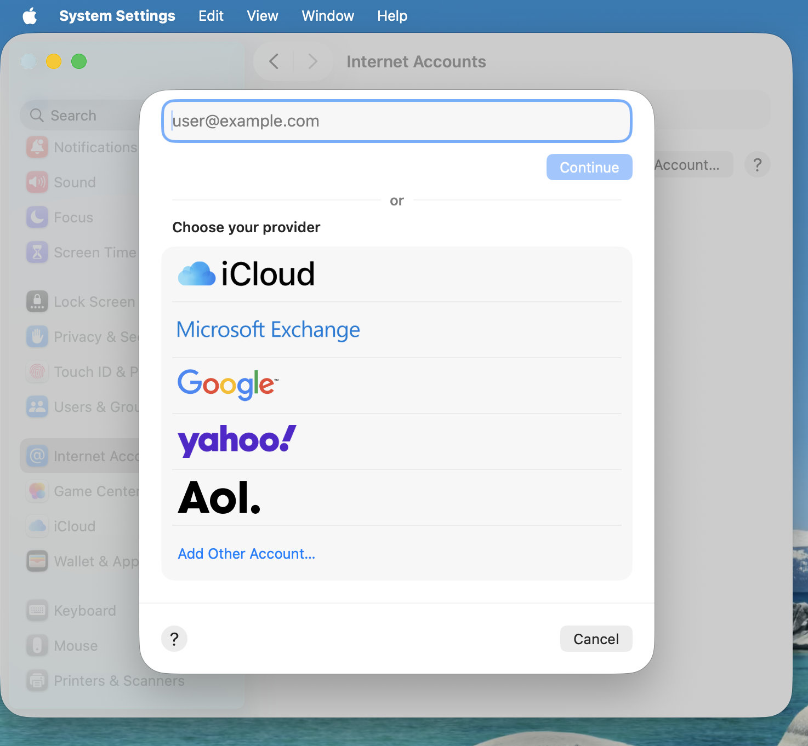
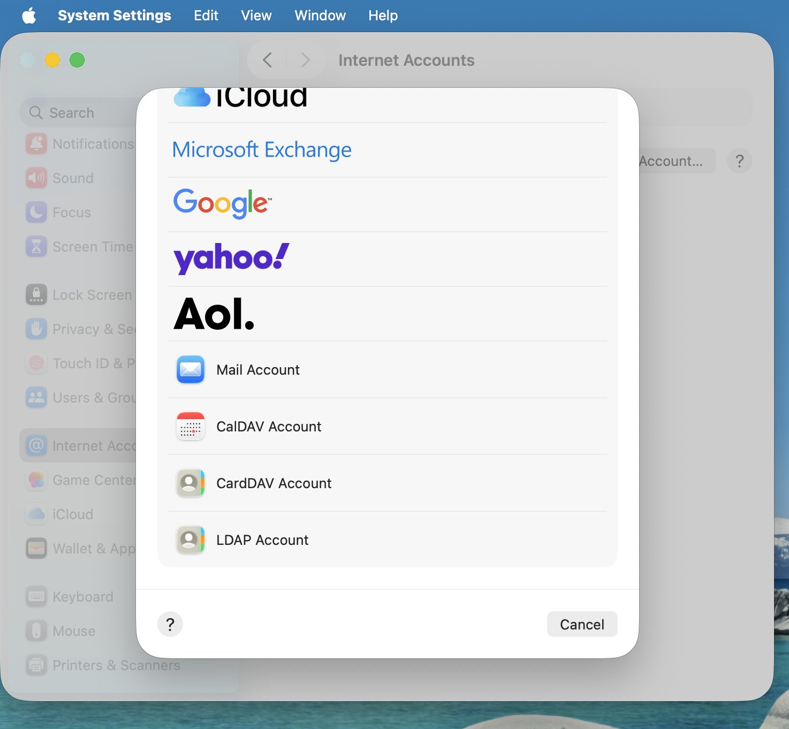
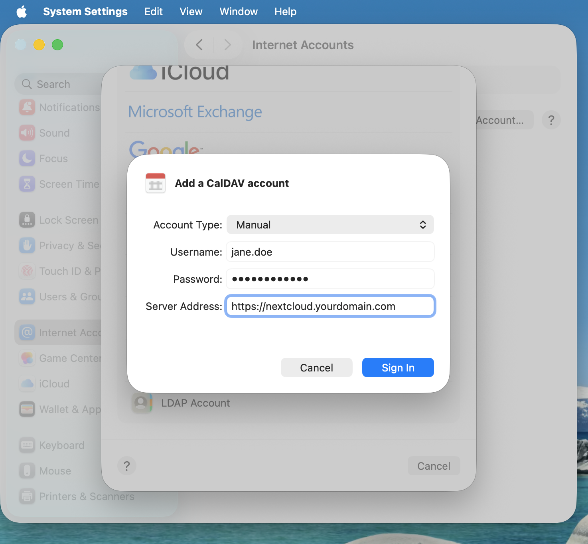

========================
Synchronizing with macOS
========================

Setup your Accounts
-------------------

In the following steps you will add **CalDAV** (Calendar)
and **CardDAV** (Contacts) to your macOS integrated Calendar and Contacts applications.
At the time of writing this guide, macOS is at version 26.3.1.

1. Click on the Apple logo in the top left corner of your screen and select
   **System Settings...** from the dropdown menu.

2. Navigate to **Internet Accounts**:

3. Click on the small blue **choose from a list.**

4. Click on **add Other Account...** 

5. Select **CalDAV Account** for calendar and **CardDAV Account** for contacts.

.. note:: You can not setup Calendar/Contacts together. You need to setup them **separately**.

6. Select **Manual** as Account Type and type in your respective credentials:

   **Username**: Your Nextcloud username or email

   **Password**: Either your password or if you use 2FA your generated app-password/token (:ref:`Learn more<managing_devices>`).

   **Server Address**: URL of your Nextcloud server (e.g. ``https://nextcloud.yourdomain.com``)

7. Click on **Sign In**.

Troubleshooting
---------------

- macOS does **not** support syncing CalDAV/CardDAV over non-encrypted ``http://``
  connections. Make sure you have ``https://`` enabled and configured on server- and
  client-side.

- **Self-signed certificates** need to be properly set up in the macOS keychain.
