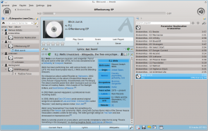

Native Media Player Support
===========================

You can access your music stored in ownCloud with every
Ampache-compatible media player. You can find the URL for your specific
ownCloud installation in your personal settings, or replace ADDRESS with
the URL of your ownCloud installation yourself.

``Ampache-URL: http://ADDRESS/apps/media/``

Ampache-compatible players that work with ownCloud include:

-  `amaroK`_, standard KDE music player
-  `tomahawk`_, cross platform player
-  `justplayer`_, music player for android

You can find more information about Ampache and other players at the
`Ampache wikipedia article`_

The current maintainer of the Media Player is Robin Appelman.

.. _amaroK: http://amarok.kde.org/
.. _tomahawk: http://www.tomahawk-player.org/
.. _justplayer: http://justplayer-dev.blogspot.com/
.. _Ampache wikipedia article: http://en.wikipedia.org/wiki/Ampache
