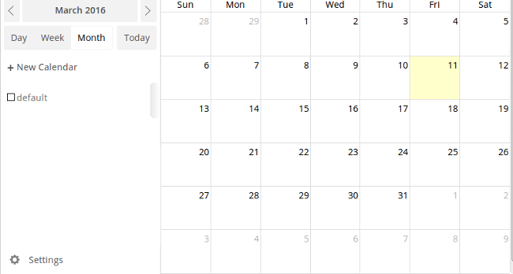
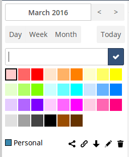
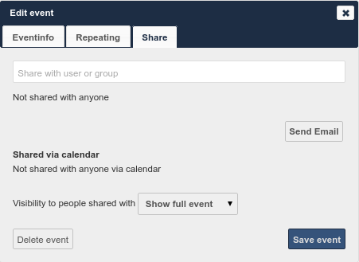
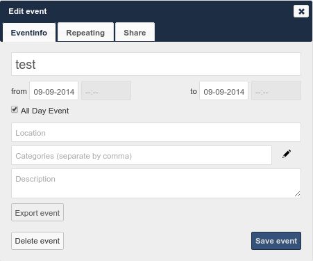
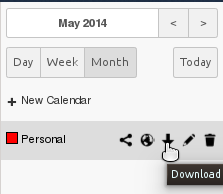
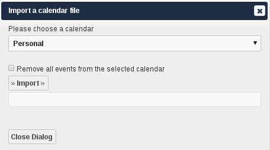
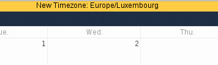

Using the Calendar App
======================

The ownCloud Calendar app enables you to create and edit events, synchronize to
other calendars you might use, and create new, personalized calendars.

By default, when you access the Calendar app for the first time, you get a
"Personal" calendar that you can use or modify as you like.

  **Calendar app (default)**

The Calendar app contains the following fields and controls:

- Calendar Date Field -- Provides the current date or enables you to select a
  date that you want to view.

- Calendar View Options -- Enables you to choose between a day, week, or month
  view for the main Calendar app window.  Also provides a quick jump button to
  access the current day (Today).

- Calendar Selection -- Enables you to choose the calendar that you want to view.

- Calendar Controls -- Provides controls for each individual calendar.  These
  controls include sharing, obtaining an external URL link to the calendar, an
  export function, an edit function, and a delete (trash) button.

- Calendar Settings -- Provides access to the calendar-specific settings.  These
  settings include the calendar timezone selection, time format selection, week
  start day, cache setting, primary CalDAV address, and iOS/OS X CalDAV address
  settings.

Creating a New Calendar
-----------------------

The ownCloud Calendar app enables you to create new calendars for work or other
activities that you want to keep separated.  You can manage each calendar
separately.

To create a new calendar:

1. Access the Calendar app.

2. Click the ``+ New Calendar`` field.

  A dialog opens to enable you to create a new calendar.

  **New calendar**

3. Specify a name for the new calendar.

4. (Optional) Specify a color for the new calendar.

5. Click the blue checkbox.

  The Calendar app creates a new calendar using the name and color specified.

Managing Calendar Settings
--------------------------

The Calendar app settings provides global configuration that applies to all
calendars that you have created in the Calendar app.

  .. figure:: ../images/calendar_settings.png

    **Calendar app settings**

In the Calendar app settings, you can modify the following:

- Timezone -- Provides an alphabetical listing of all available countries
  categorized by continent.

- Time format -- Provides the option of using 24 hour or 12 hour time format.

- Start day -- Provides the option of starting the calendar week on Monday,
  Sunday, or Saturday.

- Primary CalDAV address -- Provides the primary CalDAV link URL.

- iOS/OS X CalDAV address -- Provides the iOS/OS X CalDAV link URL.

Synchronizing Calendars Using CalDAV
------------------------------------
*Calendaring Extensions to WebDAV*, referred to as *CalDAV*, enables clients to
access scheduling information on remote servers. As an extension to WebDAV,
CalDAV (defined by RFC 4791) uses the iCalendar format to manage calendar data.
CalDAV enables multiple clients to access the same information for use in
cooperative planning and information sharing.

The Calendar app provides both the Primary CalDAV address and the iOS/OSX CalDAV
address.  Using these addresses, you can use CalDAV-compatible programs (for
example, Kontact, Evolution, or Thunderbird) using the address provided.

To better understand the URL creation, consider the following examples:

Let's assume you access your ownCloud web interface using the following address::

  http://ADDRESS

To access your ownCloud calendars using CalDAV-compatible programs like
Kontact, Evolution, or Thunderbird, you would use the following URL::

  http://ADDRESS/remote.php/caldav

To access your ownCloud calendars using Apple iCal you would use the following
URL, making sure to include the final slash::

  http://ADDRESS/remote.php/caldav/principals/username/

To access your ownCloud calendars using Mozilla Lightning you would use the
following URL::

  https://ADDRESS/remote.php/caldav/calendars/USERNAME/CALENDARNAME

The following is an example showing the completed URL where the calendar name is
``defaultcalendar`` and the username is ``test``::

       https://localhost/owncloud/remote.php/caldav/calendars/test/defaultcalendar

.. Note: Calendar names are lowercase and any spaces are removed. They are not
  URL-encoded.

Creating Events
---------------

The Calendar app enables you to create new events.

To create a new event:

1. Click a date in the month view or a time in either the week or day views.

   The ``Create a new event`` dialog box opens.

   .. figure:: ../images/calendar_create_event.png

     **Create a new event dialog box**

2. Specify a title for the event.

3. Specify a date and time duration for the event.

4. (Optional) Provide advanced option details.  These details can include the
   event location, the event category, and an event description.

   .. figure:: ../images/calendar_create_event.png

     **Create a new event dialog box**

5. (Optional) Click the Repeating tab to define any repeat settings for the event.

   .. figure:: ../images/calendar_create_event_repeat.png

     **Event Repeating tab**

   The Repeating tab provides the option of not repeating the event(default) or
   repeating the event daily, weekly, every weekday, biweekly, monthly, or yearly.
   In addition, by selecting the ``Advanced`` button in the Repeating tab, each
   repeat option provides different levels of customization to better define your
   repeat requirements for the event.

   The following table helps to define the options for each repeat rule:

   +-----------------+------------------------------------------------------------------------------------+
   | Repeat Rule     | Options                                                                            |
   +=================+====================================================================================+
   | Does not repeat | n/a                                                                                |
   +-----------------+------------------------------------------------------------------------------------+
   | Daily           | Interval - Interval at which the event is repeated                                 |
   |                 | End - never, by occurrences, by date                                               |
   +-----------------+------------------------------------------------------------------------------------+
   | Weekly          | Select weekdays - Weekday(s) on which the event is repeated                        |
   |                 | Interval - Interval at which the event is repeated                                 |
   |                 | End - never, by occurrences, by date                                               |
   +-----------------+------------------------------------------------------------------------------------+
   | Every Weekday   | Interval - Interval at which the event is repeated                                 |
   |                 | End - never, by occurrences, by date                                               |
   +-----------------+------------------------------------------------------------------------------------+
   | Bi-Weekly       | Interval - Interval at which the event is repeated                                 |
   |                 | End - never, by occurrences, by date                                               |
   +-----------------+------------------------------------------------------------------------------------+
   | Monthly         | Day choice -- by monthday or by weekday                                            |
   |                 | Events week of month - Weekday selection only; week of month on which event occurs |
   |                 | Select weekdays - Weekday(s) on which the event is repeated                        |
   |                 | Interval - Interval at which the event is repeated                                 |
   |                 | End - never, by occurrences, by date                                               |
   +-----------------+------------------------------------------------------------------------------------+
   | Yearly          | Date option - by event's date, by year days, by week number, by day and month      |
   |                 | Interval - Interval at which the event is repeated                                 |
   |                 | End - never, by occurrences, by date                                               |
   +-----------------+------------------------------------------------------------------------------------+

.. note:: If you choose all days (Monday through Friday) in the weekview menu,
  the repeating option automatically sets the repeat rule to "every weekday." If
  you can divide the interval of the weekview by two, the repeating option
  automatically sets the repeat rule to "Bi-Weekly".

Sharing Events
--------------

Once an event has been saved, a new tab appears for the event that enables you
to share it.

  **Event Share tab**

The options available in the Share tab include the following:

- ``Share with user or group`` field -- Enables you to specify users or groups with whom you want to
  share the event.

- Share visibility pulldown menu -- Enables you to specify the level of
  information that is shared.  The possible levels include:

  * Show full event -- Displays full event details to those with whom the
    event is shared.
  * Show only busy -- Displays only that you are busy during this event; no
    event details are provided.
  * Hide event -- Hides the event from the users or groups specified.

To share an event:

1. Specify the users or groups with whom you want to share (or hide) the event.

2. Define the level of visibility that you want the users or groups to have.

3. (Optional) Click the ``Send Email`` button to share the event details using an email.

4. Click the ``Save event`` button to save your changes.

   The Calendar app saves and closes the event window.

Exporting and Importing Events
------------------------------

The Calendar app enables you to export and import event or entire calendars to
or from other calendars.

Exporting Events and Calendar
~~~~~~~~~~~~~~~~~~~~~~~~~~~~~

  **Exporting an event**

You can export either a single event or an entire calendar. If you want to export
a single event, click on the event, select "Advanced" and press the "Export Event" button in the bottom left
corner. If you want to export an entire calendar, use the |download| icon next to the calendar name as
shown in the figure below:

  **Exporting calendar**

Importing Events
~~~~~~~~~~~~~~~~

  **Importing events**

You can import your calendar as an iCal file using the Files app. The Calendar app
enables you to import the calendar into a new calendar or into an already existing calendar.

To import your calendar, click the calendar file to open the import dialog.

.. note:: If the progress bar does not work properly, the folder
          ``apps/calendar/import_tmp/`` might not have write permission.

Deleting an Event
-----------------

The Calendar app enables you to delete any event that you create.  To delete a
calendar event:

1. Click the event in the Calendar app.

   The Edit event dialog box opens.

   .. figure:: ../images/calendar_edit_event.png

     **Edit event dialog box**

2. Click the ``Delete event`` button.

   The Calendar app deletes the event.

Special CalDAV URLs
-------------------

Additionally the Calendar app is providing two URLs for special functions:

**Export calendar as an .ics file**

  https://ADDRESS/remote.php/caldav/calendars/USERNAME/CALENDARNAME?export

**Your contacts' birthdays**

  https://ADDRESS/remote.php/caldav/calendars/USERNAME/contact_birthdays

Calendar App FAQ
----------------

**Question:** Why does the Calendar app request my current location?

  **Timezone set notification**

**Answer:** The calendar needs your current position to detect your timezone.
Without the correct timezone, a time offset exists between the events in the
ownCloud calendar and the desktop calendar to which you are synchronizing. You
can also set the timezone manually in the personal settings.

.. |download| image:: ../images/download.png
