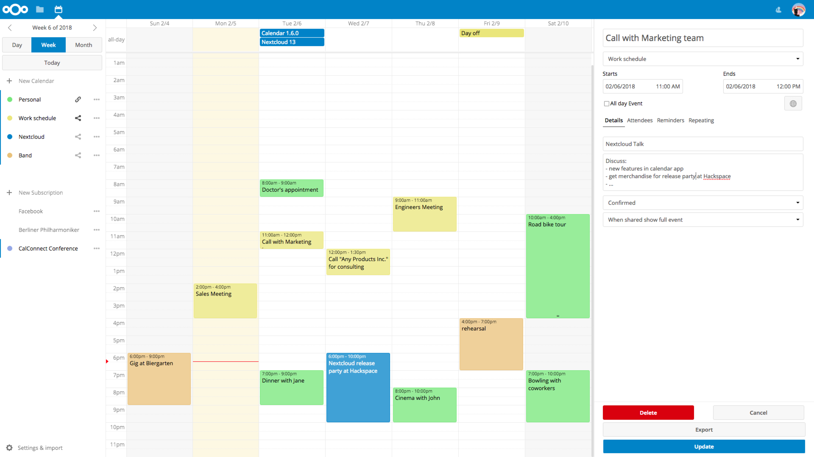
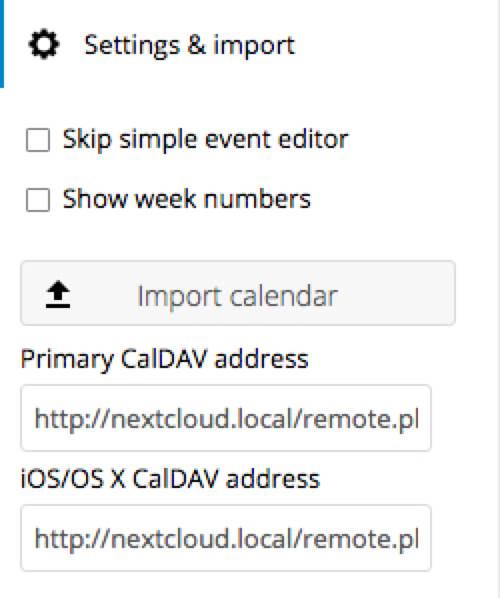
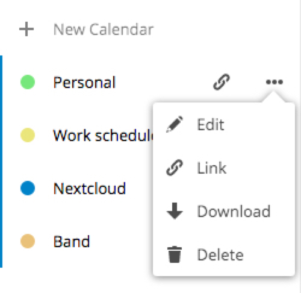
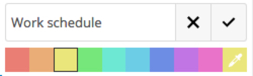

======================
Using the calendar app
======================

.. note:: The calendar app is not enabled by default and needs to be installed
          separately from our App Store. Please ask your Administrator for it.

The Nextcloud Calendar app works similar to other calendar applications you can
sync your Nextcloud calendars and events with.

When you first access the Calendar app, a default first calendar will be
pre-generated for you.

Managing your calendars
-----------------------

Import a Calendar
~~~~~~~~~~~~~~~~~

If you want to transfer your calendar and their respective events to your Nextcloud
instance, importing is the best way to do so.

1. Click on the settings-icon labeled with "Settings & Import" at the left-bottom.

2. After clicking on "+ Import Calendar" you can select a calendar file from your
local device to upload.

3. The upload can take some time and depends on how big the calendar you import
is.

.. note:: The Nextcloud Calendar application only supports iCalendar-compatible
          `.ics`-files, defined in RFC 2445.

Create a new Calendar
~~~~~~~~~~~~~~~~~~~~~

If you plan to setup a new calendar without transferring any old data from your
previous calendar, creating a new calendar is the way you should go.

.. figure:: ../images/calendar_create.png

1. Click on `+ New Calendar` in the left sidebar.

2. Type in a name for your new calendar, e.g. "Work", "Home" or "Studies".

3. After clicking on the checkmark, your new calendar is created and can be
synced across your devices, filled with new events and shared with your friends
and colleagues.

Edit, Download or Delete a Calendar
~~~~~~~~~~~~~~~~~~~~~~~~~~~~~~~~~~~

Sometimes you may want to change the color or the entire name of a previous
imported or created calendar. You may also want to export it to your local
hard drive or delete it forever.

.. note:: Please keep in mind that deleting a calendar is a irreversible action.
          After deletion, there is no way of restoring the calendar unless you
          have a local backup.

1. Click on the three-dot-menu of the respective calendar.

2. Click on `Edit`, `Download` or `Delete`.

Subscribe to a Calendar
~~~~~~~~~~~~~~~~~~~~~~~

TBD

Managing Events
---------------

TBD

Create a new event
~~~~~~~~~~~~~~~~~~

TBD

Edit an event
~~~~~~~~~~~~~

TBD

Delete an event
~~~~~~~~~~~~~~~

TBD

Share your Calendars & Events
-----------------------------

TBD
