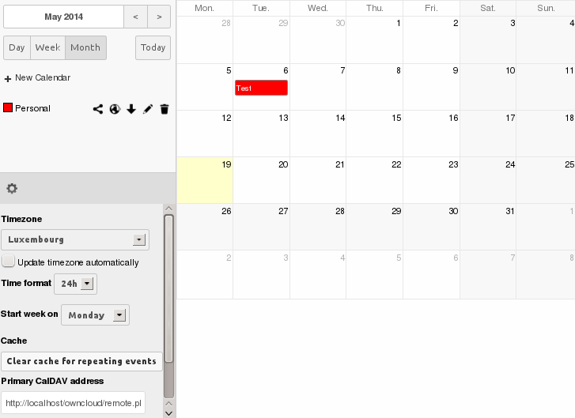
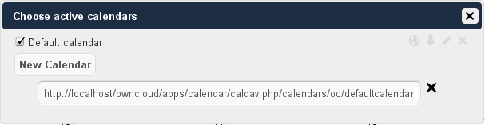
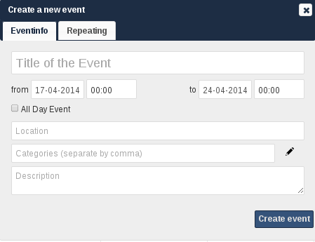

Using the Calendar App
======================

Creating a calendar
-------------------

If you use the calendar the first time, there will be already a calendar called
"Default calendar". You can manage your calendars with a click on the "Calendar"
button in the top right corner. In the dialog, which will appear, you can add,
edit, export, enable, disable and delete your calendars. There will be also a
link for CalDav access.

Synchronising Calendars with CalDav
-----------------------------------

Assuming you access your web interface via an address like this::

  http://ADDRESS

Then you can access your calendars with CalDAV-compatible programs like
Kontact, Evolution, Thunderbird using the following URL::

  http://ADDRESS/remote.php/caldav

To use the ownCloud calendar with Apple iCal you will need to use the following
URL, including the trailing slash::

  http://ADDRESS/remote.php/caldav/principals/username/

Mozilla Lightning users need to this URL scheme::

  https://ADDRESS/remote.php/caldav/calendars/USERNAME/CALENDARNAME

.. note:: The calendar name must alway be specified in URL-encoding_.

   Example for a simple calendar: The default calendar is always
   called "defaultcalendar", and the users' name here is "test".
   The full URL (which on the picture can't be seen because of the
   short edit field) is then::

       https://localhost/owncloud/remote.php/caldav/calendars/test/defaultcalendar

.. _URL-encoding: http://en.wikipedia.org/wiki/Percent-encoding

Creating events
---------------

To create an event just click on the date in the month view or choose the
timeframe in the weekview. In the dialog which will appear you can enter your
information like title, category, etc.

With the advanced options you can set the
description, the location and the repetition rate of an event. If the repeating
should end you can choose between setting the end by date or by occurrences. If
you choose in the weekview all days from Monday to Friday it will automatically
set the repeat rule to "every weekday". If the interval of the weekview can be
devided by two it automatically set the repeat rule to "Bi-Weekly".

Exporting / Importing events
----------------------------

Export
~~~~~~

.. figure:: ../images/calendar_export.png
   :scale: 50

You can export either a single event or a whole calendar. If you want to export
a single event click on it and press the export button in the bottom right
corner. If you want to export a whole calendar use the "Calendar" button as
described in the chapter "Creating a calendar".

Import
~~~~~~

.. figure:: ../images/calendar_import.png
   :scale: 50

Import your calendar as ical file using the files app. Just click on the
calendar file to open the import dialog. You can import the calendar into a new
calendar or into an already existing calendar.

.. note:: If the progressbar does not work properly, the folder
          ``apps/calendar/import_tmp/`` has probably no write permission.

Why is the calendar app asking for my current location?
-------------------------------------------------------

.. figure:: ../images/calendar_newtimezone1.png
   :scale: 50

The calendar needs your current position in order to detect your timezone.
Without the correct timezone there will be a time offset between the events in
ownCloud and your desktop calendar you synchronise with ownCloud. You can also
set the timezone manually in the personal settings.
