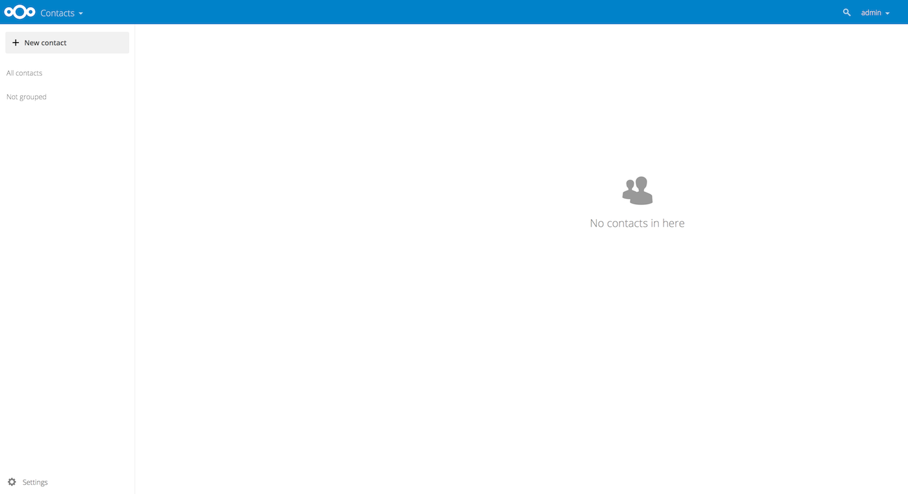
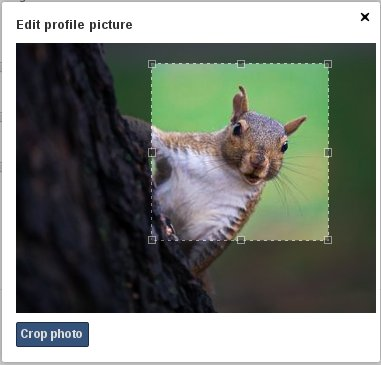
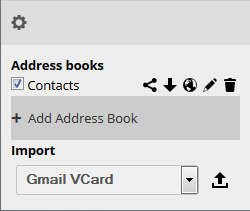

======================
Using the Contacts App
======================

The ownCloud Contacts app is similar to other mobile contact applications, but 
with more functionality.  When you first access the Contacts app, a default 
address book becomes available.

  **Contacts app (empty)**

In the Apps Information field for the Contacts app, you can choose to create a
new contact or a new group.  This field also enables you to filter your contacts
based on grouped or ungrouped contacts.

Adding Contacts
---------------
You can add contacts using one of the following methods:

* Import contacts using a Variant Call Format (VCF) file

* Add contacts manually

Importing Contacts
~~~~~~~~~~~~~~~~~~

The fastest way to add contacts is through the use of a Variant Call Format
(VCF) file.

To import contacts using a VCF file:

1. At the bottom of the Contacts app information field, locate the gear button.

  .. figure:: ../images/contact_bottombar.png

     **Contact settings gear button**

2. Click the gear button. The Contacts app upload field opens. 

  .. figure:: ../images/contact_uploadbutton.png

   **Contacts app upload field**

3. Choose an address book to which you want to import contacts by clicking the
checkbox next to the address book.

4. Select one of the options from the Import pulldown menu.  These options
include the following:

  - Automatic format -- Any VCF file. ownCloud determines the file format and 
    imports accordingly.
	
  - Gmail CSV -- The comma-separated values file from your Gmail account.
  
  - Outlook CSV -- The comma-separated values file from your Outlook account.
  
  - Thunderbird CSV -- The comma-separated values file from your Thunderbird 
    account.
	
  - Yahoo CSV -- The comma-separated values file from your Yahoo account.
  
  - PHPLdapAdmin Idif Export -- The export record from your LDAP configuration.
  
  - Gmail VCard -- The VCard files from your Gmail account.
  
  - Standard VCard -- The VCard files from your Standard account.
	
  - Yahoo VCard  -- The VCard files from your Yahoo account.
   
5. Click the upload arrow to the right of the import option that you select. 

  An Upload File window opens.
  
6. Navigate to the appropriate file on your system and select it for upload.

  .. note:: You can upload files individually or, by selecting multiple files 
    using the CTRL button and selecting them, you can upload multiple files at
    one time.

7. Once you have selected the appropriate files, click the `Open`` button.

  .. figure:: ../images/contact_vcfpick.jpg

    **Selecting VCF files**

    The interface automatically places your contacts into ownCloud.

Creating Contacts Manually
~~~~~~~~~~~~~~~~~~~~~~~~~~

The Contacts app enables you to create contacts manually.  

To create a new contact:

1. Click the ``+New contact`` option in the Contacts information field.

   An empty new contact configuration opens in the Application View field.
  
  .. figure:: ../images/contact_new.png
  
2. Specify the new contact information as follows:

  - Name -- The name of the contact.  This field provides the option of 
    specifying added information for the user by clicking the pen button to the
    right of the Name field.
	
  - Organization -- The organization for the contact.
  
  - Email -- The email address for the contact. This field defaults to the work
    email address for the contact.  However, you can specify a different email 
    designation by clicking the ``Work`` designation to the left of the email
    field.
	
  - Phone -- The phone number for the contact. This field defaults to the home
    phone number for the contact.  However, you can specify a different phone 
    designation by clicking the ``Home`` designation to the left of the phone
    field.
	
  - Address -- The address for the contact. This field defaults to the work
    address for the contact.  However, you can specify a different address 
    designation by clicking the ``Work`` designation to the left of the address
    field.
	
  - Notes -- Any notes you want to add about the contact.
  
  .. note:: The Email, Phone, and Address fields provide the option of
    specifying a contact method as "preferred."
  
Editing Contact Information
~~~~~~~~~~~~~~~~~~~~~~~~~~~

The Contacts app enables you to edit or remove contact information.

To edit contact information:

1. Navigate to the specific contact that you want to modify.

2. Select the information in the field that you want to edit.

3. Make your modifications.

  Changes that you make to any contact information are implemented immediately.
  
Removing Contact Information
~~~~~~~~~~~~~~~~~~~~~~~~~~~~

The Contacts app enables you to remove contact information.

To remove contact information:

1. Navigate to the specific contact that you want to modify.

2. Locate the contact information field that you want to remove.

3. Click the trash bin to the right of the contact information.

  Changes that you make to any contact information are implemented immediately.

Defining a Contact Avatar
~~~~~~~~~~~~~~~~~~~~~~~~~

By default, new contacts receive a letter avatar (picture) of "U" (for "User").

.. figure:: ../images/contact_picture_default.png

  **Contact picture (default)**

When you specify the name of a contact, the avatar reflects the name by adopting
the first letter of the name you provide.  For example, if you were to specify
the name of "Frederick," the avatar would dynamically change to "F" for that
contact.  If you provide multiple contacts with the same name, or with names
that start with the same first letter, the avatar uses the same letter but
changes color to indicate the difference.
 

  **Contact picture (dynamic change)**

Customizing an Avatar
~~~~~~~~~~~~~~~~~~~~~

In addition to dynamically altering the avatar for each contact, the Contacts 
app enables you to customize the avatar. You can specify an avatar in one of the
two following ways:

- Upload new image -- By selecting this option, ownCloud opens a File Upload 
  window.  You can choose a new image by navigating to the image, selecting it, 
  and clicking ``Open``.
  
- Select image from Files -- By selecting this option, ownCloud opens the Files
  dialog on the ownCloud server.  You can choose an image by navigating to the image
  in the ownCloud directory, selecting it, and clicking ``Choose.``

Cropping an Avatar Image
~~~~~~~~~~~~~~~~~~~~~~~~

After you have selected an image for your contact, the Contacts app enables you
to crop the picture.

   **Cropping contact image**

To crop the image:

1. Move the image crop box to the desired location and resize the box any way 
   you like.

2. Click ``Crop Picture`` in the crop image dialog box.

  The Contacts app crops the image and replaces whatever image was originally 
  used for the contact.

Managing Address Books
----------------------

Clicking on the settings (gear) button at the bottom of the Apps Information 
field provides access to the Contact app settings. This field shows all 
available address books, certain options for each address book, and enables you
to create new address books.

   **Contacts settings**

The Contacts settings enables you to share, export, edit, and delete address 
books.

.. note:: Hover your cursor over each icon to see a brief pop-up description.

Adding an Address Book
----------------------

To add an address book:

1. Click the ``+ Add Address Book`` option in the Contacts settings field.

  A field opens requesting you to enter a display name for the new address book.
  
  .. figure:: ../images/contact_address_book_add.png

    **Adding an address book**

2. Specify a display name for the address book.

3. Click the checkbox icon to create the new address book.

Synchronizing Address Books
---------------------------

One of the most important features in any contact application is the ability to 
keep it in sync.  The ownCloud Contacts app enables you to sync your address
books to external devices that use the Android or Apple iOS operating systems.

Synchronizing With Android
~~~~~~~~~~~~~~~~~~~~~~~~~~

To synchronize with an Android device:

1) Install CardDAV- Sync free from the Google play store by visiting `this link <https://play.google.com/store/apps/details?id=org.dmfs.carddav.sync>`_.
   This app supports auto-configuration.
  
  .. note:: Following the installing, visit carddavs://example.org/remote.php/carddav/ to auto-configure the app.

3) Enter your login details.

4) After the app has checked your login details, select the ``Sync from server to phone only`` option.

.. figure:: ../images/contact_syncopt.jpg

Synchronizing With Apple iOS
~~~~~~~~~~~~~~~~~~~~~~~~~~~~

To synchronize with an Apple iOS device:

1. Open the settings application.

2. Select Mail > Contacts > Calendars.

3. Select ``Add Account``.

4. Select ``other`` as the account type.

5. Select ``Add CardDAV account``.

6. For ``server``, enter http://example.org/remote.php/carddav/principals/username

7. Specify your username and password.

8. Select Next.

9. If your server does not support SSL, a warning is displayed. Select ``Continue``.

10. If the iPhone is unable to verify the account information, perform the following:

  a. Click ``OK``.
  
  b. Select ``advanced settings``.

  c. Make sure ``Use SSL`` is set to "OFF".

  d. Change the port to ``80``.
  
  e. Return to "account information" and click ``Save``.

  Your contacts appear in the address book of your iPhone.

Using Other Synchronization Options
~~~~~~~~~~~~~~~~~~~~~~~~~~~~~~~~~~~

ownCloud provides the following alternative synchronization options:

- For Android devices, you can use an official Android app.  You can find this
  app `here <https://owncloud.org/install/>`_.
  
- For iOS (iPhone and iPad) devices, you can use their official app.  You can
  find this app `here <https://owncloud.org/install/>`_.

Special CardDAV URLs
--------------------

Additionally, the Contacts app is providing an URL for special functions:

**Export an address book as a vCard file**

  https://ADDRESS/remote.php/caldav/addressbooks/USERNAME/ADDRESSBOOK?export

Troubleshooting
---------------

Are you having problems using the app? Have a look at the :doc:`troubleshooting` guide.

