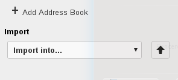

======================
Using the contacts app
======================

The Contacts app is not enabled by default in Nextcloud |version| and needs to
be installed separately from our App Store.

The Nextcloud Contacts app is similar to other mobile contact applications, but
with more functionality. When you first access the Contacts app, a default
address book becomes available.

.. figure:: ../images/contacts_empty.png

 **Contacts app (empty)**

Adding contacts
---------------
You can add contacts using one of the following methods:

* Import contacts using a Virtual Contact File (VCF/Vcard) file

* Add contacts manually

Importing Contacts
~~~~~~~~~~~~~~~~~~

The fastest way to add contacts is through the use of a Virtual Contact File
(VCF/Vcard) file.

To import contacts using a VCF/Vcard file:

1. At the bottom of the Contacts app information field, locate the gear button.

  .. figure:: ../images/contact_bottombar.png

  **Contact settings gear button**

2. Click the gear button. The Contacts app upload field opens.

**Contacts app upload field**

.. note:: The Contacts app only supports import of vCards version 3.0 and 4.0.

Creating Contacts Manually
~~~~~~~~~~~~~~~~~~~~~~~~~~

The Contacts app enables you to create contacts manually.

To create a new contact:

1. Click the ``+ New contact`` button.

   An empty new contact configuration opens in the Application View field.

  .. figure:: ../images/contact_new.png

2. Specify the new contact information. Changes that you made are implemented immediately.

Edit or Remove Contact Information
~~~~~~~~~~~~~~~~~~~~~~~~~~~~~~~~~~

The Contacts app enables you to edit or remove contact information.

To edit or remove contact information:

1. Navigate to the specific contact that you want to modify.

2. Select the information in the field that you want to edit or remove.

3. Make your modifications or click on the trash bin.

Changes or removals that you made to any contact information are implemented immediately.

Contact Picture
~~~~~~~~~~~~~~~

To define a contact picture, click on the upload button:

.. figure:: ../images/contact_picture.png

  **Contact picture (upload button)**

After you have set a contact picture, it will look like that:

.. figure:: ../images/contact_picture_set.png

  **Contact picture (set)**

If you want to upload a new one, remove it, view it in full size or download it
click on the contacts picture.

.. figure:: ../images/contact_picture_options.png

Adding and managing address books
---------------------------------

Clicking on the settings (gear) button at the bottom of the Apps Information
field provides access to the Contact app settings. This field shows all
available address books, certain options for each address book, and enables you
to create new address books, simply by specifying an address books name.

.. figure:: ../images/contact_manageaddressbook.png

   **Add address book in the contacts settings**

The Contacts settings also enables you to share, export and delete address
books. You will also find the CardDAV URLs there.
See :doc:`index` for more details about syncing your adress books
with iOS, macOS, Thunderbird and other CardDAV clients.
