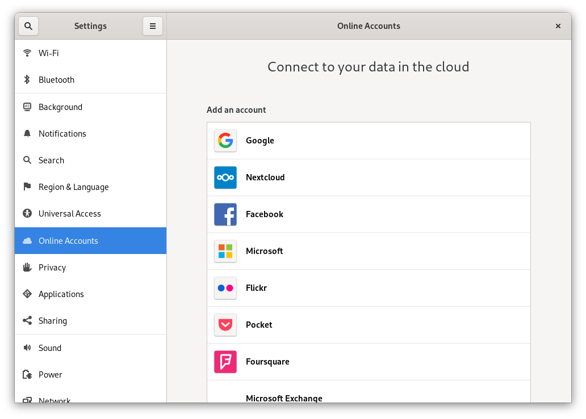
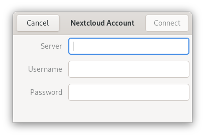

====================================
Synchronizing with the GNOME desktop
====================================

The `GNOME desktop <https://www.gnome.org>`_ has built-in support for Nextcloud's calendar,
contacts and tasks which will be displayed by the Evolution PIM or the
Calendar, Tasks and Contacts app as well has for files, which it
integrates into the Nautilus file manager via WebDAV. The latter works
only while the computer is connected. 

This can be done by following these steps:

1. In the GNOME settings, open Online Accounts.
2. Under "Add an account" pick ``Nextcloud``.

3. Enter your server URL, username and password. If you have enabled two
   factor authentification, you need to generate an
   app-password/token, because GNOME Online Accounts `doesn't support Nextcloud's webflow login yet <https://gitlab.gnome.org/GNOME/gnome-online-accounts/issues/81>`_. (`Learn more <https://docs.nextcloud.com/server/stable/user_manual/session_management.html#managing-devices>`_).

   
4. In the next window, select which resources GNOME should access and
   press the cross in the top left to close.
   
.. image:: ../images/goa-nextcloud-select.png

Nextcloud tasks, calendars and contacts should now be visible in the
Evolution PIM, the task, contacts and calendars app.

Files will be shown as a WebDAV resource in the Nautilus file manager
(and also be available in the GNOME file open/save
dialogues). Documents should be integrated into the GNOME Documents
app.

All resourses should also be searchable from anywhere by pressing the Windows key and entering a
search tearm. 

