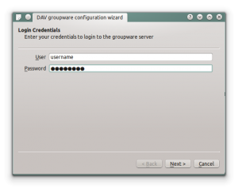
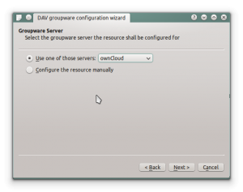
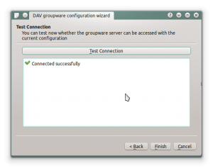
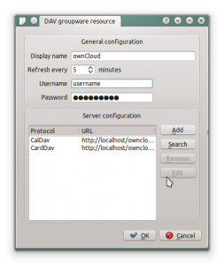
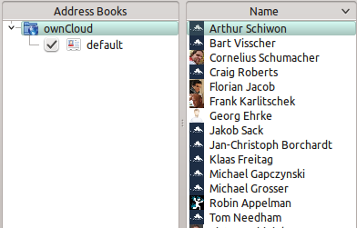

Synchronizing with KDE SC
=========================

.. image:: /images/kdes1.png

From KDE SC 4.8 and forward setting up ownCloud is very easy. From System
Settings Personal Information/Akonadi Resources Configuration select DAV
Groupware resource.

Enter your ownCloud username and password and click "Next".

Select ownCloud in the drop down list and click "Next".

Enter the host name and installation path. If you do not use SSL
remember to de-select "Use secure connection".

Test the connection. If everything went well you should see a message
like the one below.

Click "Finish" and you will be able to change the display name and
refresh interval.

Now you should see the Akonadi resource doing the first
synchronization.

..  missing
..  .. image:: ../images/kdes8.png

You can find the Contacts and Calendars in Kontact (or
KOrganizer/KAddressbook if you run the programs separately.)

