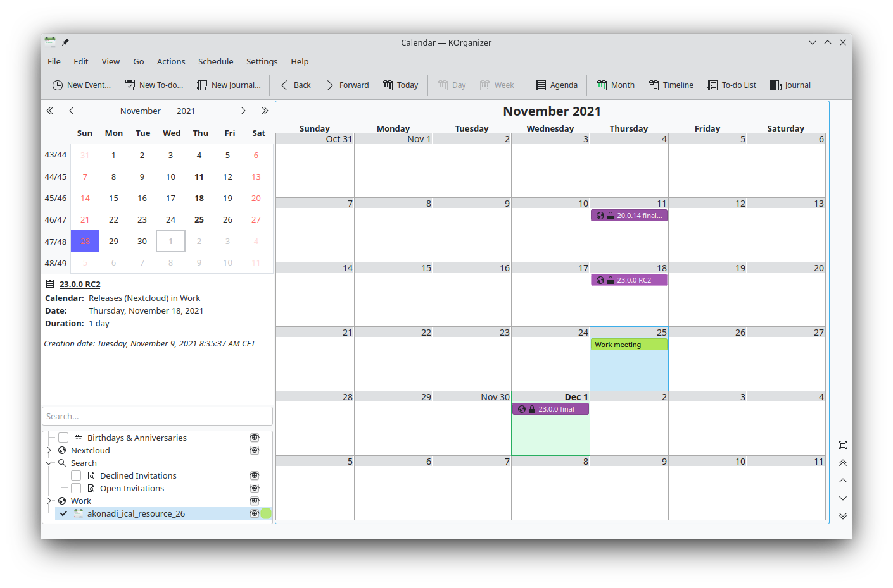

=======================================
Synchronizing with KDE PIM
=======================================

KOrganizer and KAddressbook can synchronize data with a Nextcloud server.

This can be done by following these steps:

1. Open KOrganizer and in the calendar list (bottom left) right-click and choose ``Add Calendar``

.. image:: ../images/KOrganizer_add_calendar.png

2. In the resulting list of resources, pick ``DAV groupware resource``

.. image:: ../images/korganizer_resource_choice.png

3. Enter your user name and password, or, if you have two-factor authentication enabled, use an App Password. Then click next.

.. image:: ../images/korganizer_credentials.png

To create an App Password if you have two-factor authentication:

    * in Nextcloud, go to your user settings and look under security.
    * Look for the button ``create new App password`` and before it, enter a unique name, like ``KOrganizer on my laptop``

    .. image:: ../images/app_password_naming.png

    * then click ``create new App password``. Copy-paste the password!

.. image:: ../images/app_password_created.png

4. As Groupware Server, choose ownCloud or Nextcloud in the drop-down menu. Click next.

.. image:: ../images/KOrganizer_groupware_server.png

5. Enter your Nextcloud server url and, if needed, installation path (anything that comes after the first /, for example ``mynextcloud`` in ``https://exampe.com/mynextcloud``). Then click next.

.. image:: ../images/KOrganizer_server_address.png

6. You can now test the connection. If it does not work, you can go back and try to fix it with other settings.

.. image:: ../images/KOrganizer_test1.png

.. image:: ../images/KOrganizer_test2.png

**Note:** the test can take a while!

7. Pick a name for this resource, for example ``work`` or ``private`` By default, both CalDav and CardDav are synced, that is, both calendar and contacts. Choose a refresh time, 5 minutes is default but quite often for use on a laptop. Perhaps you want to save power and be a bit slower, like once every 30 minutes. Note that you can update with a right-click on the item in the calendar list and when you create a new appointment it is synced to Nextcloud right away.

.. image:: ../images/KOrganizer_pick_resources.png

done
~~~~

After a few seconds to minutes (the sync can take a while on a slow connection) KOrganizer will show your calendars and KAddressBook will show your contacts!

.. image:: ../images/KAddressBook.png
