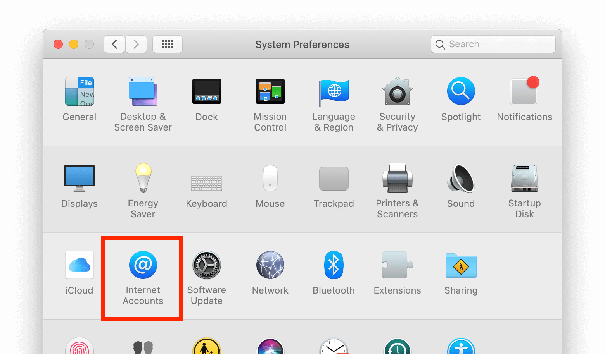
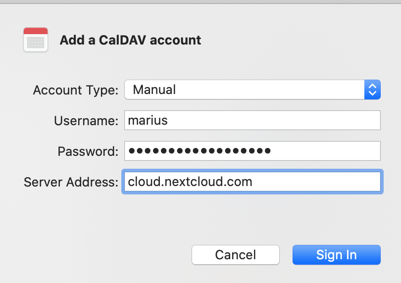

========================
Synchronizing with macOS
========================

Setup your Accounts
-------------------

In the following steps you will add your server resources for **CalDAV** (Calendar)
and **CardDAV** (Contacts) to your Nextcloud.

1. Open the **system preferences** of your macOS device.

2. Navigate to **Internet Accounts**:

3. Click on **Add Other Account…** and click on **CalDAV Account** for Calendar
   or **CardDAV Account** for Contacts:

.. image:: ./images/macos_2.png
   :alt:

.. note:: You can not setup Calendar/Contacts together. You need to setup them
          in **separate accounts**.

4. Select **Manual** as Account-Type and type in your respective credentials:

   **Username**: Your Nextcloud username or email

   **Password**: Your generated app-password/token (`Learn more <https://docs.nextcloud.com/server/stable/user_manual/session_management.html#managing-devices>`_).

   **Server Address**: URL of your Nextcloud server (e.g. ``https://cloud.example.com``)

5. Click on **Sign In**.

For **CalDAV (Calendar)**: You can now select, with which applications you want
to use this resource. In the most cases, this will be the "Calendar" application,
sometimes you may also want to use it for your **Tasks and reminders**.

.. image:: ./images/macos_4.png
   :alt:

Troubleshooting
---------------

- macOS does **not** support syncing CalDAV/CardDAV over non-encrypted ``http://``
  connections. Make sure you have ``https://`` enabled and configured on server- and
  client-side.

- **Self-signed certificates** need to be properly set up in the macOS keychain.
