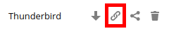
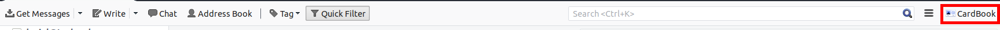
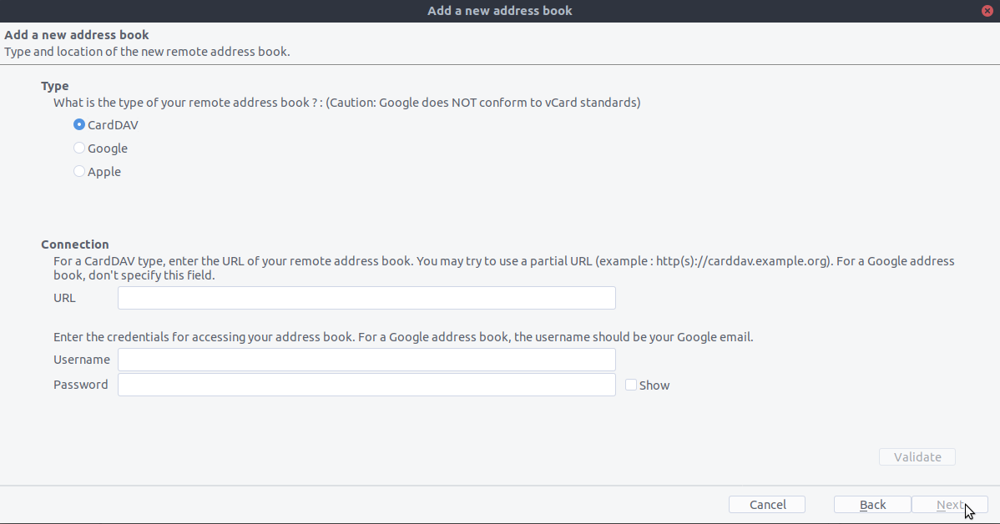
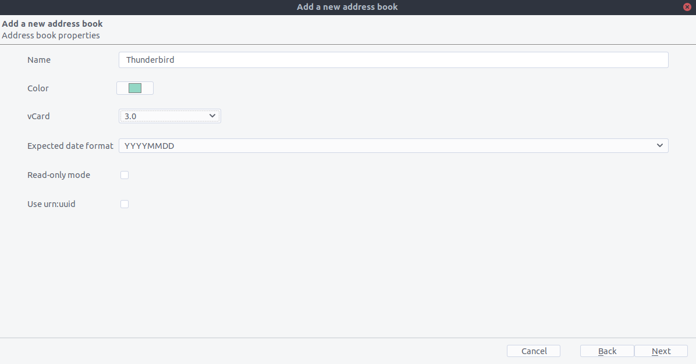
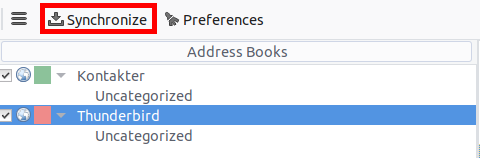
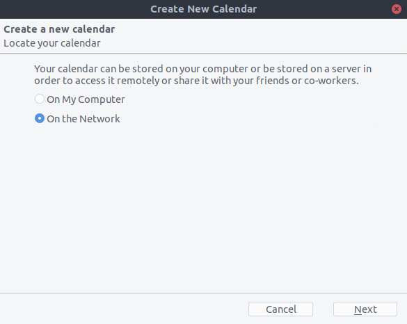
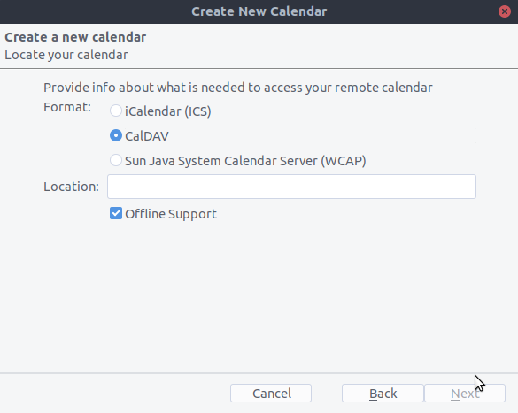

==============================
Synchronizing with Thunderbird
==============================

The easiest way: Contacts and calendars with TBSync
--------

To synchronize your calendars and contacts with Thunderbird, you need to have three add-ons installed:

1. The Lightning calendar <https://addons.thunderbird.net/de/thunderbird/addon/lightning/>
2. TBSync <https://addons.thunderbird.net/de/thunderbird/addon/tbsync/> and 
3. The TBSync provider for CalDAV and CardDAV <https://addons.thunderbird.net/de/thunderbird/addon/dav-4-tbsync/>

Once you have these add-ons in place, if you are on Windows, go to Extras/Synchronisation settings (TBSync) or Edit/Synchronisation settings (TBSync) if on Linux

* In the account manager choose "Add account/ CalDAV / CardDAV account"
* In the next window, go with the default called "Automatic configuration" and click "next"
* Enter an an account name (your choice), user name, password and the URL of your Nextcloud and click "next"
* In the next window, TBSync should have autodiscovered the CalDAV and CardDAV addresses. Click "Finish".
* Now check the box "Enable and synchronizes this account". TBSync will find all address books and calenders your account has access to on the server
* Check the box next to each calender and address book you want to have synchronised, also set how often you want them to be synchronised and push the button "sychronise now"
* After the first successful synchronisation is complete, you can close the window. Henceforth, TBSync will do the work for you. You are done and can skip the next sections (unless you need a more advanced address book)

Alternative: Using the CardBook add-on (Contacts only)
--------
CardBook is a more advanced alternative to the built-in Thunderbird address book, which speaks CardDAV out of the box.

As someone who is new to Nextcloud and new to CardBook here is what you need in excruciating pithy detail to make this work:

- `Thunderbird <https://www.thunderbird.net/>`_ for your OS unless it comes with your OS distribution (Linux)
- `CardBook <https://addons.thunderbird.net/en-US/thunderbird/addon/cardbook/>`_ (a Thunderbird contacts add-on.)

Once you've installed CardBook and Thunderbird do like this:

1. In the bottom left of the Contacts View (in Nextcloud contatcs) look for a little impeller symbol that looks like this:

which will display and URL that looks something like this:
https://cloud.nextcloud.com/remote.php/dav/addressbooks/users/daniel/Thunderbird/

2. Cardbook is found in the upper right corner of Thunderbird:

3. In the Thunderbird Cardbook add-on:

   -  "Adressbook > New Adressbook **Remote** > Next
   -  Fill in your information

4. Validate your settings and click Next, then choose the name of the addressbook and click Next again.

5. Once installed, synchronize your addressbook by clicking "Synchronize" in the top left corner of CardBook.
You'll see your address book populate from Nextcloud!

The rest of the details of dealing with Thunderbird CardBook are left to the reader...

The old method: Manually subscribing to calendars
--------

- `Thunderbird <https://www.thunderbird.net/>`_ for your OS unless it comes with your OS distribution (Linux)
- `Lightning <https://addons.mozilla.org/en-US/thunderbird/addon/lightning/>`_ (a Thunderbird calendar add-on.)

Once you've installed Lighning and Thunderbird do like this:

1. Go to your Nextcloud Calendar and click on the 3 dotted menu for the calendar that you want to synchronize which will display and URL that looks something like this:
https://cloud.nextcloud.com/remote.php/dav/calendars/daniel/personal/

2. Go to the calendar view in Thunderbird and right click in the calendar menu to the left (where the names of the calendars are) to add a **New Calendar**.

3. Choose **On the network**

4. Choose **CalDAV** and fill in the missing information:

The rest of the details of dealing with Thunderbird Calendar are left to the reader...
