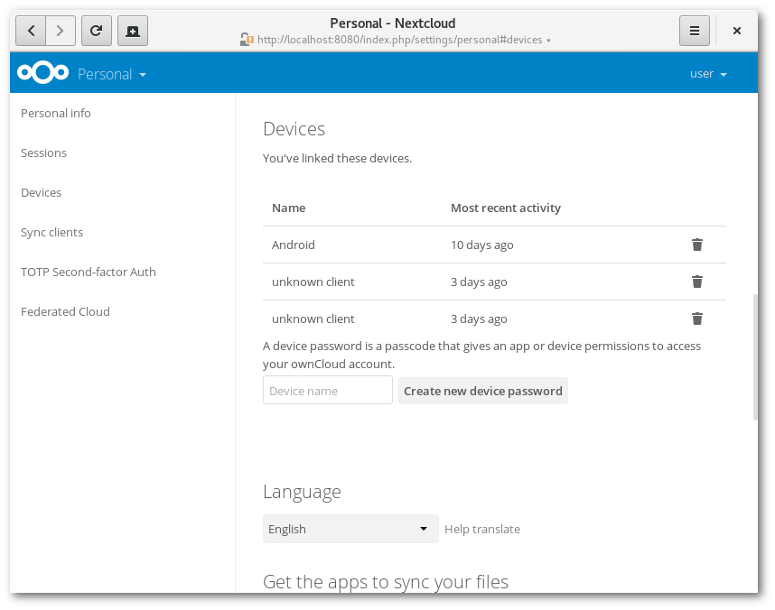
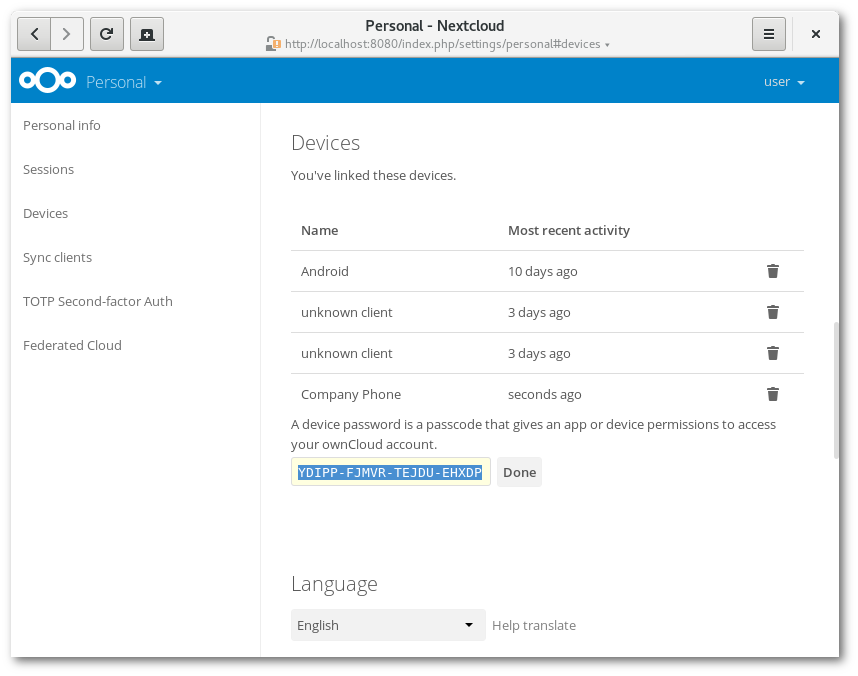

=====================================
Manage connected browsers and devices
=====================================

The personal settings page allows you to have an overview on the connected
browsers and devices.

Managing connected browsers
---------------------------

In the list of connected browsers you see which browsers connected to your
account recently:

.. figure:: images/settings_sessions.png
     :alt: List of browser sessions.

You can use the trash icon to disconnect any of the browsers in the list.

.. _managing_devices:

Managing devices
----------------

In the list of connected devices you see all the devices and clients you
generated a device password for and their last activity:

You can use the trash icon to disconnect any of the devices in the list.

At the bottom of the list you find a button to create a new device-specific
password. You can choose a name to identify the token later. The generated
password is used for configuring the new client. Ideally, generate individual
tokens for every device you connect to your account, so you can disconnect
those individually if necessary:

.. note:: You have only access to the device password when creating it,
   Nextcloud will not save the plain password, hence it's recommended to
   enter the password on the new client immediately.

.. note:: If you are :doc:`user_2fa` for your account,
   device-specific passwords are the only way to configure clients. The
   server will deny connections of clients using your login password then.

Device-specific passwords and password changes
----------------------------------------------

For password changes in external user backends the device-specific passwords
are marked as invalid and once a login of the user account with the main
password happens all device-specific passwords are updated and work again.
