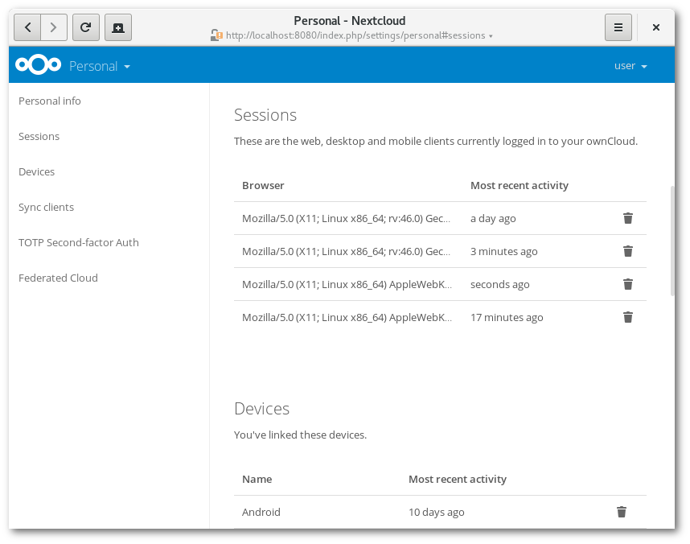
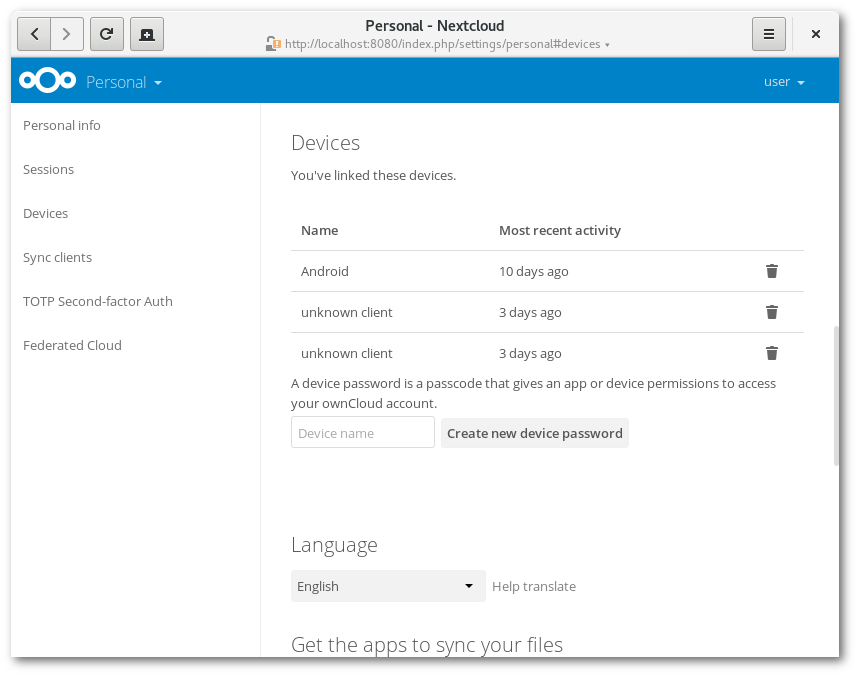
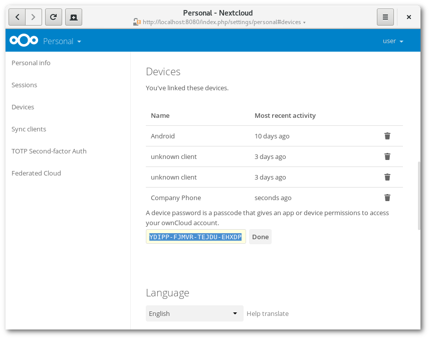

=====================================
Manage connected browsers and devices
=====================================

The personal settings page gives you an overview of the connected
browsers and devices.

Managing connected browsers
---------------------------

The list of connected browsers shows which browsers have connected to your
account recently:

You can use the trash icon to disconnect any of the browsers in the list.

.. _managing_devices:

Managing devices
----------------

The list of connected devices shows all the devices and clients you
generated a device password for and their last activity:

You can use the trash icon to disconnect any of the devices in the list.

At the bottom of the list, you can create a new device-specific
password. You can choose a name to identify the token later. The generated
password is used for configuring the new client. Ideally, generate individual
tokens for every device you connect to your account, so you can disconnect
those individually if necessary:

.. note::
   You only have access to the device password when creating it.
   Nextcloud does not save the plain password, so enter the password on
   the new client immediately.

.. note:: If you use :doc:`user_2fa` for your account,
   device-specific passwords are the only way to configure clients. The
   server will deny connections of clients using your login password then.

Device-specific passwords and password changes
----------------------------------------------

When a password changes in an external user backend, all device-specific
passwords are marked as invalid. Once you log in with the main password,
all device-specific passwords are updated and work again.
