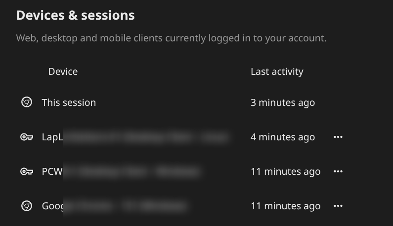
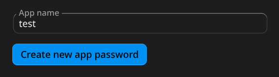
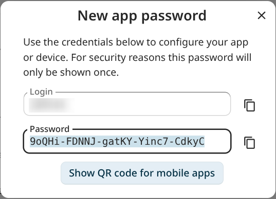

=====================================
Manage connected browsers and devices
=====================================

The personal settings page gives you an overview of the connected
browsers and devices under the "Security" tab.

Managing connected browsers and devices
---------------------------------------
.. _managing_devices:

The list of connected browsers and devices shows which browsers and devices have connected to your
account recently:

You can open the menu beside every device or session to revoke the access.

At the bottom of the list, you can create a new device-specific
password. The generated password is used for configuring the new client. 
Ideally, generate individual tokens for every device you connect to your 
account, so you can disconnect those individually if necessary:

.. note::
   You only have access to the device password when creating it.
   Nextcloud does not save the plain password, so enter the password on
   the new client immediately.

.. note::
   If you use :doc:`user_2fa` for your account, device-specific passwords
   are the only way to configure clients. The server will then deny
   connections from clients using your login password.

Device-specific passwords and password changes
----------------------------------------------

When a password changes in an external user backend, all device-specific
passwords are marked as invalid. Once you log in with the main password,
all device-specific passwords are updated and work again.
